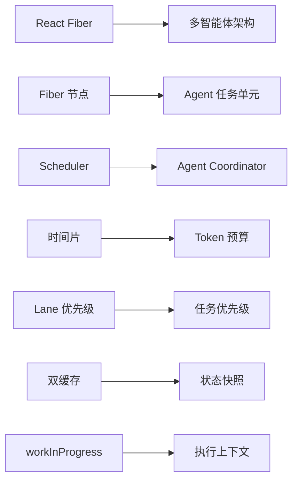

# React 时间分片思想在多智能体架构中的应用

> 将 React Fiber 的抢占式任务调度思想迁移到多智能体系统，构建高效、公平、可扩展的智能体调度架构

---

## 目录

- [一、背景与动机](#一背景与动机)
  - [1.1 React 时间分片的核心问题](#11-react-时间分片的核心问题)
  - [1.2 多智能体架构面临的挑战](#12-多智能体架构面临的挑战)
  - [1.3 概念映射](#13-概念映射)
- [二、架构设计](#二架构设计)
  - [2.1 核心数据结构](#21-核心数据结构)
  - [2.2 智能体调度器](#22-智能体调度器)
  - [2.3 工作循环机制](#23-工作循环机制)
- [三、LLM 场景特殊优化](#三llm-场景特殊优化)
  - [3.1 软中断机制](#31-软中断机制)
  - [3.2 任务分段策略](#32-任务分段策略)
  - [3.3 增量保存与复用](#33-增量保存与复用)
- [四、实际应用场景](#四实际应用场景)
  - [4.1 多会话对话系统](#41-多会话对话系统)
  - [4.2 自动驾驶多模块协调](#42-自动驾驶多模块协调)
  - [4.3 游戏AI智能体调度](#43-游戏ai智能体调度)
- [五、架构优势](#五架构优势)
  - [5.1 公平性](#51-公平性)
  - [5.2 响应性](#52-响应性)
  - [5.3 可扩展性](#53-可扩展性)
- [六、分布式扩展](#六分布式扩展)
  - [6.1 分布式任务队列](#61-分布式任务队列)
  - [6.2 分布式锁机制](#62-分布式锁机制)
  - [6.3 状态同步与容错](#63-状态同步与容错)
- [七、性能优化](#七性能优化)
  - [7.1 Token 效率优化](#71-token-效率优化)
  - [7.2 任务批处理](#72-任务批处理)
  - [7.3 预测性调度](#73-预测性调度)
- [八、完整实现示例](#八完整实现示例)
  - [8.1 核心调度器](#81-核心调度器)
  - [8.2 智能体接口](#82-智能体接口)
  - [8.3 使用示例](#83-使用示例)
- [九、最佳实践](#九最佳实践)
  - [9.1 优先级设计](#91-优先级设计)
  - [9.2 Token 预算分配](#92-token-预算分配)
  - [9.3 监控与调试](#93-监控与调试)
- [十、总结](#十总结)

---

## 一、背景与动机

### 1.1 React 时间分片的核心问题

#### React 15 的致命缺陷

```typescript
// React 15: 同步递归更新
function updateComponent() {
  renderComponent();      // 一旦开始，无法中断
  reconcileChildren();    // 递归遍历整个树
  updateDOM();
}

问题：
❌ 大型组件树 → 主线程被长时间占用
❌ 用户输入（点击、滚动）无法及时响应
❌ 动画掉帧，卡顿明显
```

#### React Fiber 的解决方案

```
将大任务拆分成小任务，每个执行 5ms 左右，主动让出主线程

核心机制：
┌─────────────────────────────────────────────────────┐
│ 1. Fiber 链表结构 - 支持中断和恢复                    │
│ 2. 调度器 - 优先级管理和时间片分配                      │
│ 3. 双缓存 - 确保更新原子性                            │
│ 4. Lane 模型 - 精细的优先级表示                       │
└─────────────────────────────────────────────────────┘
```

### 1.2 多智能体架构面临的挑战

#### 典型问题场景

```typescript
// 场景 1: ChatGPT 多会话管理
问题：
- 某个会话占用过多资源，其他会话响应缓慢
- 用户输入无法及时得到响应
- 资源利用率不均衡

// 场景 2: 自动驾驶多模块
问题：
- 感知、决策、控制模块需要动态调整优先级
- 紧急事件（行人检测）需要立即响应
- 后台规划任务可能阻塞关键模块

// 场景 3: 游戏AI
问题：
- 多个 NPC 智能体公平分配计算资源
- 实时决策需要在有限时间内完成
- 某些 NPC 行为需要高优先级（战斗状态）
```

### 1.3 概念映射

| React 概念 | 多智能体架构对应 | 说明 |
|-----------|----------------|------|
| **Fiber 节点** | **Agent 任务单元** | 智能体执行的最小可中断单元 |
| **Scheduler 调度器** | **Agent Coordinator** | 中央协调器，管理所有智能体 |
| **时间片（5ms）** | **Token/CPU 预算** | 智能体的计算资源配额 |
| **Lane 优先级** | **任务优先级** | 紧急/重要/普通/低优先级 |
| **双缓存** | **状态快照** | 任务中断时保存的执行状态 |
| **workInProgress** | **执行上下文** | 当前正在执行的智能体状态 |



---

## 二、架构设计

### 2.1 核心数据结构

#### 优先级定义（仿 Lane 模型）

```typescript
/**
 * 智能体任务优先级
 * 使用位掩码实现优先级组合和快速比较
 */
enum AgentPriority {
  CRITICAL = 1,      // 0b0001 - 紧急任务（用户输入、安全事件）
  HIGH = 2,          // 0b0010 - 重要任务（关键业务逻辑）
  NORMAL = 4,        // 0b0100 - 普通任务（常规推理）
  LOW = 8,           // 0b1000 - 低优先级（后台分析、日志）
}

// 优先级工具函数
class PriorityUtils {
  /**
   * 合并多个优先级
   */
  static combine(...priorities: AgentPriority[]): number {
    return priorities.reduce((acc, p) => acc | p, 0);
  }

  /**
   * 获取最高优先级
   */
  static getHighest(priorities: number): AgentPriority {
    if (priorities & AgentPriority.CRITICAL) return AgentPriority.CRITICAL;
    if (priorities & AgentPriority.HIGH) return AgentPriority.HIGH;
    if (priorities & AgentPriority.NORMAL) return AgentPriority.NORMAL;
    return AgentPriority.LOW;
  }

  /**
   * 检查是否包含某个优先级
   */
  static has(priorities: number, priority: AgentPriority): boolean {
    return (priorities & priority) !== 0;
  }
}
```

#### Agent 任务单元（仿 Fiber）

```typescript
/**
 * 智能体任务单元
 * 类似 React 的 Fiber 节点，支持中断和恢复
 */
interface AgentTask {
  // 基本标识
  id: string;
  agentId: string;
  userId?: string;
  sessionId?: string;

  // 优先级和资源
  priority: AgentPriority;
  tokenBudget: number;      // Token 配额（类似时间片）
  tokensUsed: number;       // 已用 Token
  maxTokens?: number;       // 最大 Token 限制

  // 状态管理
  status: 'pending' | 'running' | 'paused' | 'completed' | 'failed';
  error?: Error;

  // 中断恢复
  snapshot?: TaskSnapshot;  // 执行快照（支持恢复）
  nextTask?: AgentTask;     // 链表结构（支持中断恢复）

  // 元数据
  createdAt: number;
  updatedAt: number;
  startedAt?: number;
  completedAt?: number;

  // 任务依赖
  dependencies?: string[];   // 依赖的任务ID
  dependents?: string[];    // 依赖此任务的任务ID

  // 回调
  onProgress?: (progress: number) => void;
  onComplete?: (result: any) => void;
  onError?: (error: Error) => void;
}

/**
 * 任务快照
 * 用于中断时保存执行状态
 */
interface TaskSnapshot {
  tokensUsed: number;
  intermediateState: any;
  partialResult?: any;
  checkpoint: number;
  metadata?: Record<string, any>;
}
```

#### 智能体接口

```typescript
/**
 * 智能体接口
 * 所有智能体都需要实现这个接口
 */
interface Agent {
  /**
   * 智能体唯一标识
   */
  readonly id: string;

  /**
   * 智能体名称
   */
  readonly name: string;

  /**
   * 执行任务
   * @param task 任务对象
   * @param onStop 中断回调
   * @returns 执行结果
   */
  execute(
    task: AgentTask,
    onStop?: () => void
  ): Promise<AgentExecutionResult>;

  /**
   * 估算任务 Token 消耗
   * @param task 任务对象
   * @returns 估算的 Token 数量
   */
  estimateTokens(task: AgentTask): number;

  /**
   * 健康检查
   */
  healthCheck(): Promise<boolean>;
}

/**
 * 智能体执行结果
 */
interface AgentExecutionResult {
  /**
   * 是否完成
   */
  isComplete: boolean;

  /**
   * 消耗的 Token 数量
   */
  tokensConsumed: number;

  /**
   * 执行结果
   */
  result?: any;

  /**
   * 是否可以暂停
   */
  canPause: boolean;

  /**
   * 进度（0-1）
   */
  progress?: number;
}
```

### 2.2 智能体调度器

#### 核心调度器类

```typescript
/**
 * 智能体调度器
 * 核心组件，负责管理所有智能体的任务调度
 */
class AgentScheduler {
  // 任务队列（按优先级分组）
  private taskQueues: Map<AgentPriority, AgentTask[]> = new Map();

  // 当前活跃任务
  private activeTask: AgentTask | null = null;

  // 智能体注册表
  private agents: Map<string, Agent> = new Map();

  // 配置
  private config: SchedulerConfig;

  // 统计信息
  private stats: SchedulerStats = {
    totalTasks: 0,
    completedTasks: 0,
    failedTasks: 0,
    pausedTasks: 0,
    totalTokensUsed: 0,
  };

  constructor(config: Partial<SchedulerConfig> = {}) {
    this.config = {
      maxConcurrentTasks: 3,
      totalTokenBudget: 10000,
      timeSliceMs: 5000, // 类似 React 的 5ms
      enableFairness: true,
      ...config,
    };

    // 初始化优先级队列
    for (const priority of Object.values(AgentPriority)) {
      this.taskQueues.set(priority as AgentPriority, []);
    }
  }

  /**
   * 注册智能体
   */
  registerAgent(agent: Agent) {
    this.agents.set(agent.id, agent);
  }

  /**
   * 注销智能体
   */
  unregisterAgent(agentId: string) {
    // 清理该智能体的所有任务
    for (const queue of this.taskQueues.values()) {
      const index = queue.findIndex(t => t.agentId === agentId);
      if (index !== -1) {
        queue.splice(index, 1);
      }
    }

    this.agents.delete(agentId);
  }

  /**
   * 注册任务
   */
  enqueue(task: AgentTask): void {
    // 验证任务
    if (!this.validateTask(task)) {
      throw new Error('Invalid task');
    }

    // 设置初始状态
    task.status = 'pending';
    task.createdAt = Date.now();
    task.updatedAt = Date.now();

    // 加入队列
    const queue = this.taskQueues.get(task.priority);
    if (!queue) {
      throw new Error(`Invalid priority: ${task.priority}`);
    }

    queue.push(task);

    this.stats.totalTasks++;

    // 如果有更高优先级任务，中断当前任务
    if (this.activeTask && task.priority < this.activeTask.priority) {
      this.preemptCurrentTask();
    }
  }

  /**
   * 抢占当前任务
   */
  private preemptCurrentTask(): void {
    if (!this.activeTask) return;

    console.log(`Preempting task ${this.activeTask.id}`);

    // 保存快照
    this.activeTask.snapshot = this.captureSnapshot(this.activeTask);
    this.activeTask.status = 'paused';
    this.activeTask.updatedAt = Date.now();

    // 放回队列
    const queue = this.taskQueues.get(this.activeTask.priority);
    if (queue) {
      queue.unshift(this.activeTask);
    }

    this.stats.pausedTasks++;
    this.activeTask = null;
  }

  /**
   * 验证任务
   */
  private validateTask(task: AgentTask): boolean {
    // 检查必需字段
    if (!task.id || !task.agentId || !task.priority) {
      return false;
    }

    // 检查智能体是否存在
    if (!this.agents.has(task.agentId)) {
      console.error(`Agent ${task.agentId} not found`);
      return false;
    }

    // 检查依赖是否满足
    if (task.dependencies) {
      const allDependenciesMet = task.dependencies.every(depId => {
        return this.isTaskCompleted(depId);
      });
      if (!allDependenciesMet) {
        return false;
      }
    }

    return true;
  }

  /**
   * 检查任务是否完成
   */
  private isTaskCompleted(taskId: string): boolean {
    for (const queue of this.taskQueues.values()) {
      const task = queue.find(t => t.id === taskId);
      if (task && task.status === 'completed') {
        return true;
      }
    }
    return false;
  }

  /**
   * 捕获快照
   */
  private captureSnapshot(task: AgentTask): TaskSnapshot {
    return {
      tokensUsed: task.tokensUsed,
      intermediateState: task.intermediateState,
      partialResult: task.partialResult,
      checkpoint: Date.now(),
      metadata: {
        status: task.status,
        progress: task.progress,
      },
    };
  }

  /**
   * 从快照恢复
   */
  private restoreFromSnapshot(task: AgentTask): void {
    if (!task.snapshot) return;

    task.tokensUsed = task.snapshot.tokensUsed;
    task.intermediateState = task.snapshot.intermediateState;
    task.partialResult = task.snapshot.partialResult;
    task.progress = task.snapshot.metadata?.progress;
  }

  /**
   * 获取统计信息
   */
  getStats(): Readonly<SchedulerStats> {
    return { ...this.stats };
  }

  /**
   * 获取队列状态
   */
  getQueueStatus(): QueueStatus[] {
    const status: QueueStatus[] = [];

    for (const [priority, queue] of this.taskQueues.entries()) {
      status.push({
        priority,
        length: queue.length,
        tasks: queue.map(t => ({
          id: t.id,
          agentId: t.agentId,
          status: t.status,
          tokensUsed: t.tokensUsed,
        })),
      });
    }

    return status;
  }
}

/**
 * 调度器配置
 */
interface SchedulerConfig {
  maxConcurrentTasks: number;
  totalTokenBudget: number;
  timeSliceMs: number;
  enableFairness: boolean;
}

/**
 * 调度器统计信息
 */
interface SchedulerStats {
  totalTasks: number;
  completedTasks: number;
  failedTasks: number;
  pausedTasks: number;
  totalTokensUsed: number;
}

/**
 * 队列状态
 */
interface QueueStatus {
  priority: AgentPriority;
  length: number;
  tasks: Array<{
    id: string;
    agentId: string;
    status: string;
    tokensUsed: number;
  }>;
}
```

### 2.3 工作循环机制

```typescript
/**
 * 扩展调度器，添加工作循环
 */
class AgentSchedulerWithWorkLoop extends AgentScheduler {
  private isRunning: boolean = false;
  private workInterval?: NodeJS.Timeout;

  /**
   * 启动工作循环
   */
  async start(): Promise<void> {
    if (this.isRunning) {
      console.warn('Scheduler is already running');
      return;
    }

    this.isRunning = true;
    console.log('Scheduler started');

    this.workLoop();
  }

  /**
   * 停止工作循环
   */
  async stop(): Promise<void> {
    if (!this.isRunning) {
      return;
    }

    this.isRunning = false;

    if (this.workInterval) {
      clearTimeout(this.workInterval);
    }

    console.log('Scheduler stopped');
  }

  /**
   * 工作循环
   * 类似 React 的 workLoop
   */
  private async workLoop(): Promise<void> {
    while (this.isRunning) {
      // 挑选下一个任务
      const task = this.pickNextTask();

      if (!task) {
        // 没有任务，等待
        await this.sleep(100);
        continue;
      }

      // 执行任务
      await this.executeTask(task);

      // 检查是否需要让出资源
      if (this.shouldYield(task)) {
        this.preemptCurrentTask();
      }
    }
  }

  /**
   * 挑选下一个任务（按优先级）
   */
  private pickNextTask(): AgentTask | null {
    // 按优先级从高到低遍历
    const priorities = [
      AgentPriority.CRITICAL,
      AgentPriority.HIGH,
      AgentPriority.NORMAL,
      AgentPriority.LOW,
    ];

    for (const priority of priorities) {
      const queue = this.taskQueues.get(priority);
      if (queue && queue.length > 0) {
        // 如果启用了公平性，选择执行次数最少的任务
        if (this.config.enableFairness) {
          return this.pickFairTask(queue);
        }
        return queue.shift()!;
      }
    }

    return null;
  }

  /**
   * 挑选公平任务
   */
  private pickFairTask(queue: AgentTask[]): AgentTask {
    const agentExecutions = new Map<string, number>();

    // 统计每个智能体的执行次数
    for (const task of queue) {
      const count = agentExecutions.get(task.agentId) || 0;
      agentExecutions.set(task.agentId, count + 1);
    }

    // 找出执行次数最少的任务
    return queue.reduce((min, task) => {
      const minCount = agentExecutions.get(min.agentId) || 0;
      const taskCount = agentExecutions.get(task.agentId) || 0;
      return taskCount < minCount ? task : min;
    });
  }

  /**
   * 执行任务
   */
  private async executeTask(task: AgentTask): Promise<void> {
    console.log(`Executing task ${task.id} (agent: ${task.agentId})`);

    // 设置为活跃任务
    this.activeTask = task;
    task.status = 'running';
    task.startedAt = Date.now();

    // 恢复快照（如果有）
    if (task.snapshot) {
      this.restoreFromSnapshot(task);
    }

    try {
      // 获取智能体
      const agent = this.agents.get(task.agentId);
      if (!agent) {
        throw new Error(`Agent ${task.agentId} not found`);
      }

      // 执行智能体任务
      const result = await agent.execute(task, () => {
        // 中断回调
        console.log(`Task ${task.id} interrupted`);
      });

      // 更新统计
      task.tokensUsed += result.tokensConsumed;
      this.stats.totalTokensUsed += result.tokensConsumed;

      // 调用进度回调
      if (result.progress !== undefined && task.onProgress) {
        task.onProgress(result.progress);
      }

      // 检查是否完成
      if (result.isComplete) {
        task.status = 'completed';
        task.completedAt = Date.now();
        this.stats.completedTasks++;

        // 调用完成回调
        if (task.onComplete && result.result !== undefined) {
          task.onComplete(result.result);
        }

        this.activeTask = null;
      }
    } catch (error) {
      console.error(`Task ${task.id} failed:`, error);

      task.status = 'failed';
      task.error = error as Error;
      this.stats.failedTasks++;

      // 调用错误回调
      if (task.onError) {
        task.onError(task.error);
      }

      this.activeTask = null;
    }
  }

  /**
   * 检查是否需要让出资源
   */
  private shouldYield(task: AgentTask): boolean {
    // 超过 Token 预算
    if (task.tokensUsed >= task.tokenBudget) {
      console.log(`Task ${task.id} exceeded token budget`);
      return true;
    }

    // 超过最大 Token 限制
    if (task.maxTokens && task.tokensUsed >= task.maxTokens) {
      console.log(`Task ${task.id} exceeded max tokens`);
      return true;
    }

    // 检测到更高优先级任务
    for (const priority of [AgentPriority.CRITICAL, AgentPriority.HIGH]) {
      const queue = this.taskQueues.get(priority);
      if (queue && queue.length > 0 && priority < task.priority) {
        console.log(`Higher priority task detected`);
        return true;
      }
    }

    return false;
  }

  /**
   * 睡眠指定毫秒
   */
  private sleep(ms: number): Promise<void> {
    return new Promise(resolve => setTimeout(resolve, ms));
  }
}
```

---

## 三、LLM 场景特殊优化

### 3.1 软中断机制

```typescript
/**
 * LLM 任务执行器
 * 支持软中断：完成当前 Token 后再停止
 */
class LLMTaskExecutor implements Agent {
  readonly id = 'llm-executor';
  readonly name = 'LLM Task Executor';

  private llmClient: LLMClient;
  private shouldStop: boolean = false;

  constructor(llmClient: LLMClient) {
    this.llmClient = llmClient;
  }

  /**
   * 执行任务（支持软中断）
   */
  async execute(
    task: AgentTask,
    onStop?: () => void
  ): Promise<AgentExecutionResult> {
    this.shouldStop = false;

    const prompt = task.prompt || '';
    let fullResponse = '';
    let tokensUsed = 0;

    try {
      // 流式生成
      const stream = await this.llmClient.stream(prompt, {
        maxTokens: task.tokenBudget - task.tokensUsed,
      });

      for await (const chunk of stream) {
        // 检查是否收到中断信号
        if (this.shouldStop) {
          console.log('Soft interrupt signal received');

          // 完成当前 Token，然后停止
          this.saveCheckpoint(task, fullResponse);

          if (onStop) {
            onStop();
          }

          return {
            isComplete: false,
            tokensConsumed: tokensUsed,
            canPause: true,
            progress: tokensUsed / task.tokenBudget,
          };
        }

        fullResponse += chunk;
        tokensUsed++;

        // 更新进度
        if (task.onProgress) {
          task.onProgress(tokensUsed / task.tokenBudget);
        }

        // 检查 Token 预算
        if (tokensUsed >= task.tokenBudget - task.tokensUsed) {
          console.log('Token budget reached');

          this.saveCheckpoint(task, fullResponse);

          return {
            isComplete: false,
            tokensConsumed: tokensUsed,
            canPause: true,
            progress: 1.0,
          };
        }
      }

      // 正常完成
      return {
        isComplete: true,
        tokensConsumed: tokensUsed,
        result: fullResponse,
        canPause: false,
        progress: 1.0,
      };
    } catch (error) {
      console.error('LLM execution error:', error);
      throw error;
    }
  }

  /**
   * 请求停止
   */
  requestStop(): void {
    this.shouldStop = true;
  }

  /**
   * 保存检查点
   */
  private saveCheckpoint(task: AgentTask, partialResponse: string): void {
    task.snapshot = {
      tokensUsed: task.tokensUsed,
      intermediateState: null,
      partialResult: partialResponse,
      checkpoint: Date.now(),
      metadata: {
        status: task.status,
      },
    };
  }

  /**
   * 估算 Token 消耗
   */
  estimateTokens(task: AgentTask): number {
    const prompt = task.prompt || '';
    // 粗略估算：每 4 个字符 ≈ 1 个 Token
    return Math.ceil(prompt.length / 4);
  }

  /**
   * 健康检查
   */
  async healthCheck(): Promise<boolean> {
    try {
      const response = await this.llmClient.chat('ping', { maxTokens: 1 });
      return !!response;
    } catch {
      return false;
    }
  }
}

/**
 * LLM 客户端接口
 */
interface LLMClient {
  stream(prompt: string, options?: any): AsyncIterable<string>;
  chat(prompt: string, options?: any): Promise<string>;
}
```

### 3.2 任务分段策略

```typescript
/**
 * 分段任务接口
 */
interface SegmentedTask {
  id: string;
  agentId: string;
  segments: TaskSegment[];
  currentSegment: number;
  results: Map<string, any>;
}

/**
 * 任务段
 */
interface TaskSegment {
  id: string;
  description: string;
  dependencies: string[]; // 依赖的前置段
  tokenEstimate: number;
  handler: (context: SegmentContext) => Promise<any>;
}

/**
 * 分段上下文
 */
interface SegmentContext {
  previousResults: Map<string, any>;
  task: SegmentedTask;
  scheduler: AgentScheduler;
}

/**
 * 分段任务管理器
 */
class SegmentedTaskManager {
  private scheduler: AgentScheduler;

  constructor(scheduler: AgentScheduler) {
    this.scheduler = scheduler;
  }

  /**
   * 将长任务拆分为多个段
   */
  segmentLongTask(originalTask: AgentTask): SegmentedTask {
    return {
      id: originalTask.id,
      agentId: originalTask.agentId,
      segments: this.createSegments(originalTask),
      currentSegment: 0,
      results: new Map(),
    };
  }

  /**
   * 创建任务段
   */
  private createSegments(task: AgentTask): TaskSegment[] {
    // 示例：代码生成任务分段
    return [
      {
        id: 'analyze',
        description: '分析需求和设计',
        dependencies: [],
        tokenEstimate: 500,
        handler: async (context) => {
          // 需求分析逻辑
          return { analysis: '...' };
        },
      },
      {
        id: 'implement',
        description: '实现核心功能',
        dependencies: ['analyze'],
        tokenEstimate: 2000,
        handler: async (context) => {
          // 代码实现逻辑
          const analysis = context.previousResults.get('analyze');
          return { code: '...' };
        },
      },
      {
        id: 'test',
        description: '编写测试用例',
        dependencies: ['implement'],
        tokenEstimate: 1000,
        handler: async (context) => {
          // 测试生成逻辑
          const code = context.previousResults.get('implement');
          return { tests: '...' };
        },
      },
    ];
  }

  /**
   * 执行分段任务
   */
  async executeSegmentedTask(task: SegmentedTask): Promise<Map<string, any>> {
    const maxRetries = 3;

    for (const segment of task.segments) {
      console.log(`Executing segment ${segment.id}`);

      // 检查依赖是否完成
      if (!this.areDependenciesMet(segment, task)) {
        console.warn(`Segment ${segment.id} dependencies not met`);
        continue;
      }

      let retries = 0;
      while (retries < maxRetries) {
        try {
          // 创建上下文
          const context: SegmentContext = {
            previousResults: task.results,
            task,
            scheduler: this.scheduler,
          };

          // 执行段处理器
          const result = await segment.handler(context);

          // 保存结果
          task.results.set(segment.id, result);

          console.log(`Segment ${segment.id} completed`);
          break;
        } catch (error) {
          retries++;
          console.error(`Segment ${segment.id} failed (attempt ${retries}):`, error);

          if (retries >= maxRetries) {
            throw error;
          }

          // 等待后重试
          await this.sleep(1000 * retries);
        }
      }
    }

    return task.results;
  }

  /**
   * 检查依赖是否满足
   */
  private areDependenciesMet(segment: TaskSegment, task: SegmentedTask): boolean {
    return segment.dependencies.every(dep => {
      return task.results.has(dep);
    });
  }

  /**
   * 睡眠指定毫秒
   */
  private sleep(ms: number): Promise<void> {
    return new Promise(resolve => setTimeout(resolve, ms));
  }
}
```

### 3.3 增量保存与复用

```typescript
/**
 * Token 高效调度器
 * 支持增量保存和复用，避免 Token 浪费
 */
class TokenEfficientScheduler extends AgentSchedulerWithWorkLoop {
  private partialResults: Map<string, string> = new Map();
  private resultCache: Map<string, any> = new Map();

  /**
   * 执行任务（带缓存和增量保存）
   */
  protected async executeTask(task: AgentTask): Promise<void> {
    console.log(`Executing task ${task.id} with token efficiency`);

    this.activeTask = task;
    task.status = 'running';
    task.startedAt = Date.now();

    // 检查是否有缓存结果
    const cacheKey = this.getCacheKey(task);
    if (this.resultCache.has(cacheKey)) {
      console.log(`Cache hit for task ${task.id}`);

      task.status = 'completed';
      task.completedAt = Date.now();
      this.stats.completedTasks++;

      if (task.onComplete) {
        task.onComplete(this.resultCache.get(cacheKey));
      }

      this.activeTask = null;
      return;
    }

    // 检查是否有部分结果
    const previousResult = this.partialResults.get(task.id);

    try {
      const agent = this.agents.get(task.agentId);
      if (!agent) {
        throw new Error(`Agent ${task.agentId} not found`);
      }

      // 如果有部分结果，从上次中断处继续
      let result: AgentExecutionResult;
      if (previousResult) {
        console.log(`Resuming task ${task.id} from partial result`);

        // 增量生成
        result = await this.continueGeneration(agent, task, previousResult);
      } else {
        result = await agent.execute(task);
      }

      // 更新统计
      task.tokensUsed += result.tokensConsumed;
      this.stats.totalTokensUsed += result.tokensConsumed;

      // 保存完整结果
      if (result.isComplete && result.result !== undefined) {
        this.resultCache.set(cacheKey, result.result);

        if (task.onComplete) {
          task.onComplete(result.result);
        }
      }

      // 保存部分结果（如果未完成）
      if (!result.isComplete && result.result !== undefined) {
        this.partialResults.set(task.id, result.result);
      }

      // 检查是否完成
      if (result.isComplete) {
        task.status = 'completed';
        task.completedAt = Date.now();
        this.stats.completedTasks++;

        // 清理部分结果
        this.partialResults.delete(task.id);
      }
    } catch (error) {
      console.error(`Task ${task.id} failed:`, error);

      task.status = 'failed';
      task.error = error as Error;
      this.stats.failedTasks++;

      if (task.onError) {
        task.onError(task.error);
      }

      this.activeTask = null;
    }
  }

  /**
   * 继续生成（增量）
   */
  private async continueGeneration(
    agent: Agent,
    task: AgentTask,
    previousResult: string
  ): Promise<AgentExecutionResult> {
    // 设置部分结果到任务快照
    task.snapshot = {
      tokensUsed: task.tokensUsed,
      intermediateState: null,
      partialResult: previousResult,
      checkpoint: Date.now(),
    };

    // 从上次中断处继续执行
    const result = await agent.execute(task);

    // 合并结果
    if (result.result !== undefined) {
      result.result = previousResult + result.result;
    }

    return result;
  }

  /**
   * 生成缓存键
   */
  private getCacheKey(task: AgentTask): string {
    return `${task.agentId}:${task.prompt || ''}:${JSON.stringify(task.metadata)}`;
  }

  /**
   * 清理缓存
   */
  clearCache(taskId?: string): void {
    if (taskId) {
      this.partialResults.delete(taskId);
    } else {
      this.partialResults.clear();
      this.resultCache.clear();
    }
  }
}
```

---

## 四、实际应用场景

### 4.1 多会话对话系统

```typescript
/**
 * 多会话管理器
 */
class MultiSessionManager {
  private scheduler: AgentScheduler;
  private sessions: Map<string, Session> = new Map();
  private chatAgent: Agent;

  constructor(scheduler: AgentScheduler, chatAgent: Agent) {
    this.scheduler = scheduler;
    this.chatAgent = chatAgent;
  }

  /**
   * 创建新会话
   */
  createSession(userId: string, initialMessage?: string): string {
    const sessionId = `session_${userId}_${Date.now()}`;

    const session: Session = {
      id: sessionId,
      userId,
      messages: [],
      createdAt: Date.now(),
      updatedAt: Date.now(),
    };

    this.sessions.set(sessionId, session);

    if (initialMessage) {
      this.handleUserMessage(sessionId, initialMessage);
    }

    return sessionId;
  }

  /**
   * 处理用户消息
   */
  async handleUserMessage(sessionId: string, message: string): Promise<string> {
    const session = this.sessions.get(sessionId);
    if (!session) {
      throw new Error(`Session ${sessionId} not found`);
    }

    // 添加用户消息
    session.messages.push({
      role: 'user',
      content: message,
    });

    // 创建高优先级任务
    const task: AgentTask = {
      id: `chat_${sessionId}_${Date.now()}`,
      agentId: this.chatAgent.id,
      priority: AgentPriority.HIGH, // 用户输入高优先级
      tokenBudget: 2000,
      tokensUsed: 0,
      status: 'pending',
      prompt: this.buildPrompt(session),
      sessionId,
      userId: session.userId,
      onComplete: (response) => {
        // 添加助手回复
        session.messages.push({
          role: 'assistant',
          content: response,
        });
        session.updatedAt = Date.now();
      },
    };

    this.scheduler.enqueue(task);

    // 等待响应
    return this.waitForTaskCompletion(task.id);
  }

  /**
   * 构建对话提示
   */
  private buildPrompt(session: Session): string {
    // 简化版：将历史消息转换为提示
    return session.messages
      .map(m => `${m.role}: ${m.content}`)
      .join('\n');
  }

  /**
   * 生成后台摘要
   */
  async generateBackgroundSummary(sessionId: string): Promise<string> {
    const session = this.sessions.get(sessionId);
    if (!session) {
      throw new Error(`Session ${sessionId} not found`);
    }

    // 创建低优先级后台任务
    const task: AgentTask = {
      id: `summary_${sessionId}_${Date.now()}`,
      agentId: this.chatAgent.id,
      priority: AgentPriority.LOW, // 后台分析低优先级
      tokenBudget: 3000,
      tokensUsed: 0,
      status: 'pending',
      prompt: `请总结以下对话：\n${this.buildPrompt(session)}`,
      sessionId,
      onComplete: (summary) => {
        session.summary = summary;
        session.updatedAt = Date.now();
      },
    };

    this.scheduler.enqueue(task);

    return this.waitForTaskCompletion(task.id);
  }

  /**
   * 等待任务完成
   */
  private async waitForTaskCompletion(taskId: string): Promise<any> {
    return new Promise((resolve, reject) => {
      const interval = setInterval(() => {
        // 检查任务状态
        const task = this.findTaskById(taskId);
        if (!task) {
          clearInterval(interval);
          reject(new Error(`Task ${taskId} not found`));
          return;
        }

        if (task.status === 'completed') {
          clearInterval(interval);
          resolve(task.partialResult);
        } else if (task.status === 'failed') {
          clearInterval(interval);
          reject(task.error);
        }
      }, 100);
    });
  }

  /**
   * 根据ID查找任务
   */
  private findTaskById(taskId: string): AgentTask | undefined {
    for (const queue of (this.scheduler as any).taskQueues.values()) {
      const task = queue.find((t: AgentTask) => t.id === taskId);
      if (task) {
        return task;
      }
    }
    return undefined;
  }
}

/**
 * 会话接口
 */
interface Session {
  id: string;
  userId: string;
  messages: Message[];
  summary?: string;
  createdAt: number;
  updatedAt: number;
}

/**
 * 消息接口
 */
interface Message {
  role: 'user' | 'assistant';
  content: string;
}
```

### 4.2 自动驾驶多模块协调

```typescript
/**
 * 自动驾驶调度器
 */
class AutonomousDrivingScheduler {
  private scheduler: AgentScheduler;
  private agents: Map<string, Agent> = new Map();

  constructor() {
    this.scheduler = new AgentScheduler({
      maxConcurrentTasks: 5,
      totalTokenBudget: 20000,
      timeSliceMs: 100,
      enableFairness: false, // 自动驾驶不需要公平性，优先响应性
    });

    // 注册智能体
    this.registerAgents();
  }

  /**
   * 注册智能体
   */
  private registerAgents() {
    // 感知智能体
    const perceptionAgent = new PerceptionAgent();
    this.agents.set(perceptionAgent.id, perceptionAgent);
    this.scheduler.registerAgent(perceptionAgent);

    // 决策智能体
    const decisionAgent = new DecisionAgent();
    this.agents.set(decisionAgent.id, decisionAgent);
    this.scheduler.registerAgent(decisionAgent);

    // 控制智能体
    const controlAgent = new ControlAgent();
    this.agents.set(controlAgent.id, controlAgent);
    this.scheduler.registerAgent(controlAgent);

    // 路径规划智能体
    const planningAgent = new PlanningAgent();
    this.agents.set(planningAgent.id, planningAgent);
    this.scheduler.registerAgent(planningAgent);
  }

  /**
   * 启动自动驾驶循环
   */
  async start(): Promise<void> {
    await this.scheduler.start();

    // 定期执行感知任务
    setInterval(() => {
      this.runPerception();
    }, 100); // 10Hz
  }

  /**
   * 处理紧急事件（如行人检测）
   */
  async handleEmergency(event: EmergencyEvent): Promise<void> {
    console.log(`Handling emergency: ${event.type}`);

    // 创建最高优先级任务
    const task: AgentTask = {
      id: `emergency_${event.id}_${Date.now()}`,
      agentId: 'decision-agent',
      priority: AgentPriority.CRITICAL,
      tokenBudget: 500,
      tokensUsed: 0,
      status: 'pending',
      metadata: { event },
      onComplete: (decision) => {
        console.log(`Emergency decision: ${decision}`);
        this.executeEmergencyDecision(decision);
      },
    };

    this.scheduler.enqueue(task);
  }

  /**
   * 运行感知任务
   */
  private runPerception(): void {
    const task: AgentTask = {
      id: `perception_${Date.now()}`,
      agentId: 'perception-agent',
      priority: AgentPriority.HIGH,
      tokenBudget: 1000,
      tokensUsed: 0,
      status: 'pending',
      onComplete: (perceptionResult) => {
        // 根据感知结果触发决策
        if (perceptionResult.hasEmergency) {
          this.handleEmergency({
            id: Date.now().toString(),
            type: perceptionResult.emergencyType!,
            data: perceptionResult,
          });
        } else {
          this.runDecision(perceptionResult);
        }
      },
    };

    this.scheduler.enqueue(task);
  }

  /**
   * 运行决策任务
   */
  private runDecision(perceptionResult: any): void {
    const task: AgentTask = {
      id: `decision_${Date.now()}`,
      agentId: 'decision-agent',
      priority: AgentPriority.HIGH,
      tokenBudget: 500,
      tokensUsed: 0,
      status: 'pending',
      dependencies: [`perception_${Date.now() - 100}`],
      metadata: { perceptionResult },
      onComplete: (decision) => {
        this.runControl(decision);
      },
    };

    this.scheduler.enqueue(task);
  }

  /**
   * 运行控制任务
   */
  private runControl(decision: any): void {
    const task: AgentTask = {
      id: `control_${Date.now()}`,
      agentId: 'control-agent',
      priority: AgentPriority.HIGH,
      tokenBudget: 200,
      tokensUsed: 0,
      status: 'pending',
      metadata: { decision },
    };

    this.scheduler.enqueue(task);
  }

  /**
   * 运行后台路径规划
   */
  private runPlanning(): void {
    const task: AgentTask = {
      id: `planning_${Date.now()}`,
      agentId: 'planning-agent',
      priority: AgentPriority.NORMAL,
      tokenBudget: 2000,
      tokensUsed: 0,
      status: 'pending',
    };

    this.scheduler.enqueue(task);
  }

  /**
   * 执行紧急决策
   */
  private executeEmergencyDecision(decision: any): void {
    // 执行紧急制动或避让
    console.log(`Executing emergency: ${decision.action}`);
  }
}

/**
 * 感知智能体
 */
class PerceptionAgent implements Agent {
  readonly id = 'perception-agent';
  readonly name = 'Perception Agent';

  async execute(task: AgentTask): Promise<AgentExecutionResult> {
    // 模拟感知处理
    await this.sleep(10);

    return {
      isComplete: true,
      tokensConsumed: 100,
      result: {
        hasEmergency: false,
        objects: [],
      },
      canPause: false,
    };
  }

  estimateTokens(task: AgentTask): number {
    return 100;
  }

  async healthCheck(): Promise<boolean> {
    return true;
  }

  private sleep(ms: number): Promise<void> {
    return new Promise(resolve => setTimeout(resolve, ms));
  }
}

/**
 * 决策智能体
 */
class DecisionAgent implements Agent {
  readonly id = 'decision-agent';
  readonly name = 'Decision Agent';

  async execute(task: AgentTask): Promise<AgentExecutionResult> {
    // 模拟决策处理
    await this.sleep(5);

    return {
      isComplete: true,
      tokensConsumed: 50,
      result: {
        action: 'continue',
      },
      canPause: false,
    };
  }

  estimateTokens(task: AgentTask): number {
    return 50;
  }

  async healthCheck(): Promise<boolean> {
    return true;
  }

  private sleep(ms: number): Promise<void> {
    return new Promise(resolve => setTimeout(resolve, ms));
  }
}

/**
 * 控制智能体
 */
class ControlAgent implements Agent {
  readonly id = 'control-agent';
  readonly name = 'Control Agent';

  async execute(task: AgentTask): Promise<AgentExecutionResult> {
    // 模拟控制执行
    await this.sleep(2);

    return {
      isComplete: true,
      tokensConsumed: 20,
      result: {
        executed: true,
      },
      canPause: false,
    };
  }

  estimateTokens(task: AgentTask): number {
    return 20;
  }

  async healthCheck(): Promise<boolean> {
    return true;
  }

  private sleep(ms: number): Promise<void> {
    return new Promise(resolve => setTimeout(resolve, ms));
  }
}

/**
 * 路径规划智能体
 */
class PlanningAgent implements Agent {
  readonly id = 'planning-agent';
  readonly name = 'Planning Agent';

  async execute(task: AgentTask): Promise<AgentExecutionResult> {
    // 模拟路径规划
    await this.sleep(50);

    return {
      isComplete: true,
      tokensConsumed: 500,
      result: {
        path: [],
      },
      canPause: false,
    };
  }

  estimateTokens(task: AgentTask): number {
    return 500;
  }

  async healthCheck(): Promise<boolean> {
    return true;
  }

  private sleep(ms: number): Promise<void> {
    return new Promise(resolve => setTimeout(resolve, ms));
  }
}

/**
 * 紧急事件
 */
interface EmergencyEvent {
  id: string;
  type: string;
  data: any;
}
```

### 4.3 游戏AI智能体调度

```typescript
/**
 * 游戏 AI 调度器
 */
class GameAIScheduler {
  private scheduler: AgentScheduler;
  private npcs: Map<string, NPC> = new Map();

  constructor() {
    this.scheduler = new AgentScheduler({
      maxConcurrentTasks: 10,
      totalTokenBudget: 5000,
      timeSliceMs: 50,
      enableFairness: true, // 公平分配给所有 NPC
    });
  }

  /**
   * 添加 NPC
   */
  addNPC(npc: NPC): void {
    this.npcs.set(npc.id, npc);
    this.scheduler.registerAgent(new NPCAgent(npc));
  }

  /**
   * 移除 NPC
   */
  removeNPC(npcId: string): void {
    this.npcs.delete(npcId);
    this.scheduler.unregisterAgent(`npc-agent-${npcId}`);
  }

  /**
   * 更新所有 NPC
   */
  async updateAllNPCs(): Promise<void> {
    for (const [npcId, npc] of this.npcs) {
      this.updateNPC(npcId, npc.state);
    }
  }

  /**
   * 更新单个 NPC
   */
  updateNPC(npcId: string, state: NPCState): void {
    const npc = this.npcs.get(npcId);
    if (!npc) return;

    // 根据状态决定优先级
    const priority = this.determinePriority(npc, state);

    const task: AgentTask = {
      id: `npc_${npcId}_${Date.now()}`,
      agentId: `npc-agent-${npcId}`,
      priority,
      tokenBudget: this.calculateTokenBudget(npc, state),
      tokensUsed: 0,
      status: 'pending',
      metadata: { npcId, state },
      onComplete: (action) => {
        npc.action = action;
      },
    };

    this.scheduler.enqueue(task);
  }

  /**
   * 确定优先级
   */
  private determinePriority(npc: NPC, state: NPCState): AgentPriority {
    // 战斗状态 → 高优先级
    if (state.isInCombat) {
      return AgentPriority.HIGH;
    }

    // 感知到玩家 → 高优先级
    if (state.hasPlayerInView) {
      return AgentPriority.HIGH;
    }

    // 闲置状态 → 低优先级
    if (state.isIdle) {
      return AgentPriority.LOW;
    }

    // 默认普通优先级
    return AgentPriority.NORMAL;
  }

  /**
   * 计算 Token 预算
   */
  private calculateTokenBudget(npc: NPC, state: NPCState): number {
    // 战斗状态需要更多 Token
    if (state.isInCombat) {
      return 500;
    }

    // 默认预算
    return 200;
  }
}

/**
 * NPC 智能体
 */
class NPCAgent implements Agent {
  readonly id: string;
  readonly name: string;

  constructor(private npc: NPC) {
    this.id = `npc-agent-${npc.id}`;
    this.name = `NPC Agent ${npc.id}`;
  }

  async execute(task: AgentTask): Promise<AgentExecutionResult> {
    const { state } = task.metadata;

    // 模拟 AI 决策
    await this.sleep(10);

    const action = this.decideAction(state);

    return {
      isComplete: true,
      tokensConsumed: 100,
      result: action,
      canPause: false,
    };
  }

  /**
   * 决策逻辑
   */
  private decideAction(state: NPCState): NPCAction {
    if (state.isInCombat) {
      return {
        type: 'attack',
        target: state.target!,
      };
    }

    if (state.hasPlayerInView) {
      return {
        type: 'approach',
        target: state.playerPosition!,
      };
    }

    if (state.isIdle) {
      return {
        type: 'patrol',
        waypoints: [],
      };
    }

    return {
      type: 'idle',
    };
  }

  estimateTokens(task: AgentTask): number {
    return 100;
  }

  async healthCheck(): Promise<boolean> {
    return true;
  }

  private sleep(ms: number): Promise<void> {
    return new Promise(resolve => setTimeout(resolve, ms));
  }
}

/**
 * NPC 接口
 */
interface NPC {
  id: string;
  state: NPCState;
  action?: NPCAction;
}

/**
 * NPC 状态
 */
interface NPCState {
  isInCombat: boolean;
  hasPlayerInView: boolean;
  isIdle: boolean;
  target?: string;
  playerPosition?: { x: number; y: number; z: number };
}

/**
 * NPC 动作
 */
interface NPCAction {
  type: 'idle' | 'patrol' | 'approach' | 'attack';
  target?: any;
  waypoints?: any[];
}
```

---

## 五、架构优势

### 5.1 公平性

```typescript
/**
 * 公平调度器
 * 确保所有智能体都能获得公平的执行机会
 */
class FairScheduler extends AgentSchedulerWithWorkLoop {
  private agentFairness: Map<string, number> = new Map(); // 每个智能体的执行次数
  private agentTokens: Map<string, number> = new Map();   // 每个智能体的 Token 使用量

  /**
   * 公平挑选任务
   */
  protected pickNextTask(): AgentTask | null {
    const candidates: AgentTask[] = [];

    for (const [priority, queue] of this.taskQueues) {
      if (queue.length === 0) continue;

      // 找出该优先级下公平性最高的任务
      const fairTask = queue.reduce((min, task) => {
        const taskCount = this.agentFairness.get(task.agentId) || 0;
        const minCount = this.agentFairness.get(min.agentId) || 0;

        const taskTokens = this.agentTokens.get(task.agentId) || 0;
        const minTokens = this.agentTokens.get(min.agentId) || 0;

        // 优先选择执行次数少且 Token 使用少的任务
        const taskScore = taskCount * 1000 + taskTokens;
        const minScore = minCount * 1000 + minTokens;

        return taskScore < minScore ? task : min;
      });

      candidates.push(fairTask);
    }

    // 返回最高优先级的公平任务
    return candidates.sort((a, b) => a.priority - b.priority)[0] || null;
  }

  /**
   * 执行任务后更新公平性统计
   */
  protected async executeTask(task: AgentTask): Promise<void> {
    await super.executeTask(task);

    // 更新统计
    const count = this.agentFairness.get(task.agentId) || 0;
    this.agentFairness.set(task.agentId, count + 1);

    const tokens = this.agentTokens.get(task.agentId) || 0;
    this.agentTokens.set(task.agentId, tokens + task.tokensUsed);
  }

  /**
   * 获取公平性报告
   */
  getFairnessReport(): FairnessReport {
    const report: FairnessReport = {
      agents: [],
      totalExecutions: 0,
      totalTokens: 0,
      variance: 0,
    };

    for (const [agentId, count] of this.agentFairness) {
      const tokens = this.agentTokens.get(agentId) || 0;
      report.agents.push({
        agentId,
        executions: count,
        tokens,
      });

      report.totalExecutions += count;
      report.totalTokens += tokens;
    }

    // 计算方差
    const avg = report.totalExecutions / report.agents.length;
    const sumSquaredDiff = report.agents.reduce((sum, agent) => {
      return sum + Math.pow(agent.executions - avg, 2);
    }, 0);
    report.variance = sumSquaredDiff / report.agents.length;

    return report;
  }

  /**
   * 重置公平性统计
   */
  resetFairness(): void {
    this.agentFairness.clear();
    this.agentTokens.clear();
  }
}

/**
 * 公平性报告
 */
interface FairnessReport {
  agents: Array<{
    agentId: string;
    executions: number;
    tokens: number;
  }>;
  totalExecutions: number;
  totalTokens: number;
  variance: number;
}
```

### 5.2 响应性

```typescript
/**
 * 响应式调度器
 * 根据用户交互动态调整优先级
 */
class ResponsiveScheduler extends AgentSchedulerWithWorkLoop {
  private userInteractions: Set<string> = new Set(); // 最近有用户交互的智能体

  /**
   * 处理用户交互
   */
  handleUserInteraction(agentId: string): void {
    console.log(`User interaction detected for agent ${agentId}`);

    // 标记为有用户交互
    this.userInteractions.add(agentId);

    // 提升该智能体所有待执行任务的优先级
    this.promoteAgentTasks(agentId);
  }

  /**
   * 提升智能体任务优先级
   */
  private promoteAgentTasks(agentId: string): void {
    for (const [priority, queue] of this.taskQueues) {
      // 找到该智能体的所有任务
      const agentTasks = queue.filter(t => t.agentId === agentId);

      // 提升到高优先级
      agentTasks.forEach(task => {
        task.priority = AgentPriority.HIGH;
        this.taskQueues.get(AgentPriority.HIGH)!.push(task);

        // 从原队列移除
        const index = queue.indexOf(task);
        if (index !== -1) {
          queue.splice(index, 1);
        }
      });
    }
  }

  /**
   * 挑选下一个任务（优先处理有用户交互的）
   */
  protected pickNextTask(): AgentTask | null {
    // 首先检查有用户交互的任务
    for (const priority of [AgentPriority.CRITICAL, AgentPriority.HIGH]) {
      const queue = this.taskQueues.get(priority);
      if (queue) {
        const userTask = queue.find(t => this.userInteractions.has(t.agentId));
        if (userTask) {
          // 移除并返回
          const index = queue.indexOf(userTask);
          queue.splice(index, 1);
          return userTask;
        }
      }
    }

    // 没有用户交互任务，按正常流程
    return super.pickNextTask();
  }

  /**
   * 执行任务后清除用户交互标记
   */
  protected async executeTask(task: AgentTask): Promise<void> {
    await super.executeTask(task);

    // 清除用户交互标记（可选，根据需求）
    this.userInteractions.delete(task.agentId);
  }

  /**
   * 清理过期的用户交互标记
   */
  cleanupExpiredInteractions(maxAgeMs: number = 5000): void {
    // 这里需要记录交互时间，简化版略过
  }
}
```

### 5.3 可扩展性

```typescript
/**
 * 智能体注册表
 * 支持动态注册和注销智能体
 */
class AgentRegistry {
  private agents: Map<string, Agent> = new Map();
  private scheduler: AgentScheduler;
  private taskListeners: Map<string, Set<(task: AgentTask) => void>> = new Map();

  constructor(scheduler: AgentScheduler) {
    this.scheduler = scheduler;
  }

  /**
   * 注册智能体
   */
  registerAgent(agent: Agent): void {
    console.log(`Registering agent: ${agent.id}`);

    // 保存智能体
    this.agents.set(agent.id, agent);

    // 注册到调度器
    this.scheduler.registerAgent(agent);

    // 设置任务监听器
    agent.onTaskCreated?.((task) => {
      this.onTaskCreated(task);
    });
  }

  /**
   * 注销智能体
   */
  unregisterAgent(agentId: string): void {
    console.log(`Unregistering agent: ${agentId}`);

    const agent = this.agents.get(agentId);
    if (agent) {
      // 清理该智能体的所有任务
      this.scheduler.cleanupAgentTasks(agentId);

      // 清理任务监听器
      this.taskListeners.delete(agentId);

      // 从调度器移除
      this.scheduler.unregisterAgent(agentId);

      // 删除智能体
      this.agents.delete(agentId);
    }
  }

  /**
   * 获取智能体
   */
  getAgent(agentId: string): Agent | undefined {
    return this.agents.get(agentId);
  }

  /**
   * 获取所有智能体
   */
  getAllAgents(): Agent[] {
    return Array.from(this.agents.values());
  }

  /**
   * 添加任务监听器
   */
  addTaskListener(agentId: string, listener: (task: AgentTask) => void): void {
    if (!this.taskListeners.has(agentId)) {
      this.taskListeners.set(agentId, new Set());
    }
    this.taskListeners.get(agentId)!.add(listener);
  }

  /**
   * 移除任务监听器
   */
  removeTaskListener(agentId: string, listener: (task: AgentTask) => void): void {
    const listeners = this.taskListeners.get(agentId);
    if (listeners) {
      listeners.delete(listener);
    }
  }

  /**
   * 任务创建回调
   */
  private onTaskCreated(task: AgentTask): void {
    const listeners = this.taskListeners.get(task.agentId);
    if (listeners) {
      listeners.forEach(listener => listener(task));
    }
  }

  /**
   * 批量注册智能体
   */
  registerAgents(agents: Agent[]): void {
    agents.forEach(agent => this.registerAgent(agent));
  }

  /**
   * 批量注销智能体
   */
  unregisterAgents(agentIds: string[]): void {
    agentIds.forEach(id => this.unregisterAgent(id));
  }

  /**
   * 健康检查所有智能体
   */
  async healthCheckAll(): Promise<Map<string, boolean>> {
    const results = new Map<string, boolean>();

    for (const [id, agent] of this.agents) {
      try {
        const healthy = await agent.healthCheck();
        results.set(id, healthy);
      } catch {
        results.set(id, false);
      }
    }

    return results;
  }
}

/**
 * 扩展的 Agent 接口
 */
interface ExtendedAgent extends Agent {
  /**
   * 任务创建回调（可选）
   */
  onTaskCreated?(callback: (task: AgentTask) => void): void;
}
```

---

## 六、分布式扩展

### 6.1 分布式任务队列

```typescript
/**
 * 分布式任务调度器
 * 使用 Redis 实现分布式任务队列
 */
class DistributedTaskScheduler extends AgentSchedulerWithWorkLoop {
  private redis: Redis;
  private locks: Map<string, any> = new Map();
  private nodeId: string;

  constructor(redis: Redis, nodeId: string) {
    super();
    this.redis = redis;
    this.nodeId = nodeId;
  }

  /**
   * 注册任务（分布式）
   */
  override enqueue(task: AgentTask): void {
    // 添加节点信息
    task.metadata = {
      ...task.metadata,
      nodeId: this.nodeId,
    };

    // 使用 Redis List 实现分布式队列
    this.redis
      .rpush(`queue:${task.priority}`, JSON.stringify(task))
      .catch(err => {
        console.error('Failed to enqueue task:', err);
      });
  }

  /**
   * 挑选下一个任务（分布式）
   */
  protected async pickNextTask(): Promise<AgentTask | null> {
    // 使用分布式锁
    const lock = await this.acquireLock('scheduler:lock', 5000);

    try {
      // 从 Redis 获取任务
      for (const priority of [
        AgentPriority.CRITICAL,
        AgentPriority.HIGH,
        AgentPriority.NORMAL,
        AgentPriority.LOW,
      ]) {
        const data = await this.redis.lpop(`queue:${priority}`);
        if (data) {
          return JSON.parse(data) as AgentTask;
        }
      }
      return null;
    } catch (error) {
      console.error('Failed to pick task:', error);
      return null;
    } finally {
      await this.releaseLock(lock);
    }
  }

  /**
   * 获取分布式锁
   */
  private async acquireLock(key: string, ttl: number): Promise<any> {
    // 简化的 Redlock 实现
    const lockId = `${this.nodeId}:${Date.now()}`;
    const acquired = await this.redis.set(
      key,
      lockId,
      'PX',
      ttl,
      'NX'
    );

    if (acquired === 'OK') {
      return { key, id: lockId };
    }

    throw new Error(`Failed to acquire lock: ${key}`);
  }

  /**
   * 释放分布式锁
   */
  private async releaseLock(lock: any): Promise<void> {
    const script = `
      if redis.call("get", KEYS[1]) == ARGV[1] then
        return redis.call("del", KEYS[1])
      else
        return 0
      end
    `;

    await this.redis.eval(script, 1, lock.key, lock.id);
  }

  /**
   * 心跳检测
   */
  async heartbeat(): Promise<void> {
    await this.redis.setex(
      `node:${this.nodeId}:heartbeat`,
      10,
      Date.now().toString()
    );
  }

  /**
   * 检测失效节点
   */
  async detectDeadNodes(): Promise<string[]> {
    const nodes = await this.redis.keys('node:*:heartbeat');
    const deadNodes: string[] = [];

    for (const nodeKey of nodes) {
      const heartbeat = await this.redis.get(nodeKey);
      if (!heartbeat) {
        continue;
      }

      const age = Date.now() - parseInt(heartbeat, 10);
      if (age > 15000) { // 15秒无心跳
        const nodeId = nodeKey.split(':')[1];
        deadNodes.push(nodeId);
      }
    }

    return deadNodes;
  }

  /**
   * 重新分配失效节点的任务
   */
  async reassignDeadNodeTasks(nodeId: string): Promise<void> {
    // 简化实现：将失效节点的任务重新加入队列
    // 实际需要更复杂的逻辑来处理任务状态
  }
}
```

### 6.2 分布式锁机制

```typescript
/**
 * 分布式锁管理器
 */
class DistributedLockManager {
  private redis: Redis;
  private locks: Map<string, Lock> = new Map();
  private heartbeatInterval?: NodeJS.Timeout;

  constructor(redis: Redis) {
    this.redis = redis;
  }

  /**
   * 获取锁
   */
  async acquireLock(
    key: string,
    ttl: number,
    retryCount: number = 3,
    retryDelay: number = 100
  ): Promise<Lock | null> {
    const lockId = this.generateLockId();

    for (let i = 0; i < retryCount; i++) {
      try {
        const acquired = await this.redis.set(
          `lock:${key}`,
          lockId,
          'PX',
          ttl,
          'NX'
        );

        if (acquired === 'OK') {
          const lock: Lock = {
            key,
            id: lockId,
            ttl,
            acquiredAt: Date.now(),
          };

          this.locks.set(key, lock);
          return lock;
        }

        // 等待后重试
        await this.sleep(retryDelay * (i + 1));
      } catch (error) {
        console.error(`Failed to acquire lock ${key} (attempt ${i + 1}):`, error);
      }
    }

    return null;
  }

  /**
   * 释放锁
   */
  async releaseLock(lock: Lock): Promise<boolean> {
    try {
      const script = `
        if redis.call("get", KEYS[1]) == ARGV[1] then
          return redis.call("del", KEYS[1])
        else
          return 0
        end
      `;

      const result = await this.redis.eval(script, 1, `lock:${lock.key}`, lock.id);

      if (result === 1) {
        this.locks.delete(lock.key);
        return true;
      }

      return false;
    } catch (error) {
      console.error(`Failed to release lock ${lock.key}:`, error);
      return false;
    }
  }

  /**
   * 延长锁的 TTL
   */
  async extendLock(lock: Lock, additionalTtl: number): Promise<boolean> {
    try {
      const script = `
        if redis.call("get", KEYS[1]) == ARGV[1] then
          return redis.call("pexpire", KEYS[1], ARGV[2])
        else
          return 0
        end
      `;

      const result = await this.redis.eval(
        script,
        1,
        `lock:${lock.key}`,
        lock.id,
        additionalTtl
      );

      if (result === 1) {
        lock.ttl += additionalTtl;
        return true;
      }

      return false;
    } catch (error) {
      console.error(`Failed to extend lock ${lock.key}:`, error);
      return false;
    }
  }

  /**
   * 启动心跳续约
   */
  startHeartbeat(intervalMs: number = 1000): void {
    this.heartbeatInterval = setInterval(async () => {
      for (const lock of this.locks.values()) {
        const halfTtl = Math.floor(lock.ttl / 2);
        const elapsed = Date.now() - lock.acquiredAt;

        if (elapsed > halfTtl) {
          await this.extendLock(lock, lock.ttl);
        }
      }
    }, intervalMs);
  }

  /**
   * 停止心跳续约
   */
  stopHeartbeat(): void {
    if (this.heartbeatInterval) {
      clearInterval(this.heartbeatInterval);
      this.heartbeatInterval = undefined;
    }
  }

  /**
   * 生成锁 ID
   */
  private generateLockId(): string {
    return `${Date.now()}:${Math.random().toString(36).substring(2)}`;
  }

  /**
   * 睡眠
   */
  private sleep(ms: number): Promise<void> {
    return new Promise(resolve => setTimeout(resolve, ms));
  }
}

/**
 * 锁接口
 */
interface Lock {
  key: string;
  id: string;
  ttl: number;
  acquiredAt: number;
}
```

### 6.3 状态同步与容错

```typescript
/**
 * 分布式状态管理器
 */
class DistributedStateManager {
  private redis: Redis;
  private localState: Map<string, any> = new Map();
  private syncInterval?: NodeJS.Timeout;

  constructor(redis: Redis) {
    this.redis = redis;
  }

  /**
   * 获取状态
   */
  async getState(key: string): Promise<any> {
    // 先从本地获取
    if (this.localState.has(key)) {
      return this.localState.get(key);
    }

    // 从 Redis 获取
    const value = await this.redis.get(`state:${key}`);
    if (value) {
      const state = JSON.parse(value);
      this.localState.set(key, state);
      return state;
    }

    return null;
  }

  /**
   * 设置状态
   */
  async setState(key: string, value: any): Promise<void> {
    const state = {
      value,
      updatedAt: Date.now(),
    };

    // 更新本地
    this.localState.set(key, state);

    // 同步到 Redis
    await this.redis.set(`state:${key}`, JSON.stringify(state));
  }

  /**
   * 删除状态
   */
  async deleteState(key: string): Promise<void> {
    this.localState.delete(key);
    await this.redis.del(`state:${key}`);
  }

  /**
   * 启动状态同步
   */
  startSync(intervalMs: number = 1000): void {
    this.syncInterval = setInterval(async () => {
      await this.syncState();
    }, intervalMs);
  }

  /**
   * 停止状态同步
   */
  stopSync(): void {
    if (this.syncInterval) {
      clearInterval(this.syncInterval);
      this.syncInterval = undefined;
    }
  }

  /**
   * 同步状态
   */
  private async syncState(): Promise<void> {
    // 获取所有状态键
    const keys = await this.redis.keys('state:*');

    for (const key of keys) {
      const stateKey = key.replace('state:', '');

      const remoteValue = await this.redis.get(key);
      const localState = this.localState.get(stateKey);

      if (remoteValue) {
        const remoteState = JSON.parse(remoteValue);

        // 远程更新，更新本地
        if (!localState || remoteState.updatedAt > localState.updatedAt) {
          this.localState.set(stateKey, remoteState);
        }
      }
    }
  }
}

/**
 * 容错管理器
 */
class FaultToleranceManager {
  private scheduler: DistributedTaskScheduler;
  private stateManager: DistributedStateManager;
  private failedTasks: Map<string, FailedTaskInfo> = new Map();

  constructor