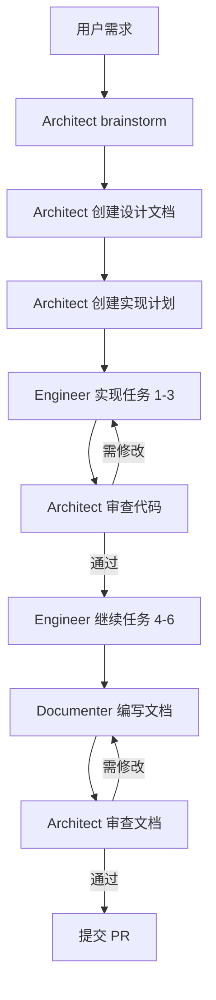

# Claude Code 多智能体实现深度解析

> 基于 Claude Code 实际使用经验的深度分析

---

## 目录

- [1. Claude Code 多智能体架构概览](#1-claude-code-多智能体架构概览)
- [2. 核心实现机制](#2-核心实现机制)
- [3. 实战工作流](#3-实战工作流)
- [4. 关键技术细节](#4-关键技术细节)
- [5. 与 OpenCode 架构对比](#5与-opencode-架构对比)

---

## 1. Claude Code 多智能体架构概览

### 1.1 Claude Code 的多智能体方式

Claude Code **本身不内置多智能体系统**，而是通过以下方式实现：

```
┌─────────────────────────────────────────────────────────────────┐
│                     用户作为"协调器"                            │
│                  (手动编排多个 Claude 实例)                      │
└─────────────────────────────────────────────────────────────────┘
                              │
                              ▼
┌─────────────────────────────────────────────────────────────────┐
│                      Claude Code 终端                            │
│  ┌─────────────┐  ┌─────────────┐  ┌─────────────┐           │
│  │   窗口 1     │  │   窗口 2     │  │   窗口 3     │           │
│  │ Architect   │  │  Engineer    │  │ Documenter  │   ...      │
│  │  (设计审查)  │  │   (编码)     │  │   (文档)     │           │
│  └─────────────┘  └─────────────┘  └─────────────┘           │
└─────────────────────────────────────────────────────────────────┘
```

**核心特点**：
- 每个 Claude 实例独立运行
- 用户手动协调各实例间的通信
- 通过文件系统（共享代码库）传递信息
- 通过提示词（Prompt）定义角色和职责

---

## 2. 核心实现机制

### 2.1 角色分工模式

基于 [Denis Hartl 的实验](https://denishartl.com/exploring-collaborative-ai-coding-agents/) 和 [Jesse Vincent 的实践](https://blog.fsck.com/2025/10/05/how-im-using-coding-agents-in-september-2025/)：

```
┌─────────────────────────────────────────────────────────────────┐
│                        Architect                                │
│  职责：设计、规划、审查                                          │
│  ┌─────────────────────────────────────────────────────────┐   │
│  │ 1. 与用户 brainstorm，细化需求                            │   │
│  │ 2. 创建初始设计文档 (initial_plan.md)                    │   │
│  │ 3. 编写详细实现计划 (implementation.md)                   │   │
│  │ 4. 审查 Engineer 的代码                                   │   │
│  │ 5. 审查 Documenter 的文档                                 │   │
│  └─────────────────────────────────────────────────────────┘   │
└─────────────────────────────────────────────────────────────────┘
                              │
                              │ 指导
                              ▼
┌─────────────────────────────────────────────────────────────────┐
│                        Engineer                                 │
│  职责：编码实现                                                │
│  ┌─────────────────────────────────────────────────────────┐   │
│  │ 1. 读取 implementation.md                                │   │
│  │ 2. 按步骤执行任务                                        │   │
│  │ 3. 编写代码                                              │   │
│  │ 4. 编写测试                                              │   │
│  │ 5. 提交代码 (git commit)                                 │   │
│  └─────────────────────────────────────────────────────────┘   │
└─────────────────────────────────────────────────────────────────┘
                              │
                              │ 交付
                              ▼
┌─────────────────────────────────────────────────────────────────┐
│                       Documenter                               │
│  职责：文档编写                                                │
│  ┌─────────────────────────────────────────────────────────┐   │
│  │ 1. 读取 implementation.md 和代码                         │   │
│  │ 2. 理解代码架构                                          │   │
│  │ 3. 编写架构文档 (architecture.md)                        │   │
│  │ 4. 编写 API 文档                                         │   │
│  └─────────────────────────────────────────────────────────┘   │
└─────────────────────────────────────────────────────────────────┘
```

### 2.2 工作流程



### 2.3 物理设置

使用 iTerm2 等终端模拟器，分割窗口：

```
┌─────────────────────────────────────────────────────────────────┐
│                           iTerm2 窗口                          │
├─────────────────────────────────────────────────────────────────┤
│  ┌─────────────┬─────────────┬─────────────┬─────────────┐   │
│  │ Architect   │  Engineer    │ Documenter  │   Shell     │   │
│  │             │             │             │             │   │
│  │ $ claude    │ $ claude    │ $ claude    │ $ cd ...    │   │
│  │             │             │             │ $ git ...    │   │
│  │             │             │             │             │   │
│  └─────────────┴─────────────┴─────────────┴─────────────┘   │
└─────────────────────────────────────────────────────────────────┘
```

---

## 3. 实战工作流

### 3.1 第一步：配置 CLAUDE.md

在项目根目录创建 `CLAUDE.md`，定义行为规范：

```markdown
# 项目指令

你是一个专业的软件工程师，使用 Claude Code 协助开发。

## 核心原则

1. **逐步推进**：不要一次性修改太多文件
2. **测试驱动**：每个功能都要有测试
3. **频繁提交**：每个小任务完成后都要 git commit
4. **遵循计划**：严格按照 implementation.md 执行

## 禁止行为

- ❌ 不要偏离计划
- ❌ 不要假设框架/库的用法
- ❌ 不要跳过测试
- ❌ 一次修改超过 3 个文件

## 期望行为

- ✅ 遇到不确定的地方，停下来问
- ✅ 每个任务完成后运行测试
- ✅ 使用具体的 commit message
- ✅ 保持代码简洁（DRY, YAGNI）

## 工具使用

- 使用 `ls` 查看目录结构
- 使用 `cat` 或 `Read` 查看文件
- 使用 `git diff` 查看变更
- 使用 `git log` 查看提交历史
```

### 3.2 第二步：Brainstorming Prompt

```bash
# 在 Architect 窗口执行
```

```
I've got an idea I want to talk through with you.
I'd like you to help me turn it into a fully formed design and spec
(and eventually an implementation plan).

Check out the current state of the project in our working directory
to understand where we're starting off, then ask me questions,
one at a time, to help refine the idea.

Ideally, the questions would be multiple choice, but open-ended
questions are OK, too. Don't forget: only one question per message.

Once you believe you understand what we're doing, stop and describe
the design to me, in sections of maybe 200-300 words at a time,
asking after each section whether it looks right so far.
```

**为什么有效**：
- 限制输出长度，让用户保持专注
- 一次一个问题，避免信息过载
- 分段确认设计，确保方向正确

### 3.3 第三步：Planning Prompt

```bash
# 在 Architect 窗口执行（设计确认后）
```

```
Great. I need your help to write out a comprehensive implementation plan.

Assume that the engineer has zero context for our codebase and questionable taste.
Document everything they need to know:
- Which files to touch for each task
- Code to write
- How to test it
- Commit messages to use

Give them the whole plan as bite-sized tasks.
DRY. YAGNI. TDD. Frequent commits.

Assume they are a skilled developer, but know almost nothing about
our toolset or problem domain. Assume they don't know good test design very well.

Please write out this plan, in full detail, into docs/plans/
```

**结果示例**：

```markdown
# Implementation Plan

## Task 1: Initialize Next.js Project
**Estimated time:** 15 minutes

### Steps
1. Create new Next.js app: `npx create-next-app@latest chess-app`
2. Configure TypeScript
3. Install dependencies: `npm install chess.js react-chessboard`

### Files to create
- `chess-app/package.json`
- `chess-app/tsconfig.json`
- `chess-app/next.config.js`

### Testing
Run `npm run dev` and verify the app starts

### Commit message
```
feat: initialize Next.js project with TypeScript
```

## Task 2: Create Chess Board Component
...
```

### 3.4 第四步：Implementation

```bash
# 在 Engineer 窗口执行
```

```
Please read @docs/plans/implementation.md and @docs/initial_plan.md.
Let me know if you have questions about the plan itself.

I will follow up with your actual instructions after.
```

然后：

```
Please implement task 1 and it's subtasks.
If you have questions, please stop and ask me.
DO NOT DEVIATE FROM THE PLAN.
```

### 3.5 第五步：Code Review

```bash
# 在 Architect 窗口执行
```

```
The engineer says it's done task 1.
Please check the work carefully.

Focus on:
1. Code quality and style
2. Test coverage
3. Adherence to the plan
4. Any potential issues

Let me know what needs to be fixed.
```

### 3.6 第六步：Documentation

```bash
# 在 Documenter 窗口执行
```

```
Your job is to document implementations created by the engineer.

First, please read @docs/plans/implementation.md and @docs/initial_plan.md.
Let me know if you have questions.

Please create documentation for task 1 (and all its subtasks).
Focus on:
- High-level architecture
- Component interactions
- Non-trivial logic
- Usage examples

Do not copy-paste every piece of code.
Create documentation in docs/ folder as required.
```

### 3.7 第七步：Iteration

```bash
# 清除 Engineer 上下文
*/clear

# 让 Engineer 继续
Please implement task 2-4.
Read @docs/plans/implementation.md for details.
DO NOT DEVIATE FROM THE PLAN.
```

同时，在 Architect 窗口：

```bash
# 重置 Architect 上下文，准备审查
*/compact

# 然后审查
The engineer says it's done tasks 2-4.
Please check the work carefully.
```

---

## 4. 关键技术细节

### 4.1 上下文管理

| 操作 | 命令 | 作用 |
|------|------|------|
| 保留完整历史 | (默认) | 用于 Architect 了解全局 |
| 清除上下文 | `*/clear` | 用于 Engineer 专注当前任务 |
| 压缩上下文 | `*/compact` | 用于 Architect 快速审查 |
| 重置到检查点 | 双击 `ESC` | 回退到之前的状态 |

**为什么需要多个窗口**：
```
同一个 Claude 实例：
- 上下文会累积，导致响应变慢
- 长对话中容易"遗忘"早期信息
- 难以同时承担多个角色

多个 Claude 实例：
- 每个 instance 专注单一职责
- 上下文隔离，响应更快
- 通过文件系统通信
```

### 4.2 文件通信协议

```
共享目录结构：
project/
├── docs/
│   ├── initial_plan.md      # Architect 创建
│   └── plans/
│       └── implementation.md # Architect 创建
├── src/                     # Engineer 修改
├── docs/
│   └── architecture.md      # Documenter 创建
└── CLAUDE.md                # 全局配置
```

**通信流程**：

```
Architect → Engineer:   读取 implementation.md
Engineer → Architect:   代码完成后，Architect 审查代码文件
Engineer → Documenter:  代码完成后，Documenter 阅读代码
Documenter → Architect: Architect 审查文档
```

### 4.3 YOLO Mode（可选）

```bash
# 跳过权限确认（危险！）
claude --dangerously-skip-permissions
```

**⚠️ 警告**：
- Claude 可以执行任何命令而不需要确认
- 建议在 Docker 容器中运行
- Anthropic 提供了 [Docker 参考](https://github.com/anthropics/claude-code/tree/main/.devcontainer)

### 4.4 Session 管理

**Pro 计划限制**：
- `$20/月` Pro 计划：有 session 限制
- 多实例会更快消耗 session
- 建议使用 Max 计划处理大型项目

**Session 重置策略**：
```bash
# 在 Architect 窗口（保留计划）
*/compact   # 压缩但保留关键信息

# 在 Engineer 窗口（清理历史）
*/clear    # 完全重置，重新加载计划

# 在 Documenter 窗口（按需清理）
*/compact or */clear
```

---

## 5. 与 OpenCode 架构对比

### 5.1 架构哲学对比

| 维度 | Claude Code | OpenCode |
|------|-------------|----------|
| **编排方式** | 手动编排 | 自动编排 |
| **智能体隔离** | 独立进程/窗口 | 共享进程 |
| **通信机制** | 文件系统 | 内存/事件 |
| **上下文管理** | 手动 `*/clear` | 自动管理 |
| **并发执行** | 用户控制多窗口 | 内置并发引擎 |

### 5.2 并发机制对比

```
Claude Code 并发：

┌─────────────────────────────────────────────────────────────────┐
│  用户手动协调                                                  │
│  ┌─────────────┬─────────────┬─────────────┐                 │
│  │  Claude 1   │  Claude 2   │  Claude 3   │                 │
│  │  独立进程   │  独立进程   │  独立进程   │                 │
│  └─────────────┴─────────────┴─────────────┘                 │
│         │             │             │                           │
│         └─────────────┴─────────────┘                           │
│                   共享文件系统                                  │
└─────────────────────────────────────────────────────────────────┘

OpenCode 并发：

┌─────────────────────────────────────────────────────────────────┐
│  WorkflowOrchestrator 自动协调                                 │
│  ┌─────────────────────────────────────────────────────────┐   │
│  │                    单一进程                              │   │
│  │  ┌───────────┬───────────┬───────────┐                 │   │
│  │  │ Subtask 1 │ Subtask 2 │ Subtask 3 │  共享内存      │   │
│  │  │ (session) │ (session) │ (session) │                 │   │
│  │  └───────────┴───────────┴───────────┘                 │   │
│  └─────────────────────────────────────────────────────────┘   │
└─────────────────────────────────────────────────────────────────┘
```

### 5.3 各自优势

**Claude Code 优势**：
- ✅ 完全控制每个智能体的行为
- ✅ 可视化进度（多窗口）
- ✅ 灵活的人工干预
- ✅ 利用现有工具（Claude Code CLI）

**OpenCode 优势**：
- ✅ 自动化的并发执行
- ✅ 内置的依赖管理
- ✅ 统一的进度跟踪
- ✅ 更好的资源利用

### 5.4 可借鉴的设计

| Claude Code 特性 | OpenCode 可借鉴 |
|-------------------|-----------------|
| 手动编排的经验 | 半自动模式（用户可干预） |
| 多窗口可视化 | 进度面板 |
| CLAUDE.md 配置 | Agent 配置文件 |
| `*/clear` 语义 | 上下文重置 API |
| 文件系统通信 | 跨会话消息传递 |

---

## 总结

### Claude Code 多智能体的本质

```
Claude Code ≠ 内置多智能体系统

Claude Code = 强大的单智能体 + 用户的编排能力

多智能体 = 多个 Claude 实例 + 人工协调
```

### 关键要点

1. **没有魔法**：Claude Code 不内置复杂的多智能体系统
2. **手动即力量**：用户完全控制流程
3. **简单有效**：文件系统作为通信机制
4. **可扩展性**：易于添加新角色（测试员、安全审查等）
5. **学习曲线**：需要实践掌握编排技巧

### 实战建议

如果你想在 OpenCode 中实现类似功能：

1. **先支持手动模式**：让用户显式指定多个任务
2. **提供进度可视化**：实时显示各子任务状态
3. **支持人工干预**：允许暂停、继续、修改
4. **渐进式自动化**：从手动编排逐步过渡到自动编排

---

## 参考资源

- [Denis Hartl 的多智能体实验](https://denishartl.com/exploring-collaborative-ai-coding-agents/)
- [Jesse Vincent 的 Claude Code 工作流](https://blog.fsck.com/2025/10/05/how-im-using-coding-agents-in-september-2025/)
- [Claude Code 官方文档](https://docs.anthropic.com/en/docs/claude-code)
- [Docker 参考实现](https://github.com/anthropics/claude-code/tree/main/.devcontainer)
