# AI Agent 项目深度分析文档

## 目录

1. [项目概述](#项目概述)
2. [架构设计](#架构设计)
3. [核心技术能力](#核心技术能力)
4. [工作原理](#工作原理)
5. [流程图](#流程图)
6. [技术栈详解](#技术栈详解)
7. [设计模式](#设计模式)
8. [扩展性设计](#扩展性设计)

---

## 项目概述

### 项目定位

这是一个基于 **Domain-Driven Design (DDD)** 和 **Repository Pattern** 构建的企业级多会话 AI Agent 系统。项目采用 TypeScript 开发，使用分层架构设计，支持 CLI 交互模式和非交互的 Demo 模式。

### 核心特性

| 特性 | 说明 |
|------|------|
| **多会话管理** | 支持多个独立会话，每个会话可独立管理消息历史 |
| **三层存储架构** | 创新的分层存储设计，平衡性能和内存使用 |
| **智能会话压缩** | 使用 LLM 自动压缩长对话，保留关键上下文 |
| **工具生态系统** | 内置 12+ 工具，支持 MCP 协议扩展 |
| **CLI 命令系统** | 完整的命令行交互界面，支持历史记录 |
| **类型安全** | 完整的 TypeScript 类型定义 |

### 项目统计

```bash
# 技术栈版本
TypeScript: 5.9.3
Node.js: 现代版本支持
MongoDB: 9.1.3
```

---

## 架构设计

### 整体架构图

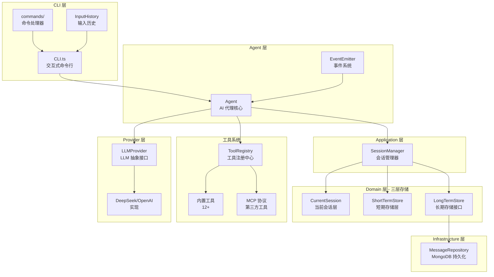

### 分层职责

#### 1. CLI 层 (src/cli/)

**职责**: 用户交互和命令处理

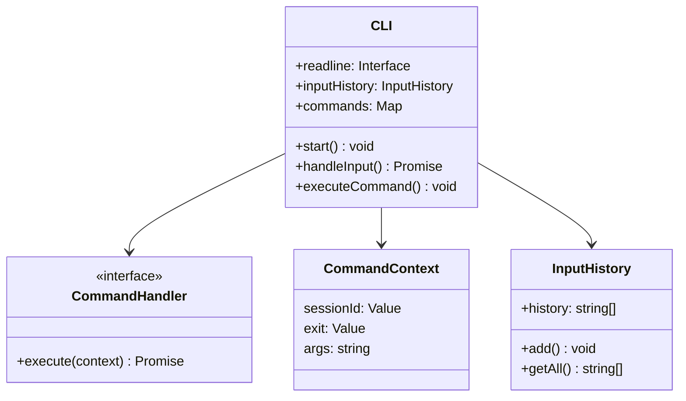

#### 2. Agent 层 (src/agent/)

**职责**: LLM 调用编排和工具执行循环

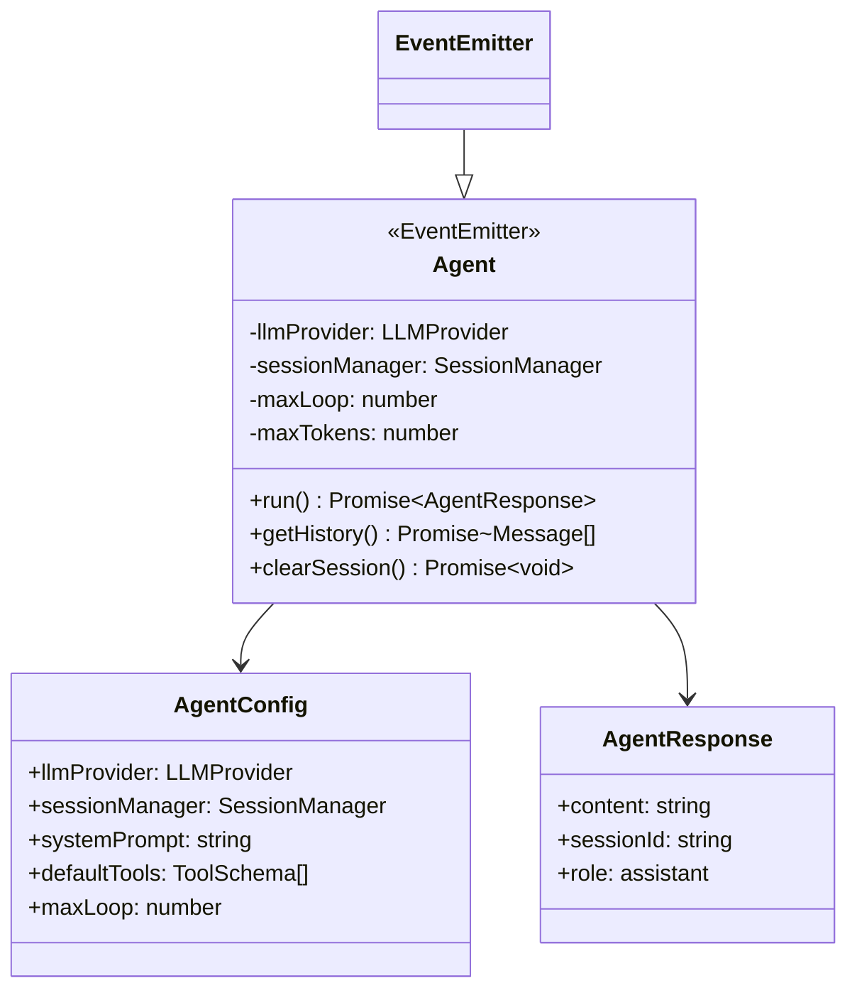

#### 3. Domain 层 (src/domain/)

**职责**: 核心业务领域模型

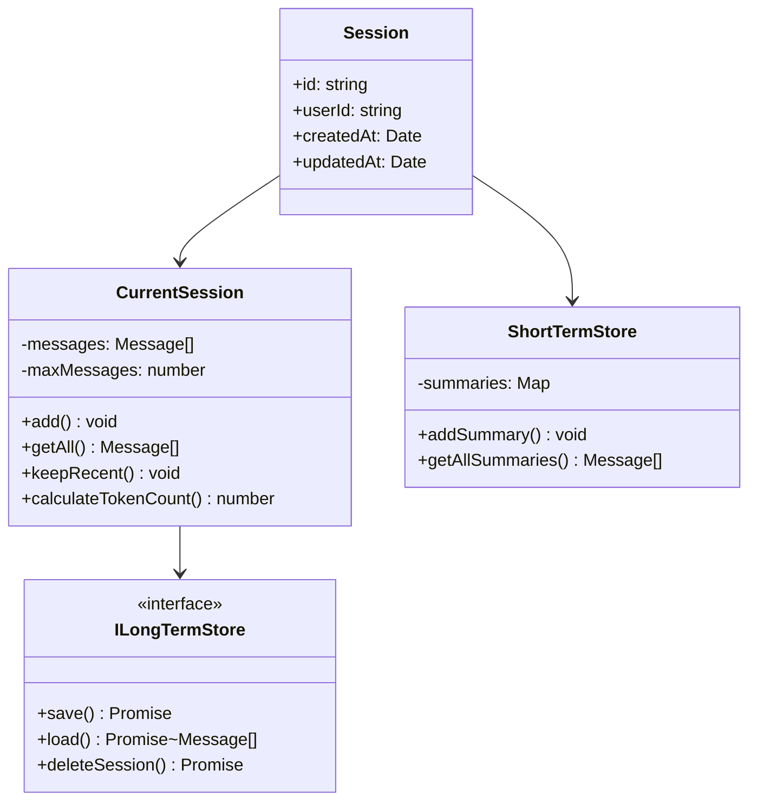

---

## 核心技术能力

### 1. 三层存储架构

这是项目最核心的技术创新，解决了长对话上下文管理的难题。

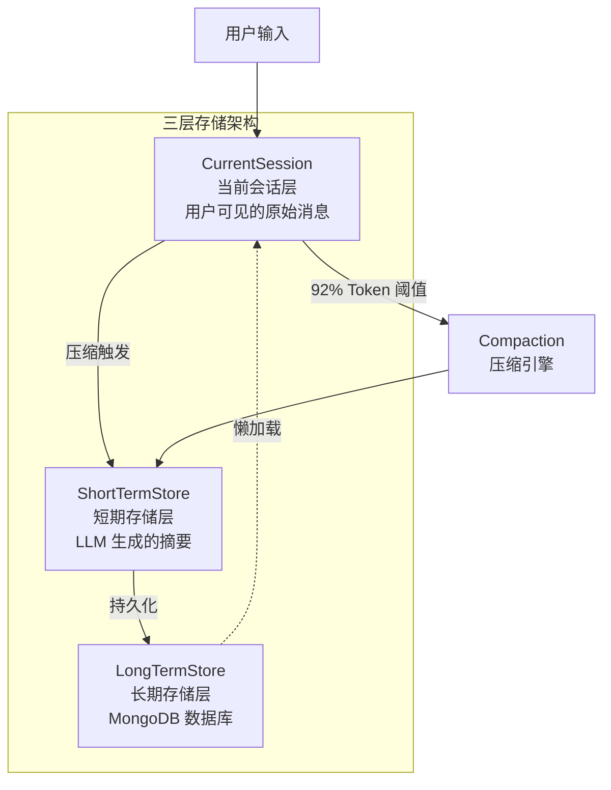

#### 工作原理

| 层级 | 存储内容 | 触发条件 | 保留策略 |
|------|----------|----------|----------|
| **CurrentSession** | 用户可见的原始消息 | - | 最长 100 条 |
| **ShortTermStore** | 压缩后的摘要 | Token 使用率达 92% | 累积摘要 |
| **LongTermStore** | 所有持久化数据 | 每次消息变更 | 永久存储 |

#### 压缩算法

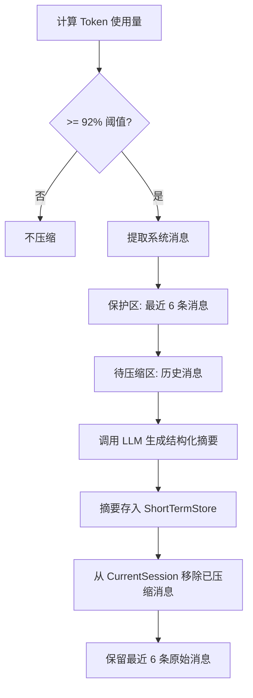

**结构化摘要模板** (8 个维度):

1. **Primary Request and Intent** - 用户核心目标
2. **Key Technical Concepts** - 涉及的技术栈
3. **Files and Code Sections** - 相关文件路径
4. **Errors and Fixes** - 错误和解决方案
5. **Problem Solving** - 问题解决思路
6. **All User Messages** - 用户关键指令
7. **Pending Tasks** - 未完成任务
8. **Current Work** - 当前进度

### 2. Token 精确估算

```typescript
// 经验系数算法
private estimate(text: string): number {
    // CJK 字符: 1:1
    const chineseChars = text.match(/[\u4e00-\u9fa5]/g)?.length || 0;
    // 其他字符: 4:1
    const otherChars = text.length - chineseChars;
    let tokenCount = Math.ceil(chineseChars * 1.0 + otherChars * 0.25);

    // JSON/代码增加 30% 开销
    if (isJson || isCode) {
        tokenCount = Math.ceil(tokenCount * 1.3);
    }

    // 特殊字符额外计算
    const specialChars = text.match(/[\d\{\}\[\]:,\.\(\)]/g)?.length || 0;
    tokenCount += Math.ceil(specialChars * 0.5);

    return tokenCount;
}
```

### 3. 工具系统

#### 工具架构

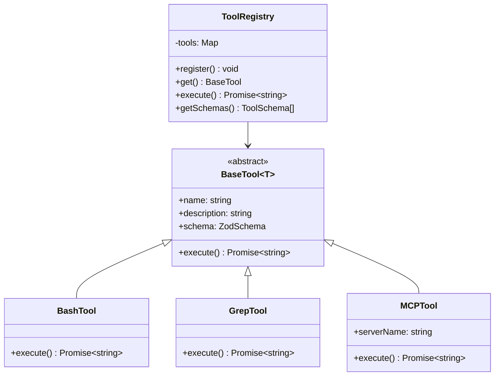

#### 内置工具清单

| 工具名称 | 功能描述 | 输入 |
|---------|----------|-----|
| `bash` | 执行 Shell 命令 | command?: string, language?: "node"|"python"|"python3", code?: string, args?: string[], stdin?: string |
| `glob` | 文件模式匹配 | pattern: string |
| `grep` | 代码内容搜索 | pattern, path, glob |
| `read_file` | 读取文件内容 | file_path: string |
| `write_file` | 写入文件 | file_path, content |
| `surgical_edit` | 精确文本替换 | file_path, old_str, new_str |
| `batch_replace` | 批量替换 | file_path, replacements |
| `todo_read` | 读取任务列表 | - |
| `todo_write` | 写入任务列表 | todos: array |
| `list_backups` | 列出备份 | - |
| `clean_backups` | 清理备份 | - |
| `web_search` | 网络搜索 | query: string |

Note: `bash` supports inline node/python via `language` + `code`. Use `stdin` to pipe data when using `command`.

#### MCP 协议集成

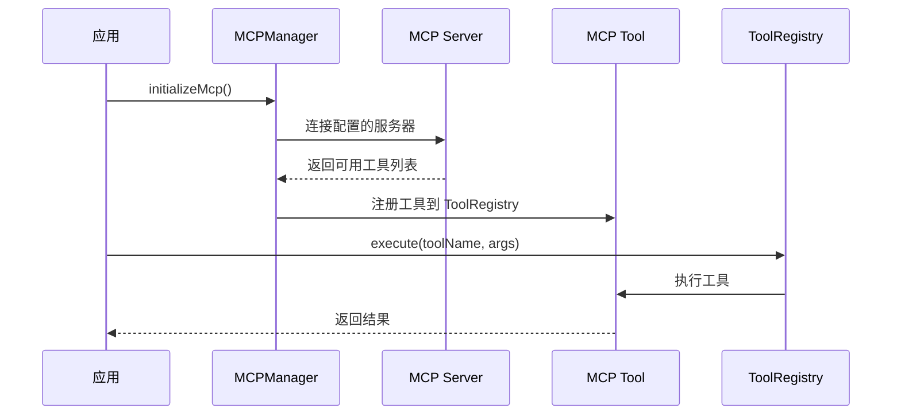

### 4. CLI 命令系统

#### 命令模式实现

```mermaid
flowchart LR
    A[用户输入] --> B{是命令吗?}
    B -->|是 (以 / 开头)| C[解析命令]
    B -->|否| D[作为用户消息]
    C --> E[命令路由]
    E --> F[执行处理器]
    F --> G[更新 CommandContext]
    G --> H{需要退出?}
    H -->|是| I[退出程序]
    H -->|否| J[继续等待输入]
```

#### 可用命令

| 命令 | 别名 | 功能 |
|------|------|------|
| `/exit` | `/quit`, `/q` | 退出程序 |
| `/clear` | - | 清除屏幕 |
| `/history` | - | 显示会话历史 |
| `/session` | `/sess` | 切换/创建会话 |
| `/help` | `/?`, `/h` | 显示帮助 |

---

## 工作原理

### Agent 运行循环

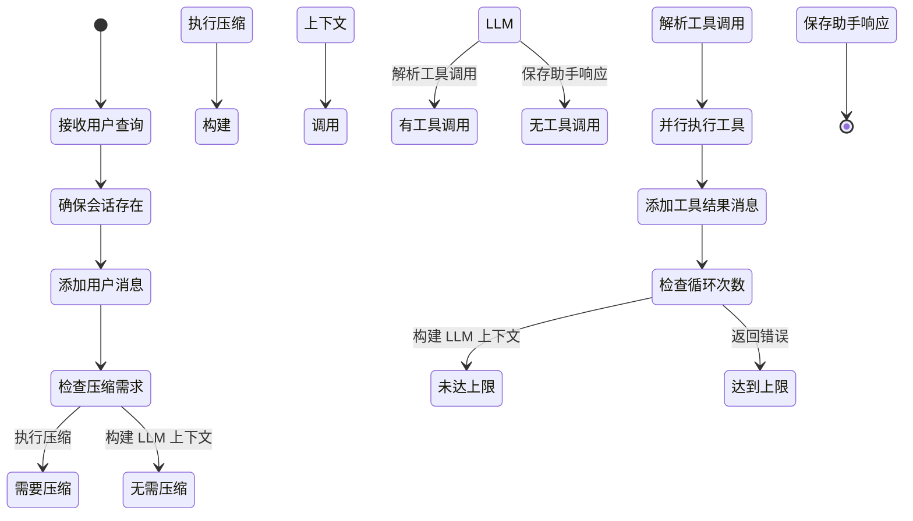

### 详细执行流程

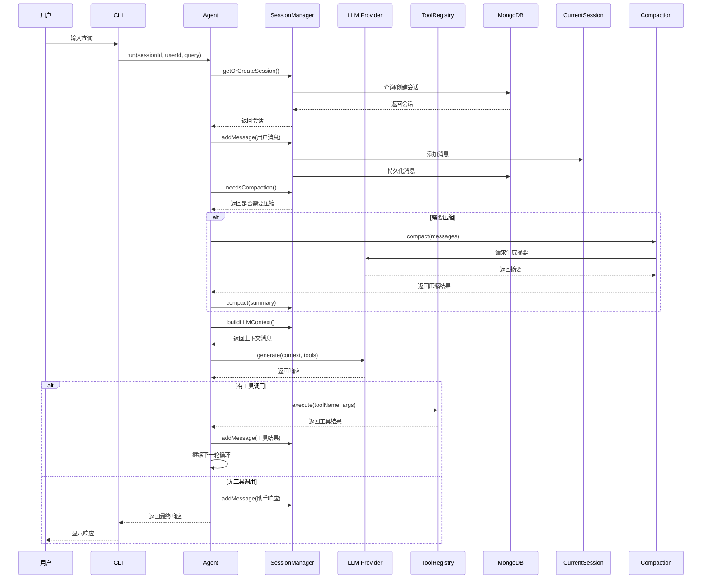

---

## 流程图

### 完整请求处理流程

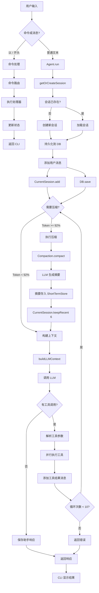

### 会话压缩流程

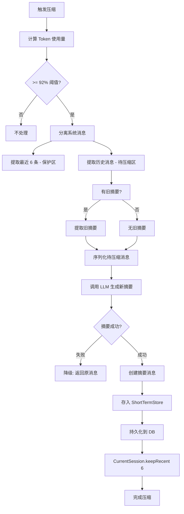

### 工具执行流程

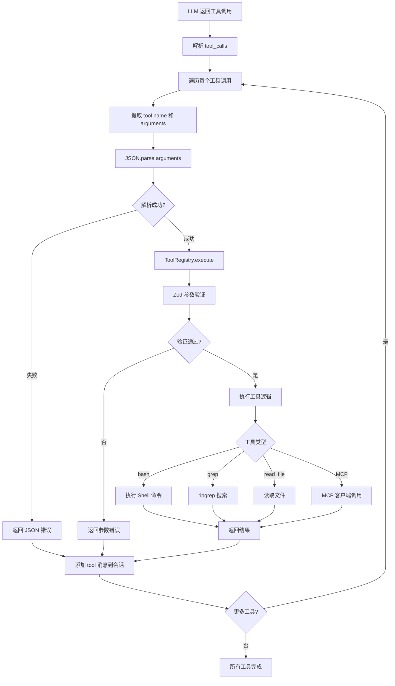

### 会话恢复流程

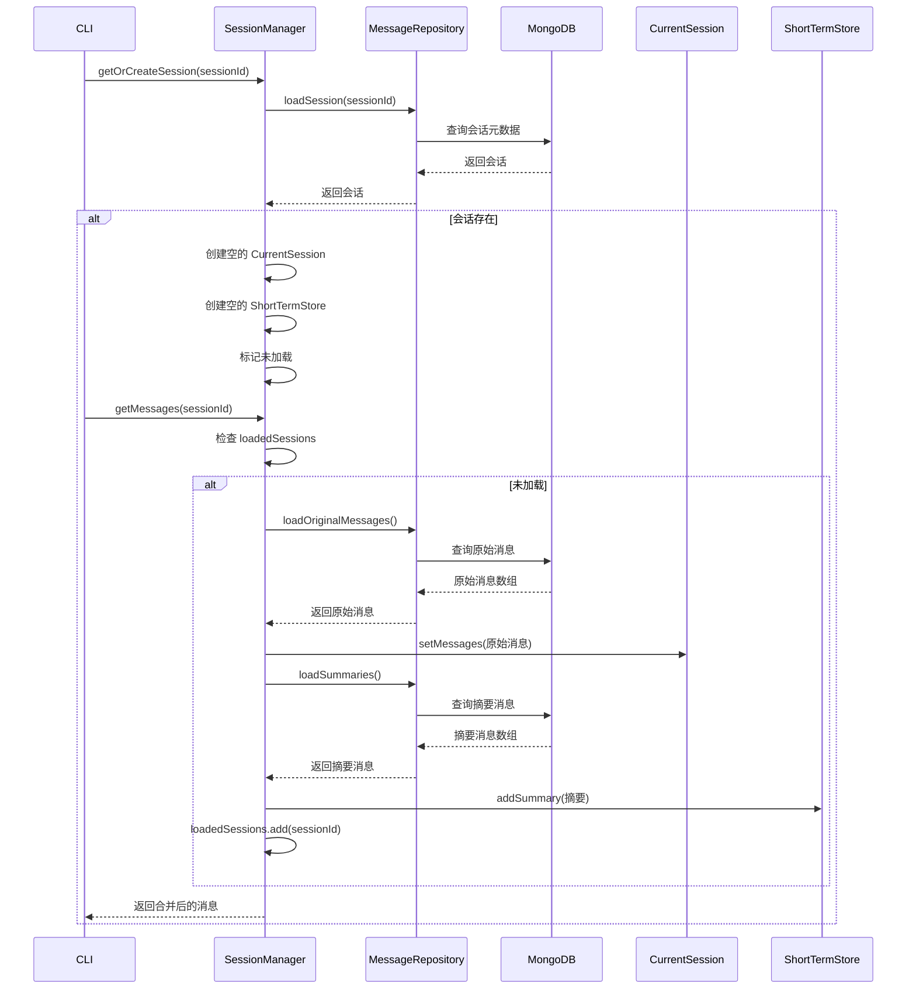

---

## 技术栈详解

### 核心依赖

| 依赖 | 版本 | 用途 |
|------|------|------|
| `typescript` | 5.9.3 | 类型系统 |
| `mongoose` | 9.1.3 | MongoDB ODM |
| `zod` | 最新 | 运行时类型验证 |
| `ora` | 最新 | CLI 加载动画 |
| `prompts` | 最新 | CLI 交互 |
| `@mcpc-tech/ripgrep-napi` | 最新 | 代码搜索 |
| `openai` | 最新 | LLM SDK |

### 环境配置

```bash
# .env.development / .env.production
DEEPSEEK_API_KEY=your_api_key
DEEPSEEK_BASE_URL=https://api.deepseek.com
MONGODB_URI=mongodb://localhost:27017/ai-agent
```

---

## 设计模式

### 1. Repository Pattern

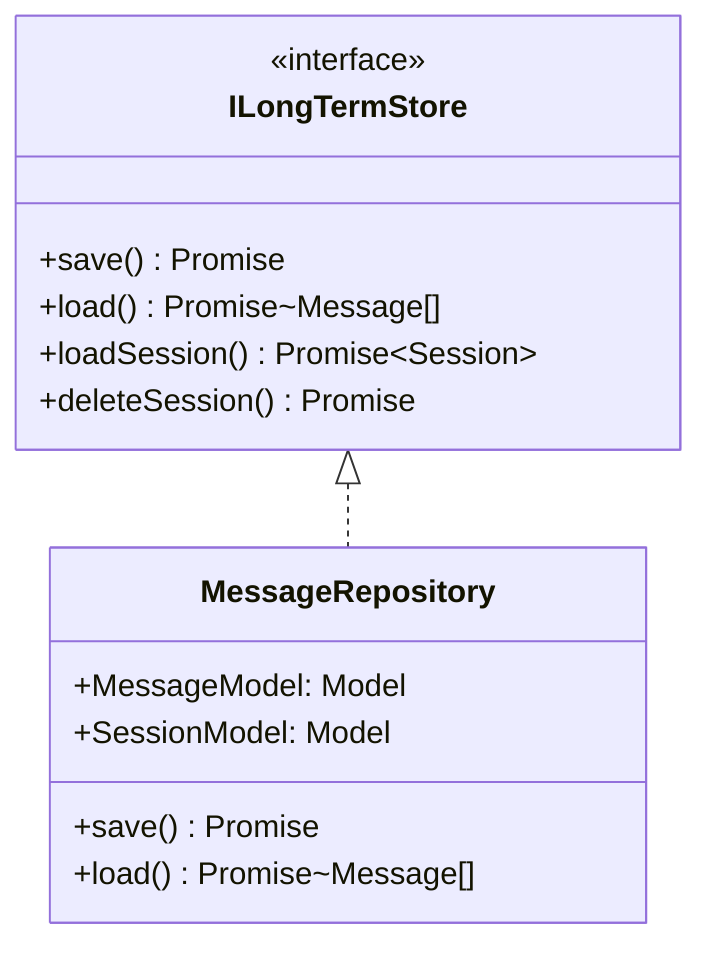

**优势**: 解耦业务逻辑与数据存储，易于切换数据库实现。

### 2. Strategy Pattern (LLM Provider)

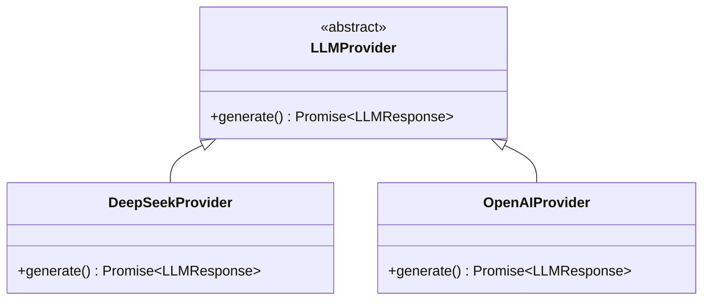

**优势**: 运行时切换不同的 LLM 提供商，无需修改 Agent 代码。

### 3. Command Pattern (CLI 命令)

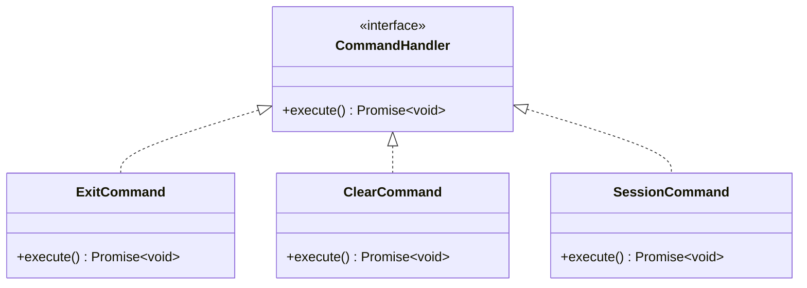

**优势**: 新增命令无需修改主 CLI 类，符合开闭原则。

### 4. Singleton Pattern (ToolRegistry)

```typescript
export class ToolRegistry {
    private static tools: Map<string, BaseTool<any>> = new Map();

    private constructor() {}

    static register<T>(tool: T | T[]): void { ... }
    static get<T>(name: string): T | undefined { ... }
}
```

**优势**: 全局唯一的工具注册表，避免重复初始化。

### 5. Event-Driven (Agent)

```typescript
class Agent extends EventEmitter {
    async run(...) {
        this.emit('start', { sessionId });
        // ... 执行逻辑
        this.emit('success', { sessionId, response });
        this.emit('end', { sessionId });
    }
}
```

**优势**: 解耦 Agent 执行过程与监控、日志等横切关注点。

---

## 扩展性设计

### 添加新的 LLM Provider

```typescript
// 1. 继承 LLMProvider
class CustomProvider extends LLMProvider {
    async generate(messages: Message[], options?: LLMOptions): Promise<LLMResponse> {
        // 自定义实现
    }
}

// 2. 使用
const agent = new Agent({
    llmProvider: new CustomProvider({ apiKey: 'xxx' }),
    // ...
});
```

### 添加新的工具

```typescript
// 1. 继承 BaseTool
class MyTool extends BaseTool<{ input: string }> {
    name = 'my_tool';
    description = 'My custom tool';
    schema = z.object({ input: z.string() });

    async execute(args): Promise<string> {
        return `Result: ${args.input}`;
    }
}

// 2. 注册
ToolRegistry.register(new MyTool());
```

### 添加新的 CLI 命令

```typescript
// 1. 创建命令处理器
const myCommand: CommandHandler = {
    name: 'mycommand',
    description: 'My command',
    execute: async (context) => {
        console.log('My command executed');
    }
};

// 2. 注册到 commands/index.ts
export function registerCommands(commands: CommandMap) {
    commands.set('mycommand', myCommand);
}
```

### 连接 MCP 服务器

```json
// mcp.config.json
{
  "servers": {
    "filesystem": {
      "command": "npx",
      "args": ["-y", "@modelcontextprotocol/server-filesystem", "/path/to/allowed/files"]
    }
  }
}
```

---

## 性能优化

### 1. 并行工具执行

```typescript
// 所有工具调用并行执行
const toolPromises = llmResponse.tool_calls.map(async (toolCall) => {
    return await ToolRegistry.execute(fn.name, args);
});
const results = await Promise.all(toolPromises);
```

### 2. 懒加载历史记录

```typescript
// 只在需要时从 DB 加载
async getMessages(sessionId: string): Promise<Message[]> {
    if (!this.loadedSessions.has(sessionId)) {
        await this.loadFullHistory(sessionId);
    }
    return this.getMessagesFromMemory(sessionId);
}
```

### 3. 数据库索引优化

```javascript
// 复合索引优化查询
MessageSchema.index({ sessionId: 1, createdAt: 1 });
```

---

## 总结

### 项目亮点

1. **三层存储架构** - 创新的会话管理方案
2. **智能压缩** - 使用 LLM 生成结构化摘要
3. **完整工具生态** - 内置工具 + MCP 扩展
4. **类型安全** - 完整的 TypeScript 类型系统
5. **清晰分层** - DDD 架构，职责明确
6. **高扩展性** - 多种设计模式支持扩展

### 适用场景

- 智能编程助手
- 知识库问答系统
- 自动化运维工具
- 对话式数据分析
- 多轮任务编排系统
