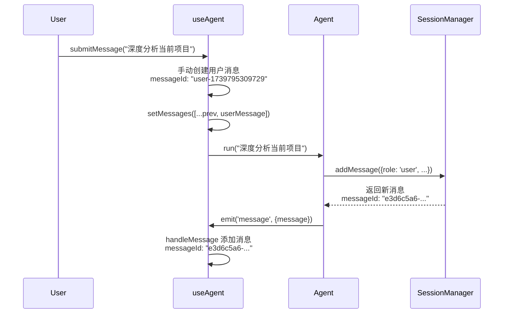
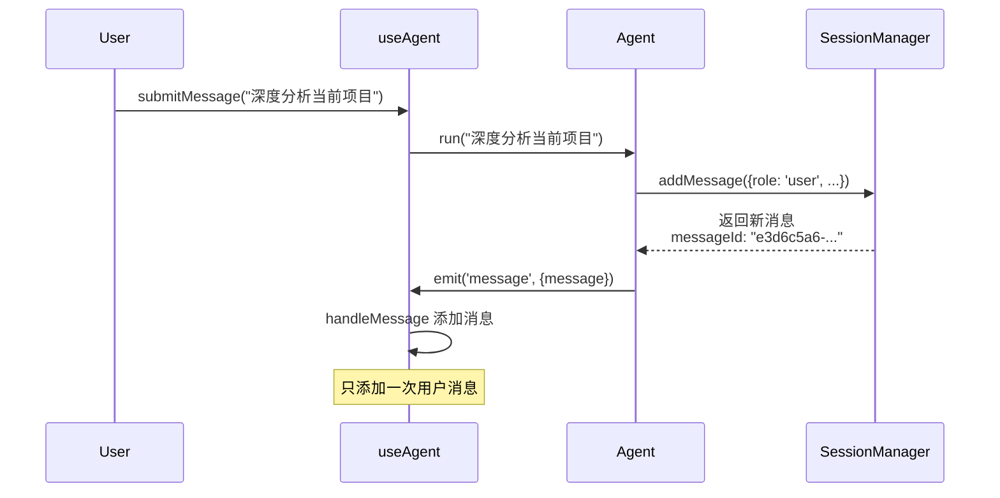

# 用户消息重复显示问题分析

## 问题描述

在 CLI 展示中，用户消息被显示两次：

```
> 深度分析当前项目

> 深度分析当前项目

●todo_create ...
```

---

## 问题根源

### 数据流分析



### 问题代码

**use-agent.ts 中的 submitMessage（修复前）**：
```typescript
const submitMessage = (message: string) => {
    const currentAgent = agentRef.current;
    if (currentAgent && message) {
        setError(null);
        setIsLoading(true);

        // ❌ 问题：手动创建用户消息
        const userMessage: Message = {
            messageId: `user-${Date.now()}`,  // "user-1739795309729"
            role: 'user',
            content: message,
        };
        setMessages(prev => [...prev, userMessage]);

        // 调用 Agent.run
        currentAgent.run(message, { stream: true });
    }
};
```

**Agent.ts 中的 run 方法**：
```typescript
async run(query: string, options?: AgentRunOptions) {
    // ...
    const userMessage: Message = this.sessionManager.addMessage({
        role: 'user',
        type: 'text',
        content: query
    } as Message);
    // messageId: "e3d6c5a6-7a73-44c9-9a97-15d8b10ce576" (由 sessionManager 生成)

    this.events.emit('message', { message: userMessage });
    // ...
}
```

**结果**：
1. `use-agent.ts` 手动添加用户消息 → `messageId: "user-1739795309729"`
2. `Agent.run` 内部添加用户消息并发出事件 → `messageId: "e3d6c5a6-7a73-44c9-9a97-15d8b10ce576"`
3. 两条消息都进入 `messages` 状态，导致显示两次

---

## 修复方案

### 移除 submitMessage 中手动添加用户消息的代码

**修复后的 submitMessage**：
```typescript
const submitMessage = (message: string) => {
    const currentAgent = agentRef.current;
    if (currentAgent && message) {
        setError(null);
        setIsLoading(true);

        // ✅ 用户消息将由 Agent 内部创建并通过 message 事件发出
        // 不再手动添加，避免重复
        currentAgent.run(message, { stream: true });
    }
};
```

### 修复后的数据流



---

## messageId 生成规则总结

| 消息来源 | messageId 格式 | 示例 |
|---------|----------------|------|
| 用户消息 | 由 SessionManager 自动生成 | `e3d6c5a6-7a73-44c9-9a97-15d8b10ce576` |
| 助手文本 | LLM 提供的 messageId | `fc770255-2b23-4906-befc-bb06650552fa` |
| 工具调用 | `{baseMessageId}-{toolCall.id}` | `fc770255-call_95bb6e9aef1441ab...` |
| 工具结果 | 与工具调用相同的 messageId | `fc770255-call_95bb6e9aef1441ab...` |

---

## 修复后的展示效果

```
> 深度分析当前项目

●todo_create {"todos":[...]}
  ✓ (3ms)
  {...}

●todo_apply_ops {"ops":[...]}
  ✓ (2ms)
  {...}
```

用户消息只显示一次，工具调用正确显示并附带结果。

---

## 总结

| 问题 | 原因 | 解决方案 | 状态 |
|------|------|----------|------|
| 用户消息显示两次 | use-agent.ts 和 Agent.run 都添加用户消息 | 移除 use-agent.ts 中手动添加逻辑 | ✅ 已完成 |

---

## 相关文件

- **src/cli/hooks/use-agent.ts** - 修复 submitMessage 方法
- **src/agent/Agent.ts** - run 方法中创建用户消息
- **src/session-v2/index.ts** - SessionManager.addMessage 方法
