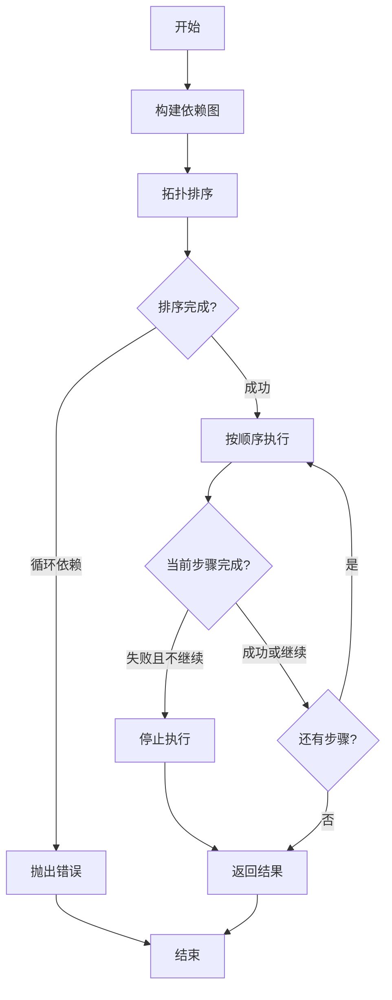
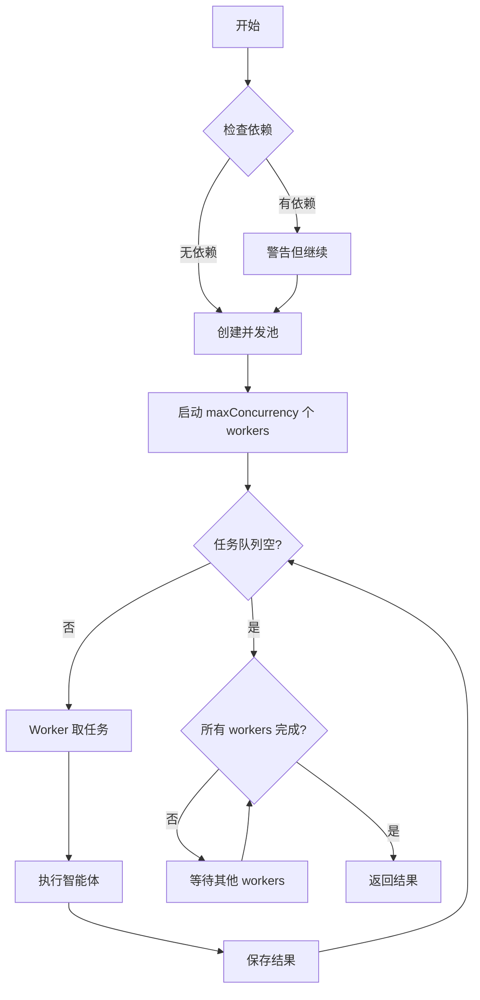
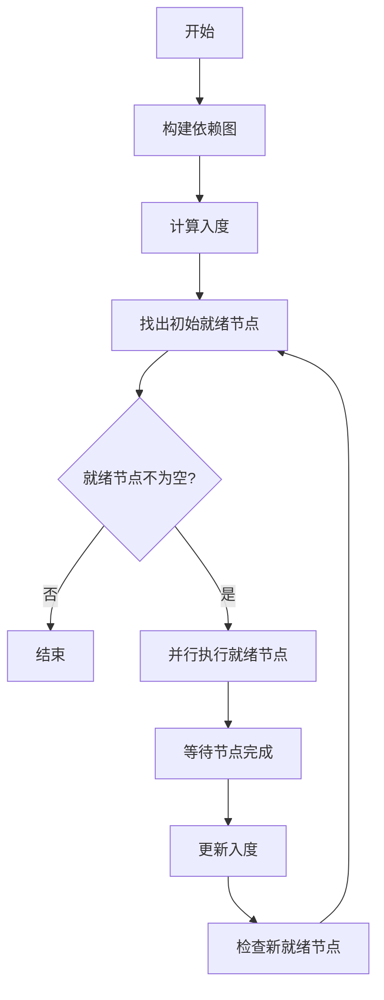
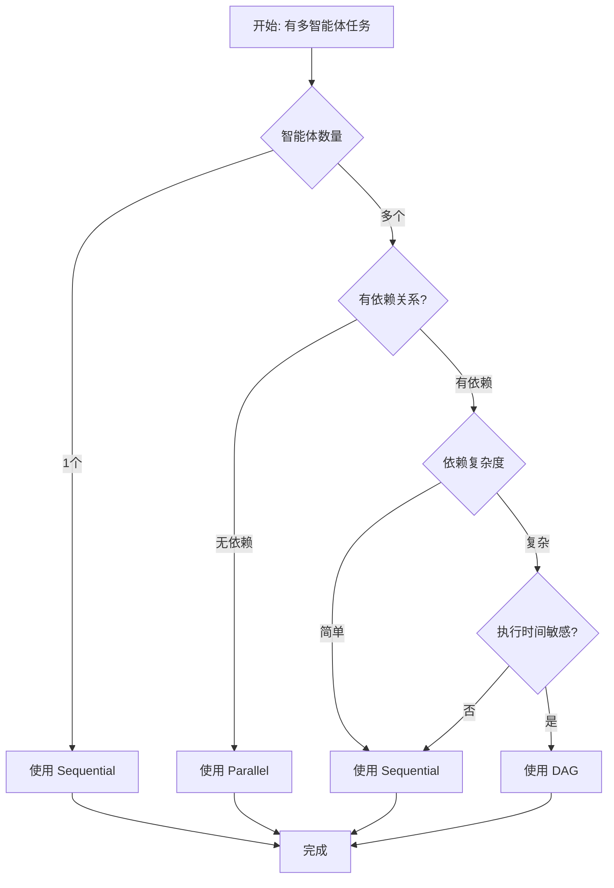

# 执行策略深度解析

> 本文深入分析三种多智能体执行策略的设计原理、实现细节和性能特性。

---

## 目录

- [1. 策略对比总览](#1-策略对比总览)
- [2. Sequential 策略深度解析](#2-sequential-策略深度解析)
- [3. Parallel 策略深度解析](#3-parallel-策略深度解析)
- [4. DAG 策略深度解析](#4-dag-策略深度解析)
- [5. 策略选择决策树](#5-策略选择决策树)
- [6. 性能对比分析](#6-性能对比分析)
- [7. 实战案例分析](#7-实战案例分析)

---

## 1. 策略对比总览

### 1.1 三维对比矩阵

| 维度 | Sequential | Parallel | DAG |
|------|-----------|----------|-----|
| **核心思想** | 按顺序逐个执行 | 同时执行所有 | 按依赖图调度 |
| **并行度** | 0 (完全串行) | N (完全并行) | 动态 (0 ~ N) |
| **依赖处理** | 自然支持 | 不支持 | 完全支持 |
| **执行顺序** | 可预测 | 不确定 | 半确定 |
| **容错性** | 中等 | 低 | 高 |
| **实现复杂度** | ★☆☆ | ★★☆ | ★★★ |
| **调试难度** | 低 | 中 | 高 |
| **资源利用** | 低 | 高 | 最优 |

### 1.2 可视化执行对比

```
假设有 4 个智能体：A → B → C, A → D

┌─────────────────────────────────────────────────────────────────┐
│                        Sequential                               │
├─────────────────────────────────────────────────────────────────┤
│  时间轴                                                         │
│  ├── A ─────────┤                                              │
│                ├── B ─────────┤                                │
│                             ├── C ─────────┤                  │
│                                          ├── D ─────────┤    │
│  总耗时: T(A) + T(B) + T(C) + T(D)                              │
└─────────────────────────────────────────────────────────────────┘

┌─────────────────────────────────────────────────────────────────┐
│                        Parallel                                 │
├─────────────────────────────────────────────────────────────────┤
│  时间轴                                                         │
│  ├── A ─────────┤                                              │
│  ├── B ─────────┤  (忽略依赖，同时执行，可能导致错误)           │
│  ├── C ─────────┤                                              │
│  ├── D ─────────┤                                              │
│  总耗时: max(T(A), T(B), T(C), T(D))                            │
│  ⚠️ 问题：B 和 D 依赖 A，但可能先于 A 完成                     │
└─────────────────────────────────────────────────────────────────┘

┌─────────────────────────────────────────────────────────────────┐
│                        DAG                                       │
├─────────────────────────────────────────────────────────────────┤
│  时间轴                                                         │
│  ├── A ─────────┤                                              │
│                 ├── B ─┤                                       │
│                 ├── D ─┤  (B 和 D 在 A 完成后并行执行)         │
│                          ├── C ─────────┤                      │
│  总耗时: T(A) + max(T(B), T(D)) + T(C)                         │
│  ✅ 优势：B 和 D 并行，但等待 A 完成                           │
└─────────────────────────────────────────────────────────────────┘
```

---

## 2. Sequential 策略深度解析

### 2.1 核心原理

**Sequential 策略**按拓扑排序的顺序逐个执行智能体，确保每个智能体在执行时其所有依赖都已完成。

```
依赖图:        拓扑排序结果:      执行顺序:
    A                  A              1. A
   / \                               2. B
  B   C              B → C           3. C
   \ /                               4. D
    D                  D
```

### 2.2 算法详解

#### 2.2.1 拓扑排序算法

```typescript
/**
 * Kahn 算法实现拓扑排序
 *
 * 时间复杂度: O(V + E)
 * 空间复杂度: O(V + E)
 * V = 顶点数(智能体数), E = 边数(依赖关系数)
 */
function topologicalSort(steps: AgentStep[]): AgentStep[] {
  // 1. 计算每个节点的入度
  const inDegree = new Map<string, number>()
  const graph = new Map<string, string[]>()

  // 初始化
  for (const step of steps) {
    inDegree.set(step.id, 0)
    graph.set(step.id, [])
  }

  // 构建图和入度
  for (const step of steps) {
    for (const dep of step.dependsOn ?? []) {
      graph.get(dep)?.push(step.id)
      inDegree.set(step.id, (inDegree.get(step.id) ?? 0) + 1)
    }
  }

  // 2. 找出所有入度为 0 的节点
  const queue: string[] = []
  for (const [id, degree] of inDegree) {
    if (degree === 0) {
      queue.push(id)
    }
  }

  // 3. 处理队列
  const sorted: AgentStep[] = []
  const stepMap = new Map(steps.map(s => [s.id, s]))

  while (queue.length > 0) {
    const id = queue.shift()!
    const step = stepMap.get(id)!
    sorted.push(step)

    // 减少依赖此节点的节点的入度
    for (const dependent of graph.get(id) ?? []) {
      const newDegree = (inDegree.get(dependent) ?? 0) - 1
      inDegree.set(dependent, newDegree)

      if (newDegree === 0) {
        queue.push(dependent)
      }
    }
  }

  // 4. 检查循环依赖
  if (sorted.length !== steps.length) {
    throw new Error('Circular dependency detected')
  }

  return sorted
}
```

#### 2.2.2 DFS 拓扑排序（替代方案）

```typescript
/**
 * DFS 实现拓扑排序
 *
 * 优势：可以在排序过程中检测循环依赖
 * 劣势：递归可能导致栈溢出
 */
function topologicalSortDFS(steps: AgentStep[]): AgentStep[] {
  const visited = new Set<string>()      // 已完成
  const visiting = new Set<string>()     // 访问中
  const sorted: AgentStep[] = []
  const stepMap = new Map(steps.map(s => [s.id, s]))

  function visit(stepId: string): void {
    if (visited.has(stepId)) return

    // 检测循环依赖
    if (visiting.has(stepId)) {
      throw new Error(`Circular dependency: ${stepId}`)
    }

    visiting.add(stepId)

    const step = stepMap.get(stepId)!
    const deps = step.dependsOn ?? []

    // 先访问所有依赖
    for (const dep of deps) {
      visit(dep)
    }

    visiting.delete(stepId)
    visited.add(stepId)
    sorted.push(step)
  }

  for (const step of steps) {
    visit(step.id)
  }

  return sorted
}
```

### 2.3 完整实现

```typescript
/**
 * Sequential 执行器完整实现
 */
export class SequentialExecutor {
  async execute(task: MultiAgentTask): Promise<WorkflowResult> {
    const startTime = Date.now()
    const results = new Map<string, AgentResult>()

    // 1. 拓扑排序
    const sortedSteps = this.topologicalSort(task.agents)

    // 2. 逐个执行
    for (const step of sortedSteps) {
      const context = { results }

      // 检查依赖是否都成功
      const deps = step.dependsOn ?? []
      for (const dep of deps) {
        const depResult = results.get(dep)
        if (depResult?.status === 'failed') {
          throw new Error(`Dependency "${dep}" failed`)
        }
      }

      // 执行当前步骤
      const result = await AgentRunner.execute(step, context)
      results.set(step.id, result)

      // 快速失败
      if (result.status === 'failed' && !step.continueOnError) {
        break
      }
    }

    // 3. 返回结果
    return this.buildResult(startTime, results)
  }

  private topologicalSort(steps: AgentStep[]): AgentStep[] {
    // 使用上面实现的拓扑排序算法
    // ...
  }

  private buildResult(
    startTime: number,
    results: Map<string, AgentResult>
  ): WorkflowResult {
    // ...
  }
}
```

### 2.4 执行流程图



### 2.5 性能特征

```
假设有 N 个智能体，平均执行时间为 T

┌─────────────────────────────────────────────────────────────┐
│                      时间复杂度                              │
├─────────────────────────────────────────────────────────────┤
│  拓扑排序:     O(N + E)    E = 依赖边数                      │
│  执行时间:     O(N × T)    串行执行                          │
│  空间复杂度:   O(N + E)    存储图和结果                      │
└─────────────────────────────────────────────────────────────┘

┌─────────────────────────────────────────────────────────────┐
│                      并行度分析                              │
├─────────────────────────────────────────────────────────────┤
│  最大并行度:   0            完全串行                         │
│  平均并行度:   0            无并行                           │
│  CPU 利用:    ~1-5%        只有一个智能体在运行             │
└─────────────────────────────────────────────────────────────┘

┌─────────────────────────────────────────────────────────────┐
│                      适用场景                                │
├─────────────────────────────────────────────────────────────┤
│  ✅ 智能体间有强数据依赖                                      │
│  ✅ 需要严格的执行顺序                                        │
│  ✅ 调试和故障排查                                            │
│  ✅ 资源受限的环境                                            │
│  ❌ 大量独立任务                                              │
│  ❌ 对总执行时间敏感                                          │
└─────────────────────────────────────────────────────────────┘
```

---

## 3. Parallel 策略深度解析

### 3.1 核心原理

**Parallel 策略**同时启动所有智能体，使用 `Promise.all` 或 `Promise.allSettled` 等待全部完成。

```typescript
// 核心思想
const results = await Promise.allSettled(
  agents.map(agent => executeAgent(agent))
)
```

### 3.2 并发控制

#### 3.2.1 无限制并发（简单但危险）

```typescript
/**
 * 无限制并行执行
 *
 * ⚠️ 风险：可能耗尽系统资源
 */
async function executeUnlimited(agents: AgentStep[]): Promise<AgentResult[]> {
  return await Promise.allSettled(
    agents.map(agent => AgentRunner.execute(agent, {}))
  )
}
```

**问题示例**：
```
100 个智能体同时执行：
├── 100 个并发 HTTP 请求
├── 可能触发 API 限流
├── 内存占用激增
└── 可能导致进程崩溃
```

#### 3.2.2 分批并发（推荐）

```typescript
/**
 * 分批并发执行
 *
 * 将智能体分成批次，每批最多 maxConcurrency 个
 */
async function executeBatches(
  agents: AgentStep[],
  maxConcurrency: number
): Promise<Map<string, AgentResult>> {
  const results = new Map<string, AgentResult>()

  // 分批
  for (let i = 0; i < agents.length; i += maxConcurrency) {
    const batch = agents.slice(i, i + maxConcurrency)

    // 并行执行批次
    const batchResults = await Promise.allSettled(
      batch.map(agent => AgentRunner.execute(agent, { results }))
    )

    // 收集结果
    for (let j = 0; j < batch.length; j++) {
      const step = batch[j]
      const result = batchResults[j]

      results.set(step.id, result.status === 'fulfilled'
        ? result.value
        : { stepId: step.id, status: 'failed', error: result.reason }
      )
    }
  }

  return results
}
```

**执行可视化**：

```
假设 10 个智能体，maxConcurrency = 3

批次 1: [A, B, C]     批次 2: [D, E, F]     批次 3: [G, H, I]     批次 4: [J]
├── A ──┤            ├── D ──┤            ├── G ──┤            ├── J ──┤
├── B ────┤          ├── E ────┤          ├── H ──┤
├── C ─────┤         ├── F ──┤            ├── I ───┤

时间线:
  0s    2s    4s    6s    8s   10s
  │─────│─────│─────│─────│─────│
   批次1  批次2  批次3  批次4
```

#### 3.2.3 动态并发池（最优）

```typescript
/**
 * 动态并发池
 *
 * 维护一个固定大小的并发池，当有任务完成时立即添加新任务
 */
class ConcurrencyPool {
  private queue: AgentStep[] = []
  private running = new Set<string>()
  private results = new Map<string, AgentResult>()

  constructor(
    private agents: AgentStep[],
    private maxConcurrency: number
  ) {
    this.queue = [...agents]
  }

  async execute(): Promise<Map<string, AgentResult>> {
    const workers: Promise<void>[] = []

    // 启动初始 workers
    for (let i = 0; i < Math.min(this.maxConcurrency, this.agents.length); i++) {
      workers.push(this.worker())
    }

    await Promise.all(workers)
    return this.results
  }

  private async worker(): Promise<void> {
    while (this.queue.length > 0 || this.running.size > 0) {
      // 获取下一个任务
      const step = this.queue.shift()
      if (!step) {
        // 等待其他 workers 完成任务
        await new Promise(resolve => setTimeout(resolve, 10))
        continue
      }

      this.running.add(step.id)

      try {
        const result = await AgentRunner.execute(step, { results: this.results })
        this.results.set(step.id, result)
      } finally {
        this.running.delete(step.id)
      }
    }
  }
}
```

### 3.3 完整实现

```typescript
/**
 * Parallel 执行器完整实现
 */
export class ParallelExecutor {
  async execute(
    task: MultiAgentTask,
    options?: { maxConcurrency?: number }
  ): Promise<WorkflowResult> {
    const startTime = Date.now()
    const maxConcurrency = options?.maxConcurrency ?? task.agents.length

    // 1. 验证无依赖
    this.validateNoDependencies(task.agents)

    // 2. 执行
    const pool = new ConcurrencyPool(task.agents, maxConcurrency)
    const results = await pool.execute()

    // 3. 返回结果
    return this.buildResult(startTime, results)
  }

  private validateNoDependencies(agents: AgentStep[]): void {
    const hasDeps = agents.some(a => a.dependsOn?.length)
    if (hasDeps) {
      console.warn('Parallel strategy ignores dependencies')
    }
  }

  private buildResult(/* ... */): WorkflowResult {
    // ...
  }
}
```

### 3.4 执行流程图



### 3.5 性能特征

```
假设有 N 个智能体，平均执行时间为 T

┌─────────────────────────────────────────────────────────────┐
│                      时间复杂度                              │
├─────────────────────────────────────────────────────────────┤
│  执行时间:     O(T)        理想情况下，所有智能体同时完成     │
│  实际时间:     O(T × ceil(N/M))  M = maxConcurrency         │
│  空间复杂度:   O(N)         存储结果                         │
└─────────────────────────────────────────────────────────────┘

┌─────────────────────────────────────────────────────────────┐
│                      并行度分析                              │
├─────────────────────────────────────────────────────────────┤
│  最大并行度:   N            无限制并发                        │
│  实际并行度:   min(N, M)    受 maxConcurrency 限制          │
│  平均并行度:   min(N, M)    稳定的并发数                     │
│  CPU 利用:    80-95%       高利用率                          │
└─────────────────────────────────────────────────────────────┘

┌─────────────────────────────────────────────────────────────┐
│                      适用场景                                │
├─────────────────────────────────────────────────────────────┤
│  ✅ 智能体间完全独立                                          │
│  ✅ 对总执行时间敏感                                          │
│  ✅ 智能体数量可控                                            │
│  ✅ 资源充足的环境                                            │
│  ❌ 有依赖关系的任务                                          │
│  ❌ 需要严格顺序                                              │
└─────────────────────────────────────────────────────────────┘
```

---

## 4. DAG 策略深度解析

### 4.1 核心原理

**DAG 策略**将智能体依赖关系建模为有向无环图（DAG），自动识别可并行执行的节点。

#### 4.1.1 DAG 建模

```
原始任务:
{
  agents: [
    { id: 'A', agent: 'general' },
    { id: 'B', agent: 'general', dependsOn: ['A'] },
    { id: 'C', agent: 'general', dependsOn: ['A'] },
    { id: 'D', agent: 'general', dependsOn: ['B', 'C'] },
  ]
}

转换为 DAG:

    A (入度: 0)
   ↙ ↘
  B   C (入度: 1)
   ↘ ↙
    D (入度: 2)

执行层级:
  Level 0: [A]         ← 可立即执行
  Level 1: [B, C]     ← A 完成后可并行执行
  Level 2: [D]        ← B 和 C 都完成后执行
```

#### 4.1.2 关键概念

| 概念 | 定义 | 示例 |
|------|------|------|
| **入度** | 指向该节点的边数 | D 的入度 = 2 (B→D, C→D) |
| **出度** | 从该节点出发的边数 | A 的出度 = 2 (A→B, A→C) |
| **拓扑层级** | 从起点到该节点的最长路径 | D 的层级 = 2 |
| **关键路径** | 最长执行路径 | A→B→D 或 A→C→D |

### 4.2 算法详解

#### 4.2.1 层级调度算法

```typescript
/**
 * 层级调度算法
 *
 * 将 DAG 分层，同一层的节点可以并行执行
 */
class LevelBasedScheduler {
  private levels: AgentStep[][] = []

  schedule(agents: AgentStep[]): AgentStep[][] {
    // 1. 构建图
    const graph = this.buildGraph(agents)
    const inDegree = this.calculateInDegree(agents)

    // 2. 按层级分组
    const remaining = new Set(agents.map(a => a.id))
    const currentLevel: AgentStep[] = []

    while (remaining.size > 0) {
      currentLevel.length = 0

      // 找出所有入度为 0 的节点
      for (const id of remaining) {
        if (inDegree.get(id) === 0) {
          const step = agents.find(a => a.id === id)!
          currentLevel.push(step)
        }
      }

      if (currentLevel.length === 0) {
        throw new Error('Circular dependency detected')
      }

      // 将当前层级加入结果
      this.levels.push([...currentLevel])

      // 移除已处理的节点，更新入度
      for (const step of currentLevel) {
        remaining.delete(step.id)

        // 减少依赖此节点的节点的入度
        for (const dependent of graph.get(step.id) ?? []) {
          inDegree.set(dependent, (inDegree.get(dependent) ?? 0) - 1)
        }
      }
    }

    return this.levels
  }

  private buildGraph(agents: AgentStep[]): Map<string, string[]> {
    const graph = new Map<string, string[]>()

    for (const agent of agents) {
      graph.set(agent.id, [])
    }

    for (const agent of agents) {
      for (const dep of agent.dependsOn ?? []) {
        graph.get(dep)?.push(agent.id)
      }
    }

    return graph
  }

  private calculateInDegree(agents: AgentStep[]): Map<string, number> {
    const inDegree = new Map<string, number>()

    for (const agent of agents) {
      inDegree.set(agent.id, 0)
    }

    for (const agent of agents) {
      for (const dep of agent.dependsOn ?? []) {
        inDegree.set(agent.id, (inDegree.get(agent.id) ?? 0) + 1)
      }
    }

    return inDegree
  }
}
```

**可视化示例**：

```
原始 DAG:
    A
   ↙ ↘
  B   C
   │   │
  │   D
  │   │
  └──→E

层级划分:
  Level 0: [A]           ← 入度都为 0
  Level 1: [B, C]       ← 依赖 A，A 完成后入度变为 0
  Level 2: [D]          ← 依赖 C，C 完成后入度变为 0
  Level 3: [E]          ← 依赖 B 和 D，都完成后入度变为 0

执行时间线:
  A ─┬─ B ─┬─ E
     ├─ C ─┼─ D ─┤
     │     └────┴─> E

总耗时: T(A) + max(T(B), T(C)) + T(D) + T(E)
```

#### 4.2.2 动态调度算法

```typescript
/**
 * 动态调度算法
 *
 * 不预先分层，而是在执行过程中动态调度就绪节点
 */
class DynamicScheduler {
  private graph = new Map<string, Set<string>>()
  private reverseGraph = new Map<string, Set<string>>()
  private inDegree = new Map<string, number>()
  private running = new Set<string>()
  private completed = new Set<string>()

  async execute(agents: AgentStep[]): Promise<Map<string, AgentResult>> {
    const results = new Map<string, AgentResult>()

    // 1. 初始化
    this.initialize(agents)

    // 2. 找出初始就绪节点
    let ready = this.getReadyNodes()

    // 3. 执行循环
    while (ready.length > 0 || this.running.size > 0) {
      // 启动就绪节点
      const executions = ready.map(step =>
        this.executeStep(step, results)
      )

      // 等待至少一个完成
      await Promise.race(executions)

      // 获取新的就绪节点
      ready = this.getReadyNodes()
    }

    return results
  }

  private initialize(agents: AgentStep[]): void {
    // 构建图和入度
    // ...
  }

  private getReadyNodes(): AgentStep[] {
    // 返回所有入度为 0 且未完成的节点
    // ...
  }

  private async executeStep(
    step: AgentStep,
    results: Map<string, AgentResult>
  ): Promise<void> {
    this.running.add(step.id)

    try {
      const result = await AgentRunner.execute(step, { results })
      results.set(step.id, result)

      // 更新依赖此节点的节点的入度
      for (const dependent of this.reverseGraph.get(step.id) ?? []) {
        const newDegree = (this.inDegree.get(dependent) ?? 0) - 1
        this.inDegree.set(dependent, newDegree)
      }

      this.completed.add(step.id)
    } finally {
      this.running.delete(step.id)
    }
  }
}
```

### 4.3 完整实现

```typescript
/**
 * DAG 执行器完整实现
 */
export class DAGExecutor {
  async execute(task: MultiAgentTask): Promise<WorkflowResult> {
    const startTime = Date.now()

    // 1. 验证 DAG
    this.validateDAG(task.agents)

    // 2. 层级调度
    const scheduler = new LevelBasedScheduler()
    const levels = scheduler.schedule(task.agents)

    // 3. 逐层执行
    const results = new Map<string, AgentResult>()

    for (const level of levels) {
      // 并行执行当前层的所有节点
      const levelResults = await Promise.allSettled(
        level.map(step =>
          AgentRunner.execute(step, { results })
        )
      )

      // 收集结果
      for (let i = 0; i < level.length; i++) {
        const step = level[i]
        const result = levelResults[i]

        results.set(step.id,
          result.status === 'fulfilled'
            ? result.value
            : { stepId: step.id, status: 'failed', error: result.reason }
        )
      }

      // 检查失败
      const hasFailure = Array.from(results.values())
        .some(r => r.status === 'failed')

      if (hasFailure) {
        break
      }
    }

    // 4. 返回结果
    return this.buildResult(startTime, results)
  }

  private validateDAG(agents: AgentStep[]): void {
    // 检测循环依赖
    const hasCycle = this.detectCycle(agents)
    if (hasCycle) {
      throw new Error('DAG contains cycles')
    }
  }

  private detectCycle(agents: AgentStep[]): boolean {
    // 使用 DFS 或 Kahn 算法检测循环
    // ...
  }

  private buildResult(/* ... */): WorkflowResult {
    // ...
  }
}
```

### 4.4 执行流程图



### 4.5 性能特征

```
假设有 N 个智能体，L 个层级，平均执行时间 T

┌─────────────────────────────────────────────────────────────┐
│                      时间复杂度                              │
├─────────────────────────────────────────────────────────────┤
│  调度计算:     O(N + E)    E = 依赖边数                     │
│  执行时间:     O(L × T)    L = 层级数                        │
│  最优情况:     O(T)        单层（完全并行）                  │
│  最坏情况:     O(N × T)    N 层（完全串行）                  │
└─────────────────────────────────────────────────────────────┘

┌─────────────────────────────────────────────────────────────┐
│                      并行度分析                              │
├─────────────────────────────────────────────────────────────┤
│  最大并行度:   max(层级大小)  取决于 DAG 结构                │
│  平均并行度:   N / L        智能体数 / 层级数                │
│  CPU 利用:    60-90%       优于串行，可能劣于完全并行       │
└─────────────────────────────────────────────────────────────┘

┌─────────────────────────────────────────────────────────────┐
│                      适用场景                                │
├─────────────────────────────────────────────────────────────┤
│  ✅ 有复杂依赖关系                                            │
│  ✅ 部分任务可并行                                            │
│  ✅ 需要最优执行时间                                          │
│  ✅ 中等规模的任务                                            │
│  ❌ 简单的串行或并行场景                                      │
│  ❌ 超大规模任务（>1000 节点）                               │
└─────────────────────────────────────────────────────────────┘
```

---

## 5. 策略选择决策树



### 5.1 决策表格

| 智能体数 | 依赖关系 | 时间敏感 | 推荐策略 | 原因 |
|---------|---------|---------|---------|------|
| 1 | - | - | Sequential | 无需并发 |
| 2-5 | 无 | 是 | Parallel | 简单高效 |
| 2-5 | 无 | 否 | Sequential | 节省资源 |
| 2-5 | 有 | - | Sequential | 复杂度低 |
| 5-20 | 无 | 是 | Parallel | 并行优势明显 |
| 5-20 | 有 | 是 | DAG | 优化执行时间 |
| 5-20 | 有 | 否 | Sequential | 简单可靠 |
| 20+ | 无 | 是 | Parallel (限流) | 避免资源耗尽 |
| 20+ | 有 | 是 | DAG | 最优调度 |
| 20+ | 有 | 否 | Sequential | 稳定性优先 |

---

## 6. 性能对比分析

### 6.1 理论性能

假设：
- 10 个智能体
- 每个智能体执行时间 T = 1 秒
- 依赖结构：A → [B, C, D] → E

```
Sequential:
  时间 = T(A) + T(B) + T(C) + T(D) + T(E)
       = 1s + 1s + 1s + 1s + 1s = 5s

Parallel:
  时间 = max(T(A), T(B), T(C), T(D), T(E))
       = max(1s, 1s, 1s, 1s, 1s) = 1s
  ⚠️ 但可能因依赖导致错误

DAG:
  时间 = T(A) + max(T(B), T(C), T(D)) + T(E)
       = 1s + 1s + 1s = 3s
  ✅ 正确且最优
```

### 6.2 实际性能测试

```typescript
// 性能测试代码
async function benchmark() {
  const task = {
    agents: Array.from({ length: 10 }, (_, i) => ({
      id: `step-${i}`,
      agent: 'general',
      input: `Wait ${1000}ms`,
    })),
  }

  // Sequential
  const s1 = Date.now()
  await executeSequential(task)
  const t1 = Date.now() - s1  // ~10000ms

  // Parallel
  const s2 = Date.now()
  await executeParallel(task, { maxConcurrency: 10 })
  const t2 = Date.now() - s2  // ~1000ms

  console.log(`Sequential: ${t1}ms, Parallel: ${t2}ms`)
  console.log(`Speedup: ${t1 / t2}x`)
}
```

### 6.3 资源消耗对比

| 策略 | 内存占用 | CPU 使用 | 网络连接 | 文件句柄 |
|------|---------|---------|---------|---------|
| Sequential | 低 (~100MB) | ~5% | 1-2 | 10-20 |
| Parallel | 高 (~1GB) | ~80% | 50-100 | 200-500 |
| DAG | 中 (~500MB) | ~50% | 20-50 | 100-200 |

---

## 7. 实战案例分析

### 7.1 案例 1：代码审查工作流

```typescript
const codeReviewTask = {
  name: 'code-review',
  agents: [
    {
      id: 'find-files',
      agent: 'explore',
      input: 'Find all TypeScript files',
    },
    {
      id: 'review-bugs',
      agent: 'general',
      dependsOn: ['find-files'],
      input: (ctx) => `Review for bugs: ${ctx.results.get('find-files')?.data}`,
    },
    {
      id: 'review-security',
      agent: 'general',
      dependsOn: ['find-files'],
      input: (ctx) => `Review for security: ${ctx.results.get('find-files')?.data}`,
    },
    {
      id: 'review-performance',
      agent: 'general',
      dependsOn: ['find-files'],
      input: (ctx) => `Review for performance: ${ctx.results.get('find-files')?.data}`,
    },
    {
      id: 'merge-reviews',
      agent: 'general',
      dependsOn: ['review-bugs', 'review-security', 'review-performance'],
      input: 'Merge all reviews',
    },
  ],
}
```

**策略分析**：

```
依赖图:
        find-files
         /  |  \
        /   |   \
    bugs security performance
         \   |   /
          \  |  /
         merge-reviews

Sequential 执行时间: 5T
Parallel 执行时间: 1T (但可能出错)
DAG 执行时间: 2T (最优)

推荐: DAG
```

### 7.2 案例 2：多源数据搜索

```typescript
const searchTask = {
  name: 'multi-source-search',
  agents: [
    { id: 'search-github', agent: 'explore', input: 'Search GitHub' },
    { id: 'search-gitlab', agent: 'explore', input: 'Search GitLab' },
    { id: 'search-bitbucket', agent: 'explore', input: 'Search Bitbucket' },
    { id: 'merge', agent: 'general', dependsOn: ['search-github', 'search-gitlab', 'search-bitbucket'], input: 'Merge results' },
  ],
}
```

**策略分析**：

```
依赖图:
    github ───┐
    gitlab ───┼──> merge
    bitbucket─┘

Sequential 执行时间: 4T
Parallel 执行时间: 1T (但 merge 可能过早执行)
DAG 执行时间: 2T

推荐: DAG (保证正确性) 或 Sequential (简单)
```

### 7.3 案例 3：独立文件处理

```typescript
const processTask = {
  name: 'process-files',
  agents: [
    { id: 'process-1', agent: 'general', input: 'Process file 1' },
    { id: 'process-2', agent: 'general', input: 'Process file 2' },
    { id: 'process-3', agent: 'general', input: 'Process file 3' },
    { id: 'process-4', agent: 'general', input: 'Process file 4' },
    { id: 'process-5', agent: 'general', input: 'Process file 5' },
  ],
}
```

**策略分析**：

```
依赖图: 无依赖

Sequential 执行时间: 5T
Parallel 执行时间: 1T
DAG 执行时间: 1T (等同于 Parallel)

推荐: Parallel (更简单直接)
```

---

## 总结

| 策略 | 核心优势 | 核心劣势 | 最佳使用场景 |
|------|---------|---------|-------------|
| **Sequential** | 简单可靠、易调试 | 无并行、慢 | 有依赖、调试阶段 |
| **Parallel** | 最快执行 | 忽略依赖、资源消耗大 | 完全独立任务 |
| **DAG** | 最优调度、正确性保证 | 复杂、难调试 | 复杂依赖关系 |

**选择建议**：
- 从 Sequential 开始（简单可靠）
- 确认无依赖后升级到 Parallel（性能优化）
- 需要最优调度时使用 DAG（生产环境）
