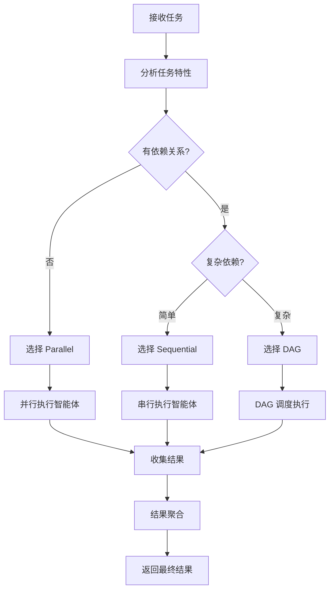

# OpenCode 混合多智能体架构设计文档

> **版本**: 1.0.0
> **作者**: OpenCode 团队
> **更新日期**: 2026-01-22

---

## 目录

- [1. 架构概述](#1-架构概述)
- [2. 设计原则](#2-设计原则)
- [3. 核心概念](#3-核心概念)
- [4. 类型定义](#4-类型定义)
- [5. 模块设计](#5-模块设计)
- [6. 实现方案](#6-实现方案)
- [7. 使用示例](#7-使用示例)
- [8. 集成方案](#8-集成方案)
- [9. 测试方案](#9-测试方案)
- [10. 迁移路径](#10-迁移路径)
- [11. 性能优化](#11-性能优化)
- [12. 错误处理](#12-错误处理)
- [13. 监控与日志](#13-监控与日志)
- [14. 扩展性设计](#14-扩展性设计)

---

## 1. 架构概述

### 1.1 背景

OpenCode 当前支持两种多智能体协作方式：
1. **单条消息多工具调用**：依赖 LLM 在一次响应中返回多个工具调用
2. **Batch 工具**：使用 `Promise.all` 并行执行最多 10 个工具调用

这两种方式存在以下局限性：
- 缺乏显式的流程控制
- 无结果聚合机制
- 依赖关系难以管理
- 错误处理不够灵活
- 无法支持条件执行

### 1.2 目标

设计一个**混合多智能体架构**，支持：
- ✅ **多种执行策略**：串行、并行、DAG
- ✅ **智能策略选择**：根据任务特性自动选择最优策略
- ✅ **结果聚合**：支持多种聚合策略
- ✅ **依赖管理**：智能体间的依赖关系管理
- ✅ **条件执行**：支持基于条件跳过某些智能体
- ✅ **错误隔离**：单个智能体失败不影响其他
- ✅ **进度跟踪**：实时反馈执行进度
- ✅ **向后兼容**：与现有 Task/Batch 工具兼容

### 1.3 架构图

```
┌─────────────────────────────────────────────────────────────────┐
│                         用户 / AI 调用                            │
└─────────────────────────────────────────────────────────────────┘
                                    │
                                    ▼
┌─────────────────────────────────────────────────────────────────┐
│                      WorkflowOrchestrator                        │
│  ┌────────────────────────────────────────────────────────────┐ │
│  │                    策略选择器                                │ │
│  │  analyze(task) → 'sequential' | 'parallel' | 'dag'        │ │
│  └────────────────────────────────────────────────────────────┘ │
│                                                                   │
│  ┌─────────────┐  ┌─────────────┐  ┌─────────────────────┐    │
│  │ Sequential  │  │  Parallel   │  │    DAG Scheduler    │    │
│  │  Executor   │  │  Executor   │  │                     │    │
│  └─────────────┘  └─────────────┘  └─────────────────────┘    │
└─────────────────────────────────────────────────────────────────┘
                                    │
                                    ▼
┌─────────────────────────────────────────────────────────────────┐
│                      Agent Execution Layer                       │
│  ┌──────────┐  ┌──────────┐  ┌──────────┐  ┌──────────┐       │
│  │ explore  │  │ analyze  │  │ validate │  │ report   │  ...  │
│  └──────────┘  └──────────┘  └──────────┘  └──────────┘       │
└─────────────────────────────────────────────────────────────────┘
                                    │
                                    ▼
┌─────────────────────────────────────────────────────────────────┐
│                      Result Aggregation                          │
│  ┌────────────────────────────────────────────────────────────┐ │
│  │  merge | vote | rank | custom aggregation function        │ │
│  └────────────────────────────────────────────────────────────┘ │
└─────────────────────────────────────────────────────────────────┘
```

### 1.4 执行流程



---

## 2. 设计原则

### 2.1 核心原则

| 原则 | 说明 | 优先级 |
|------|------|--------|
| **渐进增强** | 从简单开始，逐步增加复杂度 | P0 |
| **向后兼容** | 不破坏现有 API | P0 |
| **性能优先** | 最小化延迟，最大化并行 | P0 |
| **可观测性** | 完整的日志和进度跟踪 | P1 |
| **可测试性** | 每个组件可独立测试 | P1 |
| **可扩展性** | 易于添加新的执行策略 | P1 |

### 2.2 设计决策

#### 2.2.1 为何选择混合架构？

单一架构无法满足所有场景：
- **工作流编排**适合固定流程，但缺乏灵活性
- **MapReduce**适合并行处理，但模式受限
- **DAG**适合复杂依赖，但实现复杂
- **事件驱动**适合异步通信，但流程难以追踪

混合架构允许：
1. 根据任务特性选择最优策略
2. 组合多种策略处理复杂场景
3. 渐进式演进，降低风险

#### 2.2.2 策略选择逻辑

```typescript
// 自动选择策略的逻辑
function selectStrategy(task: MultiAgentTask): ExecutionStrategy {
  // 1. 检查是否有显式指定
  if (task.strategy) return task.strategy

  // 2. 分析任务特性
  const hasDependencies = task.agents.some(a => a.dependsOn?.length)
  const complexDeps = analyzeDependencyComplexity(task)
  const agentCount = task.agents.length

  // 3. 决策树
  if (agentCount <= 1) return 'sequential'
  if (!hasDependencies) return 'parallel'
  if (complexDeps) return 'dag'
  return 'sequential'
}
```

---

## 3. 核心概念

### 3.1 智能体步骤 (AgentStep)

单个智能体的执行配置：

```typescript
interface AgentStep {
  // 唯一标识符
  id: string

  // Agent 名称
  agent: string

  // 输入数据（静态值或动态函数）
  input?: any | ((context: WorkflowContext) => any) | ((context: WorkflowContext) => Promise<any>)

  // 依赖的步骤 ID
  dependsOn?: string[]

  // 条件执行函数
  condition?: (context: WorkflowContext) => boolean | Promise<boolean>

  // 超时时间（毫秒）
  timeout?: number

  // 重试次数
  retries?: number

  // 失败时是否继续
  continueOnError?: boolean

  // 标签（用于分组和过滤）
  tags?: string[]

  // 优先级（用于 DAG 调度）
  priority?: number
}
```

### 3.2 工作流上下文 (WorkflowContext)

执行过程中的共享上下文：

```typescript
interface WorkflowContext {
  // 原始输入
  input: any

  // 当前步骤 ID
  currentStep?: string

  // 已完成的结果
  results: Map<string, AgentResult>

  // 共享状态（用于智能体间通信）
  shared: Map<string, any>

  // 执行统计
  stats: {
    startedAt: number
    completedSteps: string[]
    failedSteps: string[]
    skippedSteps: string[]
  }

  // 用户数据（用于传递自定义信息）
  userData?: Record<string, any>
}
```

### 3.3 智能体结果 (AgentResult)

单个智能体的执行结果：

```typescript
interface AgentResult {
  // 步骤 ID
  stepId: string

  // 执行状态
  status: 'pending' | 'running' | 'completed' | 'failed' | 'skipped'

  // 结果数据
  data?: any

  // 错误信息
  error?: Error

  // 执行时间
  timing: {
    startedAt: number
    completedAt?: number
    duration?: number
  }

  // 重试次数
  retryCount: number

  // 元数据
  metadata?: Record<string, any>
}
```

### 3.4 聚合策略 (AggregationStrategy)

结果聚合的方式：

```typescript
type AggregationStrategy =
  | 'merge'      // 合并所有结果
  | 'first'      // 返回第一个成功的结果
  | 'last'       // 返回最后一个结果
  | 'all'        // 返回所有结果（数组）
  | 'vote'       // 投票（多智体决策）
  | 'rank'       // 排序后返回最优
  | 'custom'     // 自定义聚合函数

interface AggregationConfig {
  strategy: AggregationStrategy

  // 自定义聚合函数
  fn?: (results: Map<string, AgentResult>) => any | Promise<any>

  // 过滤函数（聚合前过滤结果）
  filter?: (result: AgentResult) => boolean

  // 转换函数（聚合前转换结果）
  transform?: (result: AgentResult) => any
}
```

---

## 4. 类型定义

### 4.1 核心类型

```typescript
// packages/opencode/src/workflow/types.ts

import { z } from 'zod'

/**
 * 执行策略类型
 */
export type ExecutionStrategy = 'sequential' | 'parallel' | 'dag'

/**
 * 聚合策略类型
 */
export type AggregationStrategy =
  | 'merge'
  | 'first'
  | 'last'
  | 'all'
  | 'vote'
  | 'rank'
  | 'custom'

/**
 * 智能体步骤配置
 */
export const AgentStepSchema = z.object({
  id: z.string().min(1),
  agent: z.string().min(1),
  input: z.any().optional(),
  dependsOn: z.array(z.string()).optional(),
  condition: z.function().args(z.any()).returns(z.boolean()).optional(),
  timeout: z.number().positive().optional(),
  retries: z.number().int().nonnegative().optional(),
  continueOnError: z.boolean().optional(),
  tags: z.array(z.string()).optional(),
  priority: z.number().int().optional(),
})

export type AgentStep = z.infer<typeof AgentStepSchema>

/**
 * 多智能体任务配置
 */
export const MultiAgentTaskSchema = z.object({
  // 任务名称（可选，用于日志和调试）
  name: z.string().optional(),

  // 执行策略（可选，不指定则自动选择）
  strategy: z.enum(['sequential', 'parallel', 'dag']).optional(),

  // 智能体步骤列表
  agents: z.array(AgentStepSchema).min(1),

  // 结果聚合配置
  aggregation: z.object({
    strategy: z.enum(['merge', 'first', 'last', 'all', 'vote', 'rank', 'custom']),
    fn: z.function().args(z.map(z.string(), z.any())).returns(z.any()).optional(),
    filter: z.function().args(z.any()).returns(z.boolean()).optional(),
    transform: z.function().args(z.any()).returns(z.any()).optional(),
  }).optional(),

  // 全局超时（毫秒）
  timeout: z.number().positive().optional(),

  // 最大并发数（仅 parallel 策略）
  maxConcurrency: z.number().positive().optional(),

  // 失败策略
  failurePolicy: z.enum(['fail-fast', 'continue', 'wait-all']).optional(),
})

export type MultiAgentTask = z.infer<typeof MultiAgentTaskSchema>

/**
 * 工作流上下文
 */
export interface WorkflowContext {
  input: any
  currentStep?: string
  results: Map<string, AgentResult>
  shared: Map<string, any>
  stats: WorkflowStats
  userData?: Record<string, any>
  abort?: AbortSignal
}

/**
 * 工作流统计
 */
export interface WorkflowStats {
  startedAt: number
  completedAt?: number
  completedSteps: string[]
  failedSteps: string[]
  skippedSteps: string[]
  totalSteps: number
}

/**
 * 智能体结果
 */
export interface AgentResult {
  stepId: string
  status: 'pending' | 'running' | 'completed' | 'failed' | 'skipped'
  data?: any
  error?: Error
  timing: {
    startedAt: number
    completedAt?: number
    duration?: number
  }
  retryCount: number
  metadata?: Record<string, any>
}

/**
 * 工作流结果
 */
export interface WorkflowResult {
  // 最终结果
  output: any

  // 所有步骤的结果
  results: Map<string, AgentResult>

  // 统计信息
  stats: WorkflowStats

  // 是否成功
  success: boolean

  // 错误信息（如果有）
  error?: Error
}

/**
 * 进度回调
 */
export type ProgressCallback = (progress: WorkflowProgress) => void | Promise<void>

/**
 * 工作流进度
 */
export interface WorkflowProgress {
  total: number
  completed: number
  failed: number
  running: number
  pending: number
  currentStep?: string
  message?: string
}
```

### 4.2 工具上下文扩展

```typescript
// packages/opencode/src/workflow/tool-context.ts

import type { Tool } from '@/tool/tool'

/**
 * Workflow 工具执行上下文扩展
 */
export interface WorkflowToolContext extends Tool.Context {
  // 工作流 ID
  workflowId?: string

  // 当前步骤 ID
  stepId?: string

  // 进度回调
  onProgress?: (progress: WorkflowProgress) => void
}
```

---

## 5. 模块设计

### 5.1 模块结构

```
packages/opencode/src/workflow/
├── index.ts                    # 导出所有公共 API
├── types.ts                    # 类型定义
├── orchestrator.ts             # 主编排器
├── executor/
│   ├── base.ts                 # 执行器基类
│   ├── sequential.ts           # 串行执行器
│   ├── parallel.ts             # 并行执行器
│   └── dag.ts                  # DAG 执行器
├── aggregation/
│   ├── index.ts                # 聚合器
│   ├── strategies.ts           # 聚合策略
│   └── utils.ts                # 聚合工具函数
├── scheduler/
│   ├── index.ts                # 调度器
│   ├── dag.ts                  # DAG 调度
│   └── dependency.ts           # 依赖分析
├── agent-runner.ts             # 智能体运行器
├── context.ts                  # 上下文管理
├── progress.ts                 # 进度跟踪
├── errors.ts                   # 错误类型
├── logger.ts                   # 日志记录
└── utils.ts                    # 工具函数
```

### 5.2 核心类设计

```typescript
// packages/opencode/src/workflow/orchestrator.ts

import type { MultiAgentTask, WorkflowResult, ExecutionStrategy, ProgressCallback } from './types'
import { SequentialExecutor } from './executor/sequential'
import { ParallelExecutor } from './executor/parallel'
import { DAGExecutor } from './executor/dag'
import { StrategyAnalyzer } from './scheduler/dependency'
import { Log } from '@/util/log'

/**
 * 工作流编排器
 *
 * 负责分析任务特性、选择执行策略、协调执行器。
 */
export class WorkflowOrchestrator {
  private static readonly log = Log.create({ service: 'workflow.orchestrator' })

  /**
   * 执行多智能体任务
   */
  static async execute(
    task: MultiAgentTask,
    options?: {
      onProgress?: ProgressCallback
      abort?: AbortSignal
      userData?: Record<string, any>
    }
  ): Promise<WorkflowResult> {
    const startTime = Date.now()
    const workflowId = `workflow-${Date.now()}`

    this.log.info('Starting workflow', {
      workflowId,
      taskName: task.name,
      agentCount: task.agents.length,
      strategy: task.strategy,
    })

    // 1. 验证任务配置
    this.validateTask(task)

    // 2. 选择执行策略
    const strategy = task.strategy ?? StrategyAnalyzer.analyze(task)

    this.log.info('Selected strategy', { workflowId, strategy })

    // 3. 创建对应的执行器
    const executor = this.createExecutor(strategy)

    // 4. 执行任务
    const result = await executor.execute(task, {
      workflowId,
      onProgress: options?.onProgress,
      abort: options?.abort,
      userData: options?.userData,
    })

    // 5. 记录完成日志
    const duration = Date.now() - startTime
    this.log.info('Workflow completed', {
      workflowId,
      strategy,
      duration,
      success: result.success,
      completedSteps: result.stats.completedSteps.length,
      failedSteps: result.stats.failedSteps.length,
    })

    return result
  }

  /**
   * 验证任务配置
   */
  private static validateTask(task: MultiAgentTask): void {
    // 检查步骤 ID 唯一性
    const ids = new Set(task.agents.map(a => a.id))
    if (ids.size !== task.agents.length) {
      throw new Error('Duplicate step IDs detected')
    }

    // 检查依赖的步骤存在
    for (const agent of task.agents) {
      for (const dep of agent.dependsOn ?? []) {
        if (!ids.has(dep)) {
          throw new Error(`Step "${agent.id}" depends on non-existent step "${dep}"`)
        }
      }
    }

    // 检查循环依赖
    const hasCycle = StrategyAnalyzer.detectCycle(task.agents)
    if (hasCycle) {
      throw new Error('Circular dependency detected')
    }
  }

  /**
   * 创建执行器
   */
  private static createExecutor(strategy: ExecutionStrategy) {
    switch (strategy) {
      case 'sequential':
        return new SequentialExecutor()
      case 'parallel':
        return new ParallelExecutor()
      case 'dag':
        return new DAGExecutor()
      default:
        throw new Error(`Unknown strategy: ${strategy}`)
    }
  }
}
```

### 5.3 执行器基类

```typescript
// packages/opencode/src/workflow/executor/base.ts

import type { MultiAgentTask, WorkflowResult, WorkflowContext, ProgressCallback } from '../types'
import { AgentRunner } from '../agent-runner'
import { WorkflowContextManager } from '../context'
import { ProgressTracker } from '../progress'
import { Log } from '@/util/log'

/**
 * 执行器基类
 *
 * 所有执行器都应继承此类。
 */
export abstract class BaseExecutor {
  protected readonly log = Log.create({ service: `workflow.executor.${this.name}` })
  protected abstract readonly name: string

  /**
   * 执行任务
   */
  async execute(
    task: MultiAgentTask,
    options: {
      workflowId: string
      onProgress?: ProgressCallback
      abort?: AbortSignal
      userData?: Record<string, any>
    }
  ): Promise<WorkflowResult> {
    // 初始化上下文
    const contextManager = new WorkflowContextManager({
      input: task.agents.length === 1 ? task.agents[0].input : undefined,
      userData: options.userData,
      abort: options.abort,
    })

    // 初始化进度跟踪
    const progressTracker = new ProgressTracker({
      total: task.agents.length,
      onProgress: options.onProgress,
    })

    // 执行具体策略
    const results = await this.executeStrategy(task, contextManager, progressTracker)

    // 聚合结果
    const output = await this.aggregateResults(task, results, contextManager.getContext())

    // 完成进度跟踪
    progressTracker.complete()

    return {
      output,
      results,
      stats: contextManager.getStats(),
      success: this.isSuccess(results),
    }
  }

  /**
   * 执行具体策略（由子类实现）
   */
  protected abstract executeStrategy(
    task: MultiAgentTask,
    contextManager: WorkflowContextManager,
    progressTracker: ProgressTracker
  ): Promise<Map<string, AgentResult>>

  /**
   * 聚合结果
   */
  protected async aggregateResults(
    task: MultiAgentTask,
    results: Map<string, AgentResult>,
    context: WorkflowContext
  ): Promise<any> {
    if (!task.aggregation) {
      // 没有聚合配置，返回所有结果
      return Object.fromEntries(results)
    }

    const { aggregation } = task

    // 过滤结果
    let filtered = results
    if (aggregation.filter) {
      filtered = new Map()
      for (const [id, result] of results) {
        if (aggregation.filter(result)) {
          filtered.set(id, result)
        }
      }
    }

    // 转换结果
    if (aggregation.transform) {
      for (const [id, result] of filtered) {
        filtered.set(id, {
          ...result,
          data: aggregation.transform(result),
        })
      }
    }

    // 应用聚合策略
    return this.applyAggregationStrategy(aggregation.strategy, filtered, aggregation.fn, context)
  }

  /**
   * 应用聚合策略
   */
  protected async applyAggregationStrategy(
    strategy: string,
    results: Map<string, AgentResult>,
    customFn?: (results: Map<string, AgentResult>) => any,
    context?: WorkflowContext
  ): Promise<any> {
    switch (strategy) {
      case 'merge':
        return this.mergeStrategy(results)
      case 'first':
        return this.firstStrategy(results)
      case 'last':
        return this.lastStrategy(results)
      case 'all':
        return Array.from(results.values()).map(r => r.data)
      case 'vote':
        return this.voteStrategy(results)
      case 'rank':
        return this.rankStrategy(results)
      case 'custom':
        if (!customFn) throw new Error('Custom aggregation requires a function')
        return customFn(results)
      default:
        throw new Error(`Unknown aggregation strategy: ${strategy}`)
    }
  }

  /**
   * 合并策略
   */
  protected mergeStrategy(results: Map<string, AgentResult>): any {
    const merged: Record<string, any> = {}
    for (const [id, result] of results) {
      if (result.data && typeof result.data === 'object') {
        Object.assign(merged, result.data)
      } else {
        merged[id] = result.data
      }
    }
    return merged
  }

  /**
   * 第一个成功结果
   */
  protected firstStrategy(results: Map<string, AgentResult>): any {
    for (const result of results.values()) {
      if (result.status === 'completed') {
        return result.data
      }
    }
    return undefined
  }

  /**
   * 最后一个成功结果
   */
  protected lastStrategy(results: Map<string, AgentResult>): any {
    let lastResult: any
    for (const result of results.values()) {
      if (result.status === 'completed') {
        lastResult = result.data
      }
    }
    return lastResult
  }

  /**
   * 投票策略
   */
  protected voteStrategy(results: Map<string, AgentResult>): any {
    const votes = new Map<any, number>()
    for (const result of results.values()) {
      if (result.status === 'completed') {
        const count = votes.get(result.data) ?? 0
        votes.set(result.data, count + 1)
      }
    }
    let maxVote = 0
    let winner: any
    for (const [value, count] of votes) {
      if (count > maxVote) {
        maxVote = count
        winner = value
      }
    }
    return winner
  }

  /**
   * 排序策略
   */
  protected rankStrategy(results: Map<string, AgentResult>): any {
    const successful = Array.from(results.values())
      .filter(r => r.status === 'completed')
      .sort((a, b) => {
        // 可根据元数据中的分数排序
        const aScore = a.metadata?.score ?? 0
        const bScore = b.metadata?.score ?? 0
        return bScore - aScore
      })
    return successful[0]?.data
  }

  /**
   * 判断是否成功
   */
  protected isSuccess(results: Map<string, AgentResult>): boolean {
    for (const result of results.values()) {
      if (result.status === 'failed' && !result.metadata?.continueOnError) {
        return false
      }
    }
    return true
  }

  /**
   * 执行单个智能体
   */
  protected async executeAgent(
    step: AgentStep,
    context: WorkflowContext,
    progressTracker: ProgressTracker
  ): Promise<AgentResult> {
    const result: AgentResult = {
      stepId: step.id,
      status: 'pending',
      timing: { startedAt: Date.now() },
      retryCount: 0,
    }

    progressTracker.start(step.id)

    // 检查条件
    if (step.condition) {
      const shouldRun = await step.condition(context)
      if (!shouldRun) {
        result.status = 'skipped'
        progressTracker.skip(step.id)
        return result
      }
    }

    result.status = 'running'
    progressTracker.update(step.id, 'running')

    try {
      const data = await AgentRunner.execute(step, context)
      result.data = data
      result.status = 'completed'
      progressTracker.complete(step.id)
    } catch (error) {
      result.error = error as Error
      result.status = 'failed'
      progressTracker.fail(step.id)
    }

    result.timing.completedAt = Date.now()
    result.timing.duration = result.timing.completedAt - result.timing.startedAt

    return result
  }
}
```

### 5.4 串行执行器

```typescript
// packages/opencode/src/workflow/executor/sequential.ts

import { BaseExecutor } from './base'
import type { MultiAgentTask, WorkflowContext, ProgressCallback } from '../types'
import { WorkflowContextManager } from '../context'
import { ProgressTracker } from '../progress'
import { Log } from '@/util/log'

/**
 * 串行执行器
 *
 * 按顺序执行智能体，支持依赖管理和条件执行。
 */
export class SequentialExecutor extends BaseExecutor {
  protected readonly name = 'sequential'

  protected async executeStrategy(
    task: MultiAgentTask,
    contextManager: WorkflowContextManager,
    progressTracker: ProgressTracker
  ): Promise<Map<string, AgentResult>> {
    const results = new Map<string, AgentResult>()
    const sortedSteps = this.topologicalSort(task.agents)

    for (const step of sortedSteps) {
      // 检查中止信号
      if (contextManager.getContext().abort?.aborted) {
        throw new Error('Workflow aborted')
      }

      // 更新上下文
      contextManager.setCurrentStep(step.id)

      // 执行智能体
      const result = await this.executeAgent(step, contextManager.getContext(), progressTracker)
      results.set(step.id, result)

      // 更新上下文结果
      contextManager.setResult(step.id, result)

      // 检查失败策略
      if (result.status === 'failed' && !step.continueOnError && task.failurePolicy !== 'continue') {
        throw new Error(`Step "${step.id}" failed: ${result.error?.message}`)
      }
    }

    return results
  }

  /**
   * 拓扑排序
   */
  private topologicalSort(steps: AgentStep[]): AgentStep[] {
    const sorted: AgentStep[] = []
    const visited = new Set<string>()
    const visiting = new Set<string>()

    const visit = (step: AgentStep) => {
      if (visited.has(step.id)) return
      if (visiting.has(step.id)) {
        throw new Error(`Circular dependency detected at step "${step.id}"`)
      }

      visiting.add(step.id)

      // 先访问依赖
      for (const depId of step.dependsOn ?? []) {
        const depStep = steps.find(s => s.id === depId)
        if (depStep) {
          visit(depStep)
        }
      }

      visiting.delete(step.id)
      visited.add(step.id)
      sorted.push(step)
    }

    for (const step of steps) {
      visit(step)
    }

    return sorted
  }
}
```

### 5.5 并行执行器

```typescript
// packages/opencode/src/workflow/executor/parallel.ts

import { BaseExecutor } from './base'
import type { MultiAgentTask, WorkflowContext, ProgressCallback } from '../types'
import { WorkflowContextManager } from '../context'
import { ProgressTracker } from '../progress'
import { Log } from '@/util/log'

/**
 * 并行执行器
 *
 * 并行执行所有智能体，支持并发控制。
 */
export class ParallelExecutor extends BaseExecutor {
  protected readonly name = 'parallel'

  protected async executeStrategy(
    task: MultiAgentTask,
    contextManager: WorkflowContextManager,
    progressTracker: ProgressTracker
  ): Promise<Map<string, AgentResult>> {
    const results = new Map<string, AgentResult>()
    const maxConcurrency = task.maxConcurrency ?? task.agents.length

    // 分批执行
    for (let i = 0; i < task.agents.length; i += maxConcurrency) {
      const batch = task.agents.slice(i, i + maxConcurrency)

      // 并行执行批次
      const batchResults = await Promise.allSettled(
        batch.map(step =>
          this.executeAgent(step, contextManager.getContext(), progressTracker)
        )
      )

      // 处理结果
      for (let j = 0; j < batch.length; j++) {
        const step = batch[j]
        const batchResult = batchResults[j]

        const result: AgentResult = batchResult.status === 'fulfilled'
          ? batchResult.value
          : {
              stepId: step.id,
              status: 'failed',
              error: batchResult.reason,
              timing: { startedAt: Date.now(), completedAt: Date.now() },
              retryCount: 0,
            }

        results.set(step.id, result)
        contextManager.setResult(step.id, result)
      }

      // 检查失败策略
      if (task.failurePolicy === 'fail-fast') {
        const hasFailure = Array.from(results.values()).some(
          r => r.status === 'failed' && !r.metadata?.continueOnError
        )
        if (hasFailure) {
          throw new Error('Workflow failed due to failure policy')
        }
      }
    }

    return results
  }
}
```

### 5.6 DAG 执行器

```typescript
// packages/opencode/src/workflow/executor/dag.ts

import { BaseExecutor } from './base'
import type { MultiAgentTask, WorkflowContext, ProgressCallback } from '../types'
import { WorkflowContextManager } from '../context'
import { ProgressTracker } from '../progress'
import { DAGScheduler } from '../scheduler/dag'
import { Log } from '@/util/log'

/**
 * DAG 执行器
 *
 * 使用 DAG 调度器执行智能体，自动识别可并行执行的节点。
 */
export class ParallelExecutor extends BaseExecutor {
  protected readonly name = 'dag'

  protected async executeStrategy(
    task: MultiAgentTask,
    contextManager: WorkflowContextManager,
    progressTracker: ProgressTracker
  ): Promise<Map<string, AgentResult>> {
    const scheduler = new DAGScheduler(task.agents)
    const results = new Map<string, AgentResult>()

    // 执行 DAG
    await scheduler.execute({
      async execute(step: AgentStep): Promise<void> {
        // 检查中止信号
        if (contextManager.getContext().abort?.aborted) {
          throw new Error('Workflow aborted')
        }

        contextManager.setCurrentStep(step.id)

        const result = await this.executeAgent(
          step,
          contextManager.getContext(),
          progressTracker
        )

        results.set(step.id, result)
        contextManager.setResult(step.id, result)
      },

      onStepComplete: (step: AgentStep, result: AgentResult) => {
        // 可以在这里处理完成后的逻辑
      },

      abort: contextManager.getContext().abort,
    })

    return results
  }
}
```

---

## 6. 实现方案

### 6.1 策略分析器

```typescript
// packages/opencode/src/workflow/scheduler/dependency.ts

import type { AgentStep, ExecutionStrategy } from '../types'
import { Log } from '@/util/log'

/**
 * 策略分析器
 *
 * 分析任务特性，推荐最优执行策略。
 */
export class StrategyAnalyzer {
  private static readonly log = Log.create({ service: 'workflow.analyzer' })

  /**
   * 分析任务并推荐策略
   */
  static analyze(task: MultiAgentTask): ExecutionStrategy {
    const agentCount = task.agents.length

    // 单个智能体
    if (agentCount === 1) {
      return 'sequential'
    }

    // 检查依赖关系
    const hasDependencies = task.agents.some(a => a.dependsOn?.length)

    if (!hasDependencies) {
      // 无依赖，可以完全并行
      return 'parallel'
    }

    // 分析依赖复杂度
    const complexity = this.analyzeDependencyComplexity(task)

    if (complexity.level === 'simple') {
      // 简单依赖，串行执行即可
      return 'sequential'
    }

    // 复杂依赖，使用 DAG
    return 'dag'
  }

  /**
   * 分析依赖复杂度
   */
  static analyzeDependencyComplexity(task: MultiAgentTask): {
    level: 'simple' | 'complex'
    maxDepth: number
    branchingFactor: number
  } {
    const graph = this.buildDependencyGraph(task.agents)
    const depths = new Map<string, number>()

    // 计算每个节点的深度
    for (const step of task.agents) {
      depths.set(step.id, this.calculateDepth(step.id, graph, depths))
    }

    const maxDepth = Math.max(...depths.values())

    // 计算分支因子
    let totalBranches = 0
    for (const [_, deps] of graph) {
      totalBranches += deps.length
    }
    const branchingFactor = totalBranches / task.agents.length

    return {
      level: maxDepth <= 2 && branchingFactor <= 1 ? 'simple' : 'complex',
      maxDepth,
      branchingFactor,
    }
  }

  /**
   * 构建依赖图
   */
  private static buildDependencyGraph(steps: AgentStep[]): Map<string, string[]> {
    const graph = new Map<string, string[]>()
    for (const step of steps) {
      graph.set(step.id, step.dependsOn ?? [])
    }
    return graph
  }

  /**
   * 计算节点深度
   */
  private static calculateDepth(
    stepId: string,
    graph: Map<string, string[]>,
    memo: Map<string, number>
  ): number {
    if (memo.has(stepId)) {
      return memo.get(stepId)!
    }

    const deps = graph.get(stepId) ?? []
    if (deps.length === 0) {
      memo.set(stepId, 0)
      return 0
    }

    const maxDepDepth = Math.max(
      ...deps.map(dep => this.calculateDepth(dep, graph, memo))
    )

    const depth = maxDepDepth + 1
    memo.set(stepId, depth)
    return depth
  }

  /**
   * 检测循环依赖
   */
  static detectCycle(steps: AgentStep[]): boolean {
    const graph = new Map<string, string[]>()
    for (const step of steps) {
      graph.set(step.id, step.dependsOn ?? [])
    }

    const WHITE = 0 // 未访问
    const GRAY = 1  // 访问中
    const BLACK = 2 // 已完成

    const color = new Map<string, number>()
    for (const step of steps) {
      color.set(step.id, WHITE)
    }

    const dfs = (nodeId: string): boolean => {
      color.set(nodeId, GRAY)

      for (const dep of graph.get(nodeId) ?? []) {
        const depColor = color.get(dep)
        if (depColor === GRAY) {
          return true // 发现环
        }
        if (depColor === WHITE && dfs(dep)) {
          return true
        }
      }

      color.set(nodeId, BLACK)
      return false
    }

    for (const step of steps) {
      if (color.get(step.id) === WHITE && dfs(step.id)) {
        return true
      }
    }

    return false
  }
}
```

### 6.2 DAG 调度器

```typescript
// packages/opencode/src/workflow/scheduler/dag.ts

import type { AgentStep, AgentResult } from '../types'
import { Log } from '@/util/log'

/**
 * DAG 调度器
 *
 * 基于有向无环图调度智能体执行。
 */
export class DAGScheduler {
  private readonly log = Log.create({ service: 'workflow.scheduler.dag' })
  private readonly steps: Map<string, AgentStep>
  private readonly graph: Map<string, Set<string>> // 依赖 -> 被依赖
  private readonly reverseGraph: Map<string, Set<string>> // 被依赖 -> 依赖
  private readonly inDegree: Map<string, number>

  constructor(steps: AgentStep[]) {
    this.steps = new Map(steps.map(s => [s.id, s]))
    this.graph = new Map()
    this.reverseGraph = new Map()
    this.inDegree = new Map()

    this.buildGraph(steps)
  }

  /**
   * 执行 DAG
   */
  async execute(options: {
    execute(step: AgentStep): Promise<void>
    onStepComplete?(step: AgentStep, result: AgentResult): void
    abort?: AbortSignal
  }): Promise<void> {
    const ready: AgentStep[] = []
    const running = new Set<string>()
    const completed = new Set<string>()

    // 找出初始就绪节点（入度为 0）
    for (const [id, degree] of this.inDegree) {
      if (degree === 0) {
        const step = this.steps.get(id)
        if (step) ready.push(step)
      }
    }

    // 执行调度循环
    while (ready.length > 0 || running.size > 0) {
      // 检查中止
      if (options.abort?.aborted) {
        throw new Error('DAG execution aborted')
      }

      // 启动就绪节点
      const toStart = ready.splice(0, ready.length)
      const executions = toStart.map(async step => {
        running.add(step.id)
        try {
          await options.execute(step)
          completed.add(step.id)
        } finally {
          running.delete(step.id)
        }
      })

      // 等待至少一个完成
      await Promise.race(executions)

      // 找出新的就绪节点
      for (const step of toStart) {
        if (!completed.has(step.id)) continue

        const dependents = this.reverseGraph.get(step.id) ?? []
        for (const depId of dependents) {
          const newDegree = (this.inDegree.get(depId) ?? 0) - 1
          this.inDegree.set(depId, newDegree)

          if (newDegree === 0) {
            const depStep = this.steps.get(depId)
            if (depStep) ready.push(depStep)
          }
        }
      }
    }

    // 检查是否所有节点都完成
    if (completed.size !== this.steps.size) {
      const uncompleted = Array.from(this.steps.keys())
        .filter(id => !completed.has(id))
      throw new Error(`DAG execution incomplete: ${uncompleted.join(', ')}`)
    }
  }

  /**
   * 构建图
   */
  private buildGraph(steps: AgentStep[]): void {
    // 初始化
    for (const step of steps) {
      this.graph.set(step.id, new Set())
      this.reverseGraph.set(step.id, new Set())
      this.inDegree.set(step.id, 0)
    }

    // 构建边
    for (const step of steps) {
      for (const dep of step.dependsOn ?? []) {
        // step 依赖于 dep
        // dep -> step
        if (this.graph.has(dep)) {
          this.graph.get(dep)!.add(step.id)
          this.reverseGraph.get(step.id)!.add(dep)
          this.inDegree.set(step.id, (this.inDegree.get(step.id) ?? 0) + 1)
        }
      }
    }
  }

  /**
   * 获取可并行执行的节点组
   */
  getParallelGroups(): AgentStep[][] {
    const groups: AgentStep[][] = []
    const visited = new Set<string>()

    while (visited.size < this.steps.size) {
      // 找出当前可执行的节点（所有依赖都已满足）
      const ready: AgentStep[] = []
      for (const [id, step] of this.steps) {
        if (visited.has(id)) continue

        const deps = step.dependsOn ?? []
        if (deps.every(dep => visited.has(dep))) {
          ready.push(step)
        }
      }

      if (ready.length === 0) {
        throw new Error('Cycle detected in DAG')
      }

      groups.push(ready)
      ready.forEach(step => visited.add(step.id))
    }

    return groups
  }
}
```

### 6.3 智能体运行器

```typescript
// packages/opencode/src/workflow/agent-runner.ts

import type { AgentStep, WorkflowContext } from './types'
import { Agent } from '@/agent/agent'
import { SessionPrompt } from '@/session/prompt'
import { Log } from '@/util/log'

/**
 * 智能体运行器
 *
 * 负责执行单个智能体并返回结果。
 */
export class AgentRunner {
  private static readonly log = Log.create({ service: 'workflow.agent-runner' })

  /**
   * 执行智能体
   */
  static async execute(step: AgentStep, context: WorkflowContext): Promise<any> {
    this.log.info('Executing agent', {
      stepId: step.id,
      agent: step.agent,
    })

    // 获取 Agent 配置
    const agent = await Agent.get(step.agent)
    if (!agent) {
      throw new Error(`Agent not found: ${step.agent}`)
    }

    // 解析输入
    const input = await this.resolveInput(step, context)

    // 创建子会话
    const sessionId = await this.createSession(context, step)

    // 执行 Agent
    const result = await this.runAgent(sessionId, agent, input, context)

    return result
  }

  /**
   * 解析输入
   */
  private static async resolveInput(
    step: AgentStep,
    context: WorkflowContext
  ): Promise<any> {
    if (typeof step.input === 'function') {
      return await step.input(context)
    }
    return step.input
  }

  /**
   * 创建子会话
   */
  private static async createSession(
    context: WorkflowContext,
    step: AgentStep
  ): Promise<string> {
    // TODO: 实现会话创建逻辑
    // 可以使用 Session.create() 创建子会话
    return `workflow-session-${step.id}-${Date.now()}`
  }

  /**
   * 运行 Agent
   */
  private static async runAgent(
    sessionId: string,
    agent: Agent.Info,
    input: any,
    context: WorkflowContext
  ): Promise<any> {
    // 使用 SessionPrompt 执行 Agent
    const result = await SessionPrompt.prompt({
      sessionID: sessionId,
      agent: agent.name,
      parts: [
        {
          type: 'text',
          text: typeof input === 'string' ? input : JSON.stringify(input),
        },
      ],
    })

    // 提取结果
    const message = await result.info
    const output = message.parts
      .filter(p => p.type === 'text')
      .map(p => (p as any).text)
      .join('\n')

    return output
  }
}
```

### 6.4 上下文管理

```typescript
// packages/opencode/src/workflow/context.ts

import type { WorkflowContext, WorkflowStats, AgentResult } from './types'

/**
 * 工作流上下文管理器
 *
 * 管理工作流执行过程中的共享上下文。
 */
export class WorkflowContextManager {
  private context: WorkflowContext

  constructor(options: {
    input?: any
    userData?: Record<string, any>
    abort?: AbortSignal
  }) {
    this.context = {
      input: options.input,
      results: new Map(),
      shared: new Map(),
      stats: {
        startedAt: Date.now(),
        completedSteps: [],
        failedSteps: [],
        skippedSteps: [],
        totalSteps: 0,
      },
      userData: options.userData,
      abort: options.abort,
    }
  }

  /**
   * 获取上下文
   */
  getContext(): WorkflowContext {
    return this.context
  }

  /**
   * 设置当前步骤
   */
  setCurrentStep(stepId: string): void {
    this.context.currentStep = stepId
  }

  /**
   * 设置结果
   */
  setResult(stepId: string, result: AgentResult): void {
    this.context.results.set(stepId, result)

    if (result.status === 'completed') {
      this.context.stats.completedSteps.push(stepId)
    } else if (result.status === 'failed') {
      this.context.stats.failedSteps.push(stepId)
    } else if (result.status === 'skipped') {
      this.context.stats.skippedSteps.push(stepId)
    }
  }

  /**
   * 获取结果
   */
  getResult(stepId: string): AgentResult | undefined {
    return this.context.results.get(stepId)
  }

  /**
   * 获取所有结果
   */
  getResults(): Map<string, AgentResult> {
    return this.context.results
  }

  /**
   * 设置共享数据
   */
  setShared(key: string, value: any): void {
    this.context.shared.set(key, value)
  }

  /**
   * 获取共享数据
   */
  getShared(key: string): any | undefined {
    return this.context.shared.get(key)
  }

  /**
   * 获取统计信息
   */
  getStats(): WorkflowStats {
    return { ...this.context.stats }
  }

  /**
   * 完成工作流
   */
  complete(): void {
    this.context.stats.completedAt = Date.now()
  }
}
```

### 6.5 进度跟踪

```typescript
// packages/opencode/src/workflow/progress.ts

import type { WorkflowProgress, ProgressCallback, AgentResult } from './types'
import { Log } from '@/util/log'

/**
 * 进度跟踪器
 *
 * 跟踪工作流执行进度并报告。
 */
export class ProgressTracker {
  private readonly log = Log.create({ service: 'workflow.progress' })
  private readonly state: {
    total: number
    completed: number
    failed: number
    running: number
    pending: number
    currentStep?: string
  }

  private readonly onProgress?: ProgressCallback

  constructor(options: {
    total: number
    onProgress?: ProgressCallback
  }) {
    this.state = {
      total: options.total,
      completed: 0,
      failed: 0,
      running: 0,
      pending: options.total,
    }
    this.onProgress = options.onProgress
  }

  /**
   * 开始步骤
   */
  start(stepId: string): void {
    this.state.pending--
    this.state.running++
    this.state.currentStep = stepId
    this.report()
  }

  /**
   * 完成步骤
   */
  complete(stepId: string): void {
    this.state.running--
    this.state.completed++
    if (this.state.currentStep === stepId) {
      this.state.currentStep = undefined
    }
    this.report()
  }

  /**
   * 失败步骤
   */
  fail(stepId: string): void {
    this.state.running--
    this.state.failed++
    if (this.state.currentStep === stepId) {
      this.state.currentStep = undefined
    }
    this.report()
  }

  /**
   * 跳过步骤
   */
  skip(stepId: string): void {
    this.state.pending--
    this.state.completed++
    this.report()
  }

  /**
   * 更新步骤状态
   */
  update(stepId: string, status: 'running' | 'completed' | 'failed'): void {
    switch (status) {
      case 'running':
        this.start(stepId)
        break
      case 'completed':
        this.complete(stepId)
        break
      case 'failed':
        this.fail(stepId)
        break
    }
  }

  /**
   * 完成跟踪
   */
  complete(): void {
    this.state.currentStep = undefined
    this.report()
  }

  /**
   * 报告进度
   */
  private report(): void {
    if (this.onProgress) {
      const progress: WorkflowProgress = { ...this.state }
      this.onProgress(progress).catch(error => {
        this.log.error('Progress callback error', { error })
      })
    }
  }

  /**
   * 获取当前进度
   */
  getProgress(): WorkflowProgress {
    return { ...this.state }
  }
}
```

---

## 7. 使用示例

### 7.1 基础示例

#### 7.1.1 串行执行

```typescript
import { WorkflowOrchestrator } from '@/workflow/orchestrator'
import type { MultiAgentTask } from '@/workflow/types'

// 定义串行任务
const task: MultiAgentTask = {
  name: 'code-analysis-workflow',
  strategy: 'sequential',
  agents: [
    {
      id: 'explore',
      agent: 'explore',
      input: 'Search for all TypeScript files in src/',
    },
    {
      id: 'analyze',
      agent: 'general',
      dependsOn: ['explore'],
      input: (ctx) => ({
        prompt: `Analyze these files: ${ctx.results.get('explore')?.data}`,
      }),
    },
    {
      id: 'report',
      agent: 'general',
      dependsOn: ['analyze'],
      input: (ctx) => ({
        prompt: 'Generate a report based on the analysis',
      }),
    },
  ],
}

// 执行
const result = await WorkflowOrchestrator.execute(task, {
  onProgress: (progress) => {
    console.log(`Progress: ${progress.completed}/${progress.total}`)
  },
})

console.log('Result:', result.output)
```

#### 7.1.2 并行执行

```typescript
// 定义并行任务
const task: MultiAgentTask = {
  name: 'parallel-search',
  strategy: 'parallel',
  agents: [
    {
      id: 'search-typescript',
      agent: 'explore',
      input: 'Find all TypeScript files',
    },
    {
      id: 'search-python',
      agent: 'explore',
      input: 'Find all Python files',
    },
    {
      id: 'search-rust',
      agent: 'explore',
      input: 'Find all Rust files',
    },
  ],
  aggregation: {
    strategy: 'merge',
  },
  maxConcurrency: 3,
}

const result = await WorkflowOrchestrator.execute(task)
```

#### 7.1.3 DAG 执行

```typescript
// 定义 DAG 任务
const task: MultiAgentTask = {
  name: 'dag-pipeline',
  strategy: 'dag',
  agents: [
    {
      id: 'fetch-data',
      agent: 'general',
      input: 'Fetch data from API',
    },
    {
      id: 'validate',
      agent: 'general',
      dependsOn: ['fetch-data'],
      input: 'Validate the fetched data',
    },
    {
      id: 'transform',
      agent: 'general',
      dependsOn: ['fetch-data'],
      input: 'Transform the data',
    },
    {
      id: 'load',
      agent: 'general',
      dependsOn: ['validate', 'transform'],
      input: 'Load to database',
    },
  ],
}

const result = await WorkflowOrchestrator.execute(task)
```

### 7.2 高级示例

#### 7.2.1 条件执行

```typescript
const task: MultiAgentTask = {
  name: 'conditional-workflow',
  agents: [
    {
      id: 'check',
      agent: 'general',
      input: 'Check if tests are needed',
    },
    {
      id: 'test',
      agent: 'general',
      dependsOn: ['check'],
      condition: (ctx) => {
        const checkResult = ctx.results.get('check')?.data
        return checkResult?.needsTests === true
      },
      input: 'Run tests',
    },
    {
      id: 'deploy',
      agent: 'general',
      dependsOn: ['test'],
      input: 'Deploy to production',
    },
  ],
}
```

#### 7.2.2 自定义聚合

```typescript
const task: MultiAgentTask = {
  name: 'code-review',
  agents: [
    { id: 'reviewer1', agent: 'general', input: 'Review code' },
    { id: 'reviewer2', agent: 'general', input: 'Review code' },
    { id: 'reviewer3', agent: 'general', input: 'Review code' },
  ],
  aggregation: {
    strategy: 'custom',
    fn: (results) => {
      // 自定义聚合逻辑
      const reviews = Array.from(results.values()).map(r => r.data)

      // 找出所有提到的问题
      const allIssues = reviews.flatMap(r => r.issues ?? [])

      // 按严重程度分组
      const bySeverity = allIssues.reduce((acc, issue) => {
        acc[issue.severity] = acc[issue.severity] ?? []
        acc[issue.severity].push(issue)
        return acc
      }, {} as Record<string, any[]>)

      return {
        totalIssues: allIssues.length,
        bySeverity,
        needsChanges: bySeverity.critical?.length > 0,
      }
    },
  },
}
```

#### 7.2.3 错误处理

```typescript
const task: MultiAgentTask = {
  name: 'resilient-workflow',
  agents: [
    {
      id: 'step1',
      agent: 'general',
      input: 'Do something',
      continueOnError: true, // 失败后继续
      retries: 3, // 重试 3 次
    },
    {
      id: 'step2',
      agent: 'general',
      dependsOn: ['step1'],
      input: (ctx) => {
        const result = ctx.results.get('step1')
        if (result?.status === 'failed') {
          return 'Use fallback strategy'
        }
        return 'Use normal strategy'
      },
    },
  ],
  failurePolicy: 'continue', // 整体失败策略
}
```

#### 7.2.4 进度跟踪

```typescript
const result = await WorkflowOrchestrator.execute(task, {
  onProgress: (progress) => {
    console.log(`
      Progress: ${progress.completed}/${progress.total}
      Running: ${progress.running}
      Failed: ${progress.failed}
      Current: ${progress.currentStep}
    `)
  },
})
```

---

## 8. 集成方案

### 8.1 新增 Workflow 工具

```typescript
// packages/opencode/src/tool/workflow.ts

import { Tool } from './tool'
import { WorkflowOrchestrator } from '@/workflow/orchestrator'
import type { MultiAgentTask } from '@/workflow/types'
import z from 'zod'

export const WorkflowTool = Tool.define(
  'workflow',
  {
    description: `
Execute a multi-agent workflow with various execution strategies.

This tool allows you to:
- Run agents sequentially (with dependencies)
- Run agents in parallel (for independent tasks)
- Run agents in a DAG (for complex dependencies)
- Aggregate results from multiple agents

Strategies:
- sequential: Execute agents one by one, respecting dependencies
- parallel: Execute all agents concurrently (max concurrency can be set)
- dag: Automatically schedule agents based on dependency graph

Aggregation strategies:
- merge: Merge all results into a single object
- first: Return the first successful result
- last: Return the last successful result
- all: Return all results as an array
- vote: Use majority voting on results
- rank: Return the highest-ranked result
- custom: Use a custom aggregation function

Example:
{
  "name": "code-review",
  "strategy": "parallel",
  "agents": [
    { "id": "r1", "agent": "general", "input": "Review for bugs" },
    { "id": "r2", "agent": "general", "input": "Review for security" },
    { "id": "r3", "agent": "general", "input": "Review for performance" }
  ],
  "aggregation": { "strategy": "merge" }
}
    `.trim(),

    parameters: z.object({
      name: z.string().optional().describe('Workflow name for logging'),
      strategy: z.enum(['sequential', 'parallel', 'dag']).optional().describe('Execution strategy (auto-detected if not specified)'),
      agents: z.array(z.object({
        id: z.string().describe('Unique step identifier'),
        agent: z.string().describe('Agent name to execute'),
        input: z.any().optional().describe('Input for the agent (can be a value or function)'),
        dependsOn: z.array(z.string()).optional().describe('Step IDs this step depends on'),
        condition: z.string().optional().describe('JavaScript expression for conditional execution'),
        timeout: z.number().optional().describe('Timeout in milliseconds'),
        retries: z.number().optional().describe('Number of retries on failure'),
        continueOnError: z.boolean().optional().describe('Continue workflow if this step fails'),
        tags: z.array(z.string()).optional().describe('Tags for grouping/filtering'),
      })).min(1).describe('Agent steps to execute'),
      aggregation: z.object({
        strategy: z.enum(['merge', 'first', 'last', 'all', 'vote', 'rank', 'custom']),
        filter: z.string().optional().describe('JavaScript expression to filter results'),
        transform: z.string().optional().describe('JavaScript expression to transform results'),
      }).optional().describe('Result aggregation configuration'),
      maxConcurrency: z.number().optional().describe('Maximum concurrent agents (parallel strategy only)'),
      failurePolicy: z.enum(['fail-fast', 'continue', 'wait-all']).optional().describe('How to handle failures'),
      timeout: z.number().optional().describe('Global workflow timeout in milliseconds'),
    }),

    async execute(args, ctx) {
      // 构建任务配置
      const task: MultiAgentTask = {
        name: args.name,
        strategy: args.strategy,
        agents: args.agents.map(agent => ({
          ...agent,
          // 解析条件函数
          condition: agent.condition ? new Function('ctx', `return (${agent.condition})`) as any : undefined,
        })),
        aggregation: args.aggregation,
        maxConcurrency: args.maxConcurrency,
        failurePolicy: args.failurePolicy,
        timeout: args.timeout,
      }

      // 执行工作流
      const result = await WorkflowOrchestrator.execute(task, {
        onProgress: (progress) => {
          ctx.metadata({
            title: `Workflow: ${progress.completed}/${progress.total} steps completed`,
            metadata: { progress },
          })
        },
        abort: ctx.abort,
      })

      // 返回结果
      const summary = `
Workflow completed: ${result.stats.completedSteps.length}/${result.stats.totalSteps} steps successful
Failed: ${result.stats.failedSteps.length}
Duration: ${result.stats.completedAt! - result.stats.startedAt}ms
      `.trim()

      return {
        title: `Workflow: ${task.name || 'unnamed'}`,
        output: JSON.stringify(result.output, null, 2),
        metadata: {
          stats: result.stats,
          success: result.success,
        },
      }
    },

    formatValidationError(error) {
      return `Invalid workflow parameters: ${error.errors.map(e => e.message).join(', ')}`
    },
  }
)
```

### 8.2 注册到工具注册表

```typescript
// packages/opencode/src/tool/registry.ts

import { WorkflowTool } from './workflow'

export async function all(): Promise<Tool.Info[]> {
  const custom = await state().then((x) => x.custom)
  const config = await Config.get()

  return [
    // ... existing tools
    InvalidTool,
    BashTool,
    ReadTool,
    // ... other tools
    TaskTool,

    // 新增 Workflow 工具
    WorkflowTool,

    // ... custom tools
    ...custom,
  ]
}
```

### 8.3 配置开关

```typescript
// packages/opencode/src/config/config.ts

export interface Config {
  // ... existing config

  experimental?: {
    // ... existing flags
    workflow_tool?: boolean // 启用工作流工具
  }
}
```

---

## 9. 测试方案

### 9.1 单元测试

```typescript
// packages/opencode/src/workflow/__tests__/orchestrator.test.ts

import { describe, it, expect, vi } from 'bun:test'
import { WorkflowOrchestrator } from '../orchestrator'
import { SequentialExecutor } from '../executor/sequential'
import { ParallelExecutor } from '../executor/parallel'
import { DAGExecutor } from '../executor/dag'

describe('WorkflowOrchestrator', () => {
  describe('策略选择', () => {
    it('应该为单个智能体选择串行策略', () => {
      const task = {
        agents: [{ id: '1', agent: 'general' }],
      }
      const strategy = StrategyAnalyzer.analyze(task)
      expect(strategy).toBe('sequential')
    })

    it('应该为无依赖的多智能体选择并行策略', () => {
      const task = {
        agents: [
          { id: '1', agent: 'general' },
          { id: '2', agent: 'general' },
        ],
      }
      const strategy = StrategyAnalyzer.analyze(task)
      expect(strategy).toBe('parallel')
    })

    it('应该为有依赖的智能体选择串行策略', () => {
      const task = {
        agents: [
          { id: '1', agent: 'general' },
          { id: '2', agent: 'general', dependsOn: ['1'] },
        ],
      }
      const strategy = StrategyAnalyzer.analyze(task)
      expect(strategy).toBe('sequential')
    })
  })

  describe('执行', () => {
    it('应该成功执行串行工作流', async () => {
      const task = {
        agents: [
          { id: '1', agent: 'general', input: 'Step 1' },
          { id: '2', agent: 'general', dependsOn: ['1'], input: 'Step 2' },
        ],
      }

      const result = await WorkflowOrchestrator.execute(task)
      expect(result.success).toBe(true)
      expect(result.stats.completedSteps.length).toBe(2)
    })
  })
})
```

### 9.2 集成测试

```typescript
// packages/opencode/src/workflow/__tests__/integration.test.ts

import { describe, it, expect } from 'bun:test'
import { WorkflowOrchestrator } from '../orchestrator'

describe('Workflow Integration', () => {
  it('应该执行完整的代码审查工作流', async () => {
    const task = {
      name: 'code-review',
      agents: [
        { id: 'explore', agent: 'explore', input: 'Find all TS files' },
        { id: 'review', agent: 'general', dependsOn: ['explore'] },
      ],
    }

    const result = await WorkflowOrchestrator.execute(task)
    expect(result.success).toBe(true)
  })
})
```

### 9.3 性能测试

```typescript
// packages/opencode/src/workflow/__tests__/performance.test.ts

import { describe, it, expect } from 'bun:test'
import { WorkflowOrchestrator } from '../orchestrator'

describe('Workflow Performance', () => {
  it('并行执行应该比串行快', async () => {
    const agents = Array.from({ length: 10 }, (_, i) => ({
      id: `step-${i}`,
      agent: 'general',
      input: `Step ${i}`,
    }))

    const serialTask = { strategy: 'sequential' as const, agents }
    const parallelTask = { strategy: 'parallel' as const, agents }

    const serialStart = Date.now()
    await WorkflowOrchestrator.execute(serialTask)
    const serialTime = Date.now() - serialStart

    const parallelStart = Date.now()
    await WorkflowOrchestrator.execute(parallelTask)
    const parallelTime = Date.now() - parallelStart

    expect(parallelTime).toBeLessThan(serialTime)
  })
})
```

---

## 10. 迁移路径

### 10.1 阶段 1：增强 Batch 工具（2-4 周）

```typescript
// 扩展 Batch 工具，添加聚合支持
const enhancedBatch = {
  tool_calls: [
    { tool: 'task', parameters: { subagent_type: 'explore', ... } },
    { tool: 'task', parameters: { subagent_type: 'analyze', ... } },
  ],
  // 新增：聚合配置
  aggregation: {
    strategy: 'merge', // 'first' | 'last' | 'all' | 'merge' | 'custom'
    fn: undefined, // 自定义聚合函数
  },
}
```

### 10.2 阶段 2：引入 Workflow 工具（1-2 月）

```typescript
// 新增 Workflow 工具
const workflowTask = {
  agents: [
    { id: 'step1', agent: 'general', input: '...' },
    { id: 'step2', agent: 'general', dependsOn: ['step1'] },
  ],
  strategy: 'sequential', // 'parallel' | 'dag'
}
```

### 10.3 阶段 3：引入 DAG 支持（3-6 月）

```typescript
// 添加 DAG 调度器
const dagTask = {
  agents: [
    { id: 'a', agent: 'general' },
    { id: 'b', agent: 'general', dependsOn: ['a'] },
    { id: 'c', agent: 'general', dependsOn: ['a'] },
    { id: 'd', agent: 'general', dependsOn: ['b', 'c'] },
  ],
  strategy: 'dag',
}
```

### 10.4 兼容性保证

```typescript
// 旧 Batch 工具仍然可用
const legacyBatch = {
  tool_calls: [
    { tool: 'task', parameters: { ... } },
  ],
}

// 新 Workflow 工具提供更多功能
const workflow = {
  agents: [...],
  aggregation: {...},
  strategy: 'auto', // 自动选择
}
```

---

## 11. 性能优化

### 11.1 并发控制

```typescript
// 限制并发数，避免资源耗尽
const task = {
  agents: [...],
  maxConcurrency: 5, // 最多 5 个智能体同时运行
}
```

### 11.2 懒加载

```typescript
// 只在需要时创建执行器
class ExecutorFactory {
  private static executors = new Map<string, BaseExecutor>()

  static get(strategy: ExecutionStrategy): BaseExecutor {
    if (!this.executors.has(strategy)) {
      this.executors.set(strategy, this.createExecutor(strategy))
    }
    return this.executors.get(strategy)!
  }
}
```

### 11.3 结果缓存

```typescript
// 缓存智能体结果
const task = {
  agents: [
    {
      id: 'expensive',
      agent: 'general',
      cache: true, // 启用缓存
      ttl: 3600000, // 1 小时
    },
  ],
}
```

---

## 12. 错误处理

### 12.1 错误类型

```typescript
// packages/opencode/src/workflow/errors.ts

export class WorkflowError extends Error {
  constructor(
    message: string,
    public code: string,
    public stepId?: string,
    public cause?: Error
  ) {
    super(message)
    this.name = 'WorkflowError'
  }
}

export class StepFailedError extends WorkflowError {
  constructor(stepId: string, cause: Error) {
    super(`Step "${stepId}" failed`, 'STEP_FAILED', stepId, cause)
    this.name = 'StepFailedError'
  }
}

export class CyclicDependencyError extends WorkflowError {
  constructor() {
    super('Circular dependency detected', 'CYCLIC_DEPENDENCY')
    this.name = 'CyclicDependencyError'
  }
}

export class TimeoutError extends WorkflowError {
  constructor(stepId: string, timeout: number) {
    super(`Step "${stepId}" timed out after ${timeout}ms`, 'TIMEOUT', stepId)
    this.name = 'TimeoutError'
  }
}
```

### 12.2 错误恢复

```typescript
// 重试配置
const task = {
  agents: [
    {
      id: 'unstable',
      agent: 'general',
      retries: 3, // 重试 3 次
      retryDelay: 1000, // 每次重试间隔 1 秒
      retryBackoff: 'exponential', // 指数退避
    },
  ],
}
```

---

## 13. 监控与日志

### 13.1 结构化日志

```typescript
this.log.info('Workflow started', {
  workflowId,
  taskName: task.name,
  agentCount: task.agents.length,
  strategy: selectedStrategy,
})
```

### 13.2 性能指标

```typescript
// 记录执行时间
const metrics = {
  totalDuration: result.stats.completedAt! - result.stats.completedAt,
  averageStepDuration: totalDuration / result.stats.totalSteps,
  slowestStep: findSlowestStep(result.results),
}
```

### 13.3 调试模式

```typescript
// 启用详细日志
const result = await WorkflowOrchestrator.execute(task, {
  debug: true,
  logLevel: 'verbose',
})
```

---

## 14. 扩展性设计

### 14.1 自定义执行策略

```typescript
// 注册自定义执行器
import { ExecutorRegistry } from '@/workflow/executor/registry'

class CustomExecutor extends BaseExecutor {
  protected readonly name = 'custom'

  protected async executeStrategy(...) {
    // 自定义执行逻辑
  }
}

ExecutorRegistry.register('custom', CustomExecutor)
```

### 14.2 自定义聚合策略

```typescript
// 注册自定义聚合器
import { AggregationRegistry } from '@/workflow/aggregation/registry'

AggregationRegistry.register('custom', {
  name: 'custom',
  aggregate: (results) => {
    // 自定义聚合逻辑
  },
})
```

### 14.3 插件系统

```typescript
// 工作流插件
interface WorkflowPlugin {
  name: string
  beforeExecute?(task: MultiAgentTask): Promise<void>
  afterExecute?(result: WorkflowResult): Promise<void>
  onStepComplete?(step: AgentStep, result: AgentResult): Promise<void>
}

// 注册插件
Workflow.registerPlugin({
  name: 'logging',
  onStepComplete: (step, result) => {
    console.log(`Step ${step.id} completed:`, result)
  },
})
```

---

## 附录 A：API 参考

### A.1 WorkflowOrchestrator

| 方法 | 参数 | 返回值 | 说明 |
|------|------|--------|------|
| `execute` | `task: MultiAgentTask, options?: ExecuteOptions` | `Promise<WorkflowResult>` | 执行工作流 |

### A.2 MultiAgentTask

| 属性 | 类型 | 必填 | 说明 |
|------|------|------|------|
| `name` | `string` | 否 | 工作流名称 |
| `strategy` | `ExecutionStrategy` | 否 | 执行策略 |
| `agents` | `AgentStep[]` | 是 | 智能体步骤 |
| `aggregation` | `AggregationConfig` | 否 | 结果聚合 |
| `maxConcurrency` | `number` | 否 | 最大并发数 |
| `failurePolicy` | `FailurePolicy` | 否 | 失败策略 |
| `timeout` | `number` | 否 | 全局超时 |

### A.3 AgentStep

| 属性 | 类型 | 必填 | 说明 |
|------|------|------|------|
| `id` | `string` | 是 | 步骤 ID |
| `agent` | `string` | 是 | Agent 名称 |
| `input` | `any \| Function` | 否 | 输入数据 |
| `dependsOn` | `string[]` | 否 | 依赖的步骤 |
| `condition` | `Function` | 否 | 条件函数 |
| `timeout` | `number` | 否 | 超时时间 |
| `retries` | `number` | 否 | 重试次数 |
| `continueOnError` | `boolean` | 否 | 失败后继续 |
| `tags` | `string[]` | 否 | 标签 |

---

## 附录 B：故障排除

### B.1 常见问题

| 问题 | 原因 | 解决方案 |
|------|------|----------|
| 工作流卡住 | 循环依赖 | 检查 `dependsOn` 配置 |
| 内存不足 | 并发过多 | 降低 `maxConcurrency` |
| 超时 | 智能体执行慢 | 增加 `timeout` 值 |
| 结果为空 | 聚合配置错误 | 检查 `aggregation` 配置 |

### B.2 调试技巧

```typescript
// 1. 启用详细日志
const result = await WorkflowOrchestrator.execute(task, {
  debug: true,
})

// 2. 检查中间结果
console.log('All results:', result.results)

// 3. 分析执行顺序
console.log('Execution order:', result.stats.completedSteps)
```

---

## 附录 C：最佳实践

### C.1 任务设计

```typescript
// ✅ 好的设计
const goodTask = {
  agents: [
    { id: 'fetch', agent: 'general', input: 'Fetch data' },
    { id: 'process', agent: 'general', dependsOn: ['fetch'] },
    { id: 'save', agent: 'general', dependsOn: ['process'] },
  ],
}

// ❌ 不好的设计
const badTask = {
  agents: [
    { id: 'a', agent: 'general' },
    { id: 'b', agent: 'general', dependsOn: ['c'] }, // c 不存在
  ],
}
```

### C.2 错误处理

```typescript
// ✅ 好的错误处理
const task = {
  agents: [
    {
      id: 'risky',
      agent: 'general',
      continueOnError: true, // 失败后继续
      retries: 3, // 重试
    },
  ],
  failurePolicy: 'continue', // 整体继续
}
```

### C.3 性能优化

```typescript
// ✅ 优化并发
const task = {
  agents: [...], // 100 个智能体
  maxConcurrency: 10, // 限制并发
}
```

---

**文档结束**
